# 랜섬웨어 복구 기술 조사

### Ransomware Recovery Technology Survey

<br/>

<br/>

### INDEX

- **(2017) A brief study of Wannacry Threat: Ransomware Attack**

- **(2017) PayBreak: Defense Against Cryptographic Ransomware | ASIA CCS '17**

- **(2018) Towards Data Resilience: The Analytical Case of Crypto Ransomware Data Recovery Techniques**

<br/>

-----

<br/>

#### (2017) A brief study of Wannacry Threat: Ransomware Attack

```
Recently Ransomware virus software spread like a cyclone winds.
A cyclone wind creates atmospheric instability; likewise ransomware creates computer data instability.
Every user is moving towards digitization.
User keep data secure in his or her computer.
But what if data is hijacked. A ransomware is one of the software virus that hijack users data.
A ransomware may lock the system in a way which is not for a knowledgeable person to reverse.
It not only targets home computersbut business also gets affected.
It encrypts data in such a way that normal person can no longer decrypt.
A person has to pay ransom to decrypt it.
But it does not generate that files will be released.
This paper gives a brief study of WannaCry ransomware,
its effect on computer world and its preventive measures to control ransomware on computer system.
```

Prevention is essential in keeping computer safe.

Its a recommendation for users to keep their operating system and software updated.

Make use of multilayers protection security solutions that is reliable.

Back up all important and valuable data offline regularly.

Ransomware can be sent through various sources like Emails, Advertisement, by creating websites and many more things that can share the ransomware to the computer users.

Ransomware restricts the use of the system in various ways after intruding the system.

It is mainly classified into the following three types: Scareware, Lock-Screen, and Encrypting.

WannaCryransomware virus attacked the whole world and no one knows how to decrypt these files.

Ransomware is a type of Malicious software designed to block access to computer system until some of money is paid.

Following are some of the preventive measure to avoid ransomware:

- Antivirus should always have a last update.
- Spam messages should not be opened or replied.
- Back up the data. To defeat, regularly updated backup
- Personalize the anti-spam settings the right way.
- Apply patches and keep the operating system, antivirus, browsers, Adobe Flash Player, Java, and other software up-to-date.
- Keep the Windows Firewall turned on and properly configured at all times.
- Enhance the security of your Microsoft Office components (Word, Excel, PowerPoint, Access, etc.).
- Think of disabling remote services.
- .Filter EXEs in email.
- Use a reputable security suite.
- Use System Restore to get back to a known-clean state.
- Use System Restore to get back to a known-clean state.
- Sure to disable file sharing.
- Switch off unused wireless connections, such as Bluetooth or infrared ports.
- Exercise caution before using Wi-Fi network.
- Do not click on harmful links in your email.
- Do not visit unsafe and unreliable websites.

<br/>

-----

<br/>

#### (2017) PayBreak: Defense Against Cryptographic Ransomware | ASIA CCS '17

```
Similar to criminals in the physical world, cyber-criminals use a variety of illegal and immoral means to achieve monetary gains. Recently, malware known as ransomware started to leverage strong cryptographic primitives to hold victims' computer files "hostage" until a ransom is paid. Victims, with no way to defend themselves, are often advised to simply pay. Existing defenses against ransomware rely on ad-hoc mitigations that target the incorrect use of cryptography rather than generic live protection. To fill this gap in the defender's arsenal, we describe the approach, prototype implementation, and evaluation of a novel, automated, and most importantly proactive defense mechanism against ransomware. Our prototype, called PayBreak, effectively combats ransomware, and keeps victims' files safe.
PayBreak is based on the insight that secure file encryption relies on hybrid encryption where symmetric session keys are used on the victim computer. PayBreak observes the use of these keys, holds them in escrow, and thus, can decrypt files that would otherwise only be recoverable by paying the ransom. Our prototype leverages low overhead dynamic hooking techniques and asymmetric encryption to realize the key escrow mechanism which allows victims to restore the files encrypted by ransomware. We evaluated PayBreak for its effectiveness against twenty hugely successful families of real-world ransomware, and demonstrate that our system can restore all files that are encrypted by samples from twelve of these families, including the infamous CryptoLocker, and more recent threats such as Locky and SamSam. Finally, PayBreak performs its protection task at negligible performance overhead for common office workloads and is thus ideally suited as a proactive online protection system.
```

물리적 세계의 범죄자들과 비슷하게, 사이버 범죄자들은 금전적 이득을 얻기 위해 다양한 불법적이고 비도덕적인 수단을 사용한다.

랜섬웨어에 대한 기존의 방어는 일반적인 실시간 보호보다는 암호화의 잘못된 사용을 목표로 하는 임시 완화 기능에 의존한다.

방어 무기의 이러한 공백을 메우기 위해 우리는 랜섬웨어에 대한 새로운, 자동화된, 그리고 가장 중요한 사전 예방적 방어 메커니즘의 접근법, 프로토타입 구현 및 평가를 설명한다.

PayBreak라고 불리는 우리의 프로토타입은 랜섬웨어와 효과적으로 싸우고 희생자들의 파일을 안전하게 지켜준다.

PayBreak는 보안 파일 암호화가 공격 대상 컴퓨터에서 대칭 세션 키를 사용하는 하이브리드 암호화에 의존한다는 통찰력을 기반으로 한다.

PayBreak은 이러한 키의 사용을 관찰하고 에스크로 보관하며, 따라서 몸값을 지불해야만 복구할 수 있는 파일을 해독할 수 있다.

우리의 프로토타입은 낮은 오버헤드 동적 후킹 기술과 비대칭 암호화를 활용하여 피해자가 랜섬웨어로 암호화된 파일을 복구할 수 있는 핵심 에스크로 메커니즘을 실현한다.

우리는 PayBreak이 실제 랜섬웨어의 20개의 매우 성공적인 가정에 대한 효과성을 평가했고, 우리의 시스템이 악명높은 CryptoLocker를 포함한 12개 샘플군과 최근의 위협으로 암호화된 모든 파일을 복원할 수 있다는 것을 증명했다.

마지막으로 PayBreak는 일반적인 작업 부하에 대해 최소한의 성능 오버헤드로 보호 작업을 수행하므로 사전 예방적 온라인 보호 시스템으로 이상적으로 적합하다.

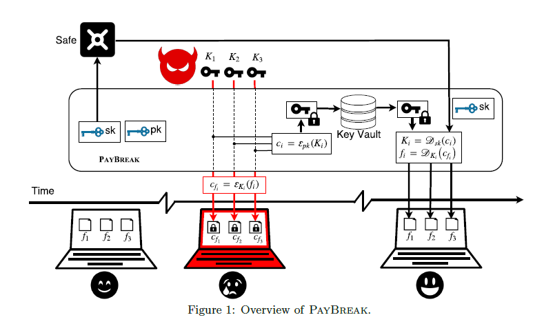

이 시스템의 키 값 자산은 마이크로소프트의 CryptoAPI와 Crypto++에서 사용하는 대칭키는 필요한 경우에만 피해자가 접근할 수 있도록 안전하게 저장된다.

세션키는 시스템 설치 중 생성된 사용자의 공용키(pku)를 사용하여 암호화 및 내보내기를 시행한다.

이 단계에서 2048비트 RSA 키를 구현하고 있으며, 2048비트의 큰 키의 크기는 보다 작거나 같은 크기의 데이터의 안전한 암호화를 보장한다.

<br/>

##### Reference

###### Alma ransomware: Analysis of a new ransomware threat (and a decrypter!). | Aug 24, '16

- https://info.phishlabs.com/blog/alma-ransomware-analysis-of-a-new-ransomware-threat-and-a-decrypter.

랜섬웨어 공격은 사건 수에서 은행 트로이 목마를 앞질렀다.

랜섬웨어의 급속한 인기는 위협 행위자들이 연구원들과 경쟁자들을 능가하려고 애쓰면서 수십 가지의 변종, 하위 유형, 그리고 비슷한 유형의 군집을 형성하게 되었다.

이 역동적인 위협 환경에서는 기존의 랜섬웨 제품군에서 전술, 기술 또는 절차의 변화를 모니터링 하는 것과 함께 소셜 미디어 및 언더그라운드 시장에서 새로운 위협을 모니터링한다.

이 과정에서 새로운 위협 행위자가 랜섬웨 설계와 유통을 처음 시도했을 가능성이 있는 것에 대해 경각심을 갖고 조사한 것이다.

최근 Alma 랜섬웨어라 불리는 새로운 유형의 랜섬웨어가 공격 키트를 통해 전달되는 것을 확인하였고, 웹 서버에 종종 숨겨져 있는 공격 키트(EK)는 악성 페이로드 전달을 위해 사용자의 웹 브라우저를 방문하는 취약성을 악용하는 위협 행위자들이 사용하는 툴킷이다.


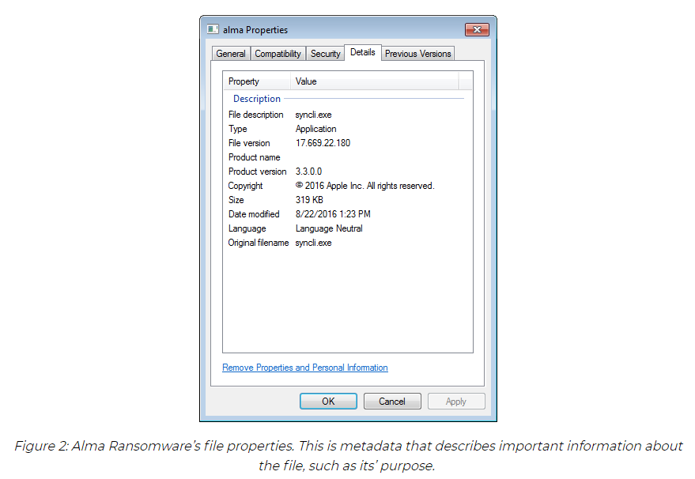

The executable itself makes use of Address Space Layout Randomization (ASLR) enabled per a flag found in the PE Header. ASLR is a protection mechanism in which the operating system randomizes the memory locations of the program in order to make it less susceptible to buffer overflow attacks. However, to less experienced malware analysts or to those unfamiliar with the concept, it also makes it more difficult to analyze as locations for certain functions will change upon each execution of the payload. This is easily defeated by changing the corresponding value found within the header of the executable.


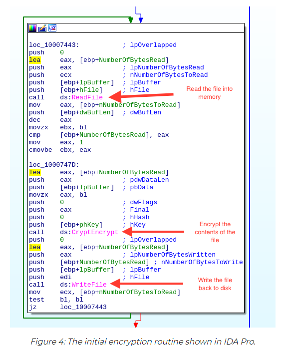

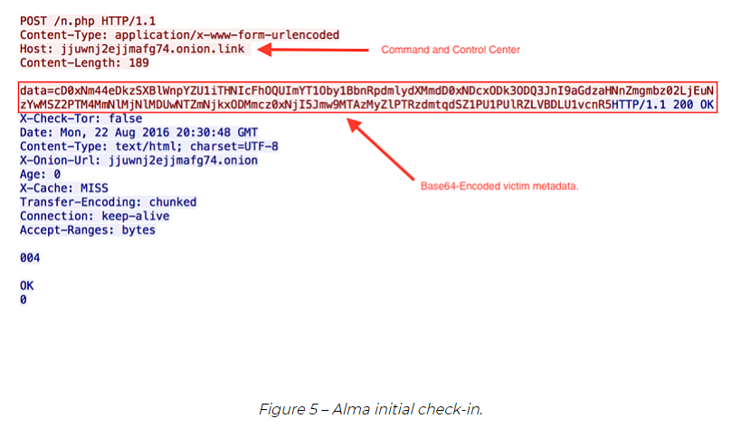


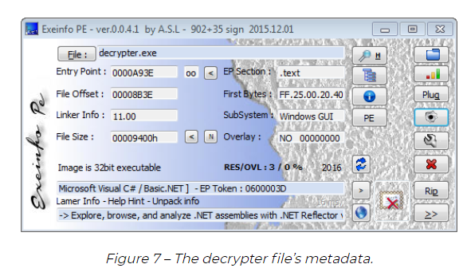

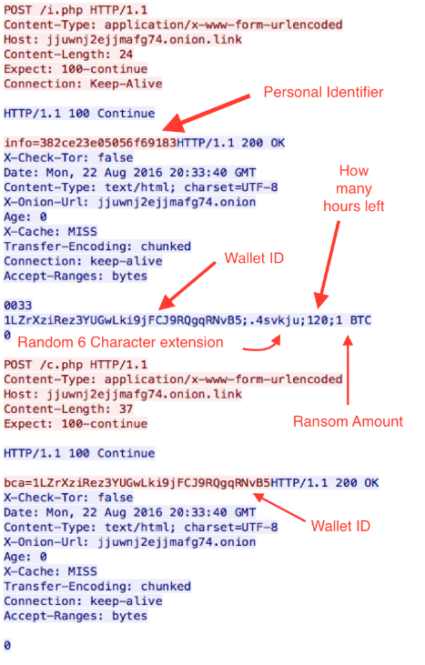


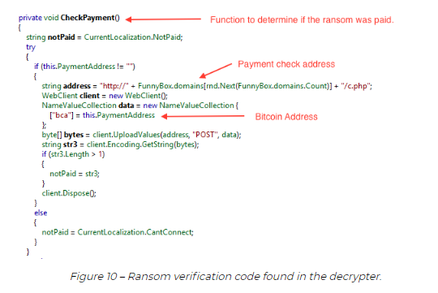


분석을 통해 해독 도구는 모든 희생자가 자신의 파일을 해독할 수 있도록 하는 MITM(man-in-the-middle) 기법에 취약하다고 판단했다.

아래 그림 12는 알마 랜섬웨어가 암호화를 수행한 후 간단한 텍스트 파일을 보여준다.

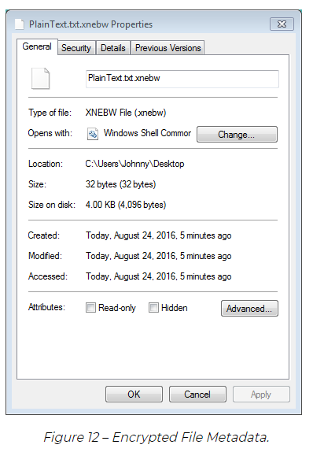

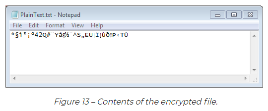

Now we can execute a MITM technique on the decrypter (or write your own) to restore your files. We made use of Fiddler, a popular HTTP proxy developed by Telerik to modify the responses from the command and control server. Before the responses can be modified, you need to enable filtering so that breakpoints can be set on POST requests. Figure 14 shows the parameters that need to be set before the man-in-the-middle attack can be completed.


As displayed in Figure 8, when the decrypter is run, it attempts to check-in with the command and control by issuing a POST request to I.php. The server will then respond with several values (Bitcoin wallet, file extension, hours left to pay, amount to pay). Figure 15 below displays that you can run the POST request and break on the response. Here we are able to supply Fiddler with a .dat file containing parameters we specify. This allows manipulation of any of these values, including amount to pay and time left to pay.

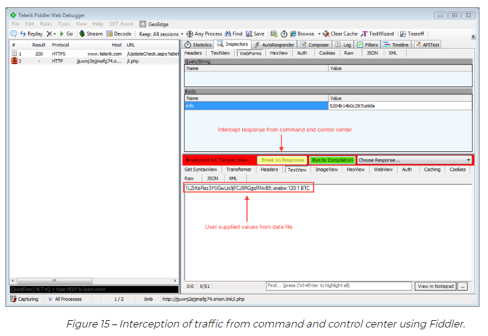

After we have supplied Fiddler with the data file, we can then click “Run to Completion”. The decrypter will then issue a request POSTing the Bitcoin Address to c.php. If the victim has not paid the ransom, the server will respond with nothing. We can craft a data file containing the key generated by the Alma Ransomware payload and break on the response. Figure 16 below exhibits our state at this point.


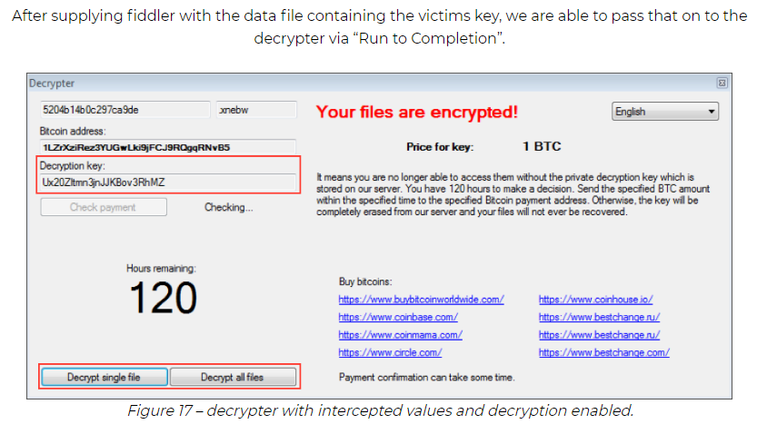

Figure 17, shows our MITM attack is successful using the values supplied by our data files and Fiddler. We are now granted the ability to decrypt any of our previously encrypted files. We want to decrypt our PlainText.txt file from Figures 12 and 13 and our results are displayed in figure 18 below.

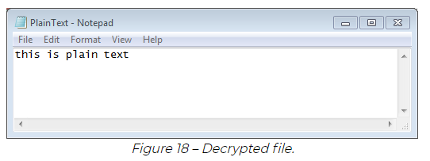

<br/>

**Alma Ransomware Decrypter .CS**

```c#
using System;
using System.Collections.Generic;
using System.IO;
using System.Linq;
using System.Runtime.InteropServices;
using System.Text;
using System.Threading.Tasks;

namespace ALDecrypter
{
    class Program
    {

        public const uint CRYPT_VERIFYCONTEXT = 0xf0000000;
        public const string MS_ENH_RSA_AES_PROV = "Microsoft Enhanced RSA and AES Cryptographic Provider";
        public const string MS_ENH_RSA_AES_PROV_XP = "Microsoft Enhanced RSA and AES Cryptographic Provider (Prototype)";
        public const uint PROV_RSA_AES = 0x18;

        [return: MarshalAs(UnmanagedType.Bool)]
        [DllImport("advapi32.dll")]
        public static extern bool CryptAcquireContext(out IntPtr phProv, string pszContainer, string pszProvider, uint dwProvType, uint dwFlags);

        [return: MarshalAs(UnmanagedType.Bool)]
        [DllImport("advapi32.dll")]
        public static extern bool CryptCreateHash(IntPtr hProv, ALG_ID Algid, IntPtr hKey, uint dwFlags, out IntPtr phHash);

        [return: MarshalAs(UnmanagedType.Bool)]
        [DllImport("advapi32.dll")]
        public static extern bool CryptDecrypt(IntPtr hKey, IntPtr hHash, [MarshalAs(UnmanagedType.Bool)] bool Final, uint dwFlags, byte[] pbData, ref int pdwDataLen);

        [return: MarshalAs(UnmanagedType.Bool)]
        [DllImport("advapi32.dll")]
        public static extern bool CryptDeriveKey(IntPtr hProv, ALG_ID Algid, IntPtr hBaseData, uint dwFlags, ref IntPtr phKey);

        [return: MarshalAs(UnmanagedType.Bool)]
        [DllImport("advapi32.dll")]
        public static extern bool CryptDestroyHash(IntPtr hHash);

        [return: MarshalAs(UnmanagedType.Bool)]
        [DllImport("advapi32.dll")]
        public static extern bool CryptDestroyKey(IntPtr hKey);

        [return: MarshalAs(UnmanagedType.Bool)]
        [DllImport("advapi32.dll")]
        public static extern bool CryptHashData(IntPtr hHash, byte[] pbData, int dwDataLen, uint dwFlags);

        [return: MarshalAs(UnmanagedType.Bool)]
        [DllImport("advapi32.dll")]
        public static extern bool CryptReleaseContext(IntPtr hProv, uint dwFlags);

        public static bool Decrypt(string file, string pass)
        { 
            IntPtr zero = IntPtr.Zero;      // pointer to CSP handle
            IntPtr phKey = IntPtr.Zero;     // pointer to HCRYPTKEY
            IntPtr phHash = IntPtr.Zero;    // hash object handle

            int pdwDataLen = 0;             // pointer to DWORD that provides length of buffer to be decrypted
            int count = 0x80;

            try
            {
                /* The CryptAcquireContext function is used to acquire a handle to a particular key 
                 * container within a particular cryptographic service provider (CSP). This returned 
                 * handle is used in calls to CryptoAPI functions that use the selected CSP.
                 * 
                 * Source: MSDN
                 */
                if (!CryptAcquireContext(out zero, null, "Microsoft Enhanced RSA and AES Cryptographic Provider", 0x18, 0xf0000000) && !CryptAcquireContext(out zero, null, "Microsoft Enhanced RSA and AES Cryptographic Provider (Prototype)", 0x18, 0xf0000000))
                {
                    return false;
                }

                /* The CryptCreateHash function initiates the hashing of a stream of data. It creates 
                 * and returns to the calling application a handle to a cryptographic service provider (CSP) 
                 * hash object. This handle is used in subsequent calls to CryptHashData and CryptHashSessionKey 
                 * to hash session keys and other streams of data.
                 * 
                 * Source: MSDN
                 */
                if (!CryptCreateHash(zero, ALG_ID.CALG_SHA_256, IntPtr.Zero, 0, out phHash))
                {
                    return false;
                }

                /* The CryptHashData function adds data to a specified hash object. This function and 
                 * CryptHashSessionKey can be called multiple times to compute the hash of long or 
                 * discontinuous data streams.
                 * 
                 * Source: MSDN
                 */
                if (!CryptHashData(phHash, Encoding.Unicode.GetBytes(pass), pass.Length, 0))
                {
                    return false;
                }

                /*
                 * The CryptDeriveKey function generates cryptographic session keys derived from a base data 
                 * value. This function guarantees that when the same cryptographic service provider (CSP) 
                 * and algorithms are used, the keys generated from the same base data are identical. The 
                 * base data can be a password or any other user data.
                 * 
                 * Source: MSDN
                 */
                if (!CryptDeriveKey(zero, ALG_ID.CALG_AES_128, phHash, 0, ref phKey))
                {
                    return false;
                }

                CryptDestroyHash(phHash);       // destroy the hash object
                phHash = IntPtr.Zero;           // clear hash object handle

                using (MemoryStream stream = new MemoryStream(File.ReadAllBytes(file)))
                {
                    using (MemoryStream stream2 = new MemoryStream())
                    {
                        byte[] buffer = new byte[0x100];
                        bool final = false;

                        while (!final)
                        {
                            pdwDataLen = stream.Read(buffer, 0, count);
                            if (pdwDataLen <= (count - 1))
                            {
                                final = true;
                            }
                            CryptDecrypt(phKey, IntPtr.Zero, final, 0, buffer, ref pdwDataLen);
                            stream2.Write(buffer, 0, pdwDataLen);
                        }
                        FileStream stream3 = new FileStream(file, FileMode.Create, FileAccess.Write);
                        stream2.WriteTo(stream3);
                        stream3.Close();
                        File.Move(file, file.Replace(Path.GetExtension(file), ""));
                    }
                }

                // release the handle of the key
                if (phKey != IntPtr.Zero)
                {
                    CryptDestroyKey(phKey);
                }

                // release handle of CSP and key container
                if (zero != IntPtr.Zero)
                {
                    CryptReleaseContext(zero, 0);
                }

                return true;
            }

            // in case anything fails we want to destroy relevant items from memory
            catch
            {
                // release the handle of the key
                if (phKey != IntPtr.Zero)
                {
                    CryptDestroyKey(phKey);
                }

                // release handle of CSP and key container
                if (zero != IntPtr.Zero)
                {
                    CryptReleaseContext(zero, 0);
                }

                return false;   // indicate to caller we failed - bail out!
            }

        }

        static void Main(string[] args)
        {
            if (args.Length != 2)
            {
                Console.WriteLine("AlmaLocker Decrypter v.01");
                Console.WriteLine("Authored by King Salemno\n");
                Console.WriteLine("Please use as follows: \n");
                Console.WriteLine("ALDecrypter.exe AES_KEY FILE_TO_BE_DECRYPTED");
                System.Environment.Exit(1);
            }

            Console.WriteLine("AlmaLocker Decrypter v.01");
            Console.WriteLine("Authored by King Salemno");
            Console.WriteLine("\nDecrypting File ...\n");
            Decrypt(args[1], args[0]);
            Console.WriteLine("File Decrypted!");
        }

        public enum ALG_ID
        {
            CALG_AES_128 = 0x660e,
            CALG_SHA_256 = 0x800c
        }
    }
}
```

<br/>

-------

#### **(2018) Towards Data Resilience: The Analytical Case of Crypto Ransomware Data Recovery Techniques**

```
Crypto ransomware has earned an infamousreputation in the malware landscape and its sound sends alot of shivers to many despite being a new entrant. Themedia has not helped matters even as the myths andinaccuracies surrounding crypto ransomware continue todeepen. It’s been purported that once crypto ransomwareattacks, the victim is left with no option but to pay inorder to retrieve the encrypted data, and that without aguarantee, or risk losing the data forever. Securityresearchers are inadvertently thrown into a cat-and-mousechase to catch up with the latest vices of the aforesaid inorder to provide data resilience. In this paper, we debunkthe myths surrounding loss of data via a cryptoransomware attack. Using a variety of crypto ransomwaresamples, we employ reverse engineering and dynamicanalysis to evaluate the underlying attack structures anddata deletion techniques employed by the ransomware.Further, we expose the data deletion techniques used byransomware to prevent data recovery and suggest howsuch could be countered. From the results, we furtherpresent observed sandbox evasion techniques employedby ransomware against both static and dynamic analysisin an effort to obfuscate its operations and subsequentlyprevent data recovery. Our analyses have led us to theconclusion that no matter how devastating a cryptoransomware attack might appear, the key to data recoveryoptions lies in the underlying attack structure and theimplemented data deletion methodology.
```

랜섬웨어 공격으로 인한 데이터 손실을 다양한 랜섬웨어 샘플을 사용하여, 랜섬웨어가 채택한 기본 공격 구조와 데이터 삭제 기법을 평가하기 위해 리버스 엔지니어링 및 동적 분석을 통해 알아본다.

또한, 랜섬웨어가 데이터 복구를 막기 위해 사용하는 데이터 삭제 기법을 공개하고 그러한 기법에 어떻게 대응할 수 있는지 제안한다.

그 결과로부터 관찰된 샌드박스 회피 기법을 추가로 제시한다.

난독화 및 데이터 복구를 방지하기 위해 정적 및 동적 분석 모두에 대해 랜섬웨어를 사용한다.

아무리 파괴적인 랜섬웨어 공격이 나타나더라도 데이터 복구 옵션의 핵심은 기본 공격 구조와 구현된 데이터 삭제 방법론에 있다는 결론을 도출한다.

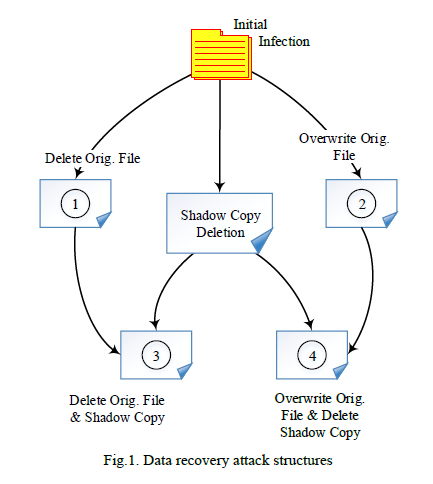

>  A ransomware attack on data recovery can implement any of the four attack instances depicted in figure 1.

<br/>

-----

<br/>