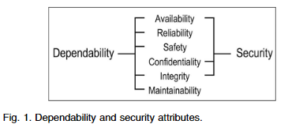

# Security Engineering (보안 공학)

 

## Table of Contents (목차)

### Paper

- (2004.10) Basic Concepts and Taxononmy of Dependable and Secure Computing - IEEE

 

 

## (2004.10) Basic Concepts and Taxononmy of Dependable and Secure Computing - IEEE

> https://ieeexplore.ieee.org/document/1335465

**신뢰할 수 있고 안전한 컴퓨팅의 기본 개념 및 분류**

 

### Abstract (요약)

&nbsp;이 논문은 신뢰성, 가용성, 안전성, 무결성, 유지 보수성 등과 같은 특수한 경우를 포함하는 일반적인 개념인 신뢰성과 관련된 주요 내용들을 정의한다. 보안은 가용성 및 무결성 외에도 기밀 유지에 대해서도 고려해야 한다. 그에 대해서는 기본 정의들이 먼저 주어져야 한다. 그런 다음 신뢰성과 보안에 대한 위협(결함, 오류, 장애), 속성 및 달성 수단(결함 방지, 내결함성, 장애 제거, 장애 예측)을 해결하는 추가 정의에 대한 의견을 제시하고 이를 보완한다. 최종 목표는 광범위한 상황에 걸쳐 관련성이 있는 일련의 일반적인 개념을 설명하는 것이며, 그에 따라 특정 유형의 시스템, 시스템 장애에 또는 시스템 장애의 원인을 포함하여 수많은 과학 및 기술 커뮤니티 간의 의사소통과 협력을 돕는 것이 목표이다.

 

### 1 Introduction (서론)

&nbsp;본 논문은 컴퓨팅 및 통신 시스템의 신뢰성과 보안을 다룰 때 실행되는 다양한 개념을 특정짓는 정확한 정의를 제공하는 것을 목표로 한다. 시스템 경계에 대한 불확실성이 있는 시스템에 대해 논의할 때 이러한 개념들을 명확히하는 것은 의외로 어렵다. 더욱이, 시스템의 복잡성 혹은 사양이 종종 주요 문제이며, 가능한 고장 원인 또는 실패의 결과를 결정하는 것은 매우 미묘한 프로세스가 될 수 있으며, 결함의 원인이 되는 것을 방지하기 위한 조항이 있다.

&nbsp;고신뢰성(Dependability)은 신뢰성, 가용성, 안전성, 무결성, 유지 보수성 등의 일반적인 속성을 포함하는 포괄적인 개념으로 처음 소개되었다. 보안을 고려하면 가용성 무결성 외에도 기밀성에 대한 우려가 생긴다. 그런 다음 기본 정의는 추가 정의들을 통해 보완된다. 굵은 글씨체는 용어가 정의될 때 사용되며, 이탤릭체는 독자의 주의를 집중시키기 위해 사용된다.

&nbsp;본 논문은 기술적 상호 작용을 용이하게 하기위해 다양한 전문 분야의 개념에 대해 최소한의 합의를 문서화하려는 시도로도 볼 수 있다. 또한 다른 기관(표준화 기구를 포함한)에서 사용하고 교육 목적에 적합하길 바란다. 우리의 관심사는 개념들(the concepts)에 있다. 단어들은

 

### 2 The Basic Concepts

&nbsp;이 섹션에서는 신뢰할 수 있고 안전한 컴퓨팅의 분류법에 대한 전체 논의에서 사용될 기본 정의 세트를 제시한다. 이 정의는 개별 논리 게이트에서 인간 운영자와 사용자가 있는 컴퓨터 네트워크에 이르기까지 컴퓨팅 및 통신 시스템의 전체 범위를 포괄할 수 있을 만큼 충분히 일반적이다. 이어지는 내용에서 우리는 주로 컴퓨팅 및 통신 시스템에 중점을 두지만, 우리의 정의는 컴퓨터 기반 시스템, 즉 관심 있는 컴퓨팅 및 통신 시스템의 즉각적인 환경을 제공하는 인간과 조직을 포괄하는 시스템과 관련이 있는 것을 목적으로도 한다.

 

#### 2.1 System Function, Behavior, Structure, and Service

&nbsp;우리의 분류법의 시스템은 다른 실체, 즉 하드웨어, 소프트웨어, 인간 및 물리적 세계를 포함한 다른 실체와 자연 현상으로 상호 작용하는 실체이다. 이러한 다른 시스템은 주어진 시스템의 환경입니다. 시스템 경계는 시스템과 시스템 환경 사이의 공통적인 경계선이다.

 

#### 2.4 The Means to Attain Dependability and Security

&nbsp;지난 50년 동안 신뢰성과 보안의 다양한 속성을 달성하기 위해 많은 수단이 개발되었습니다. 이러한 평균은 네 가지 주요 범주로 그룹화할 수 있다.

    

 

### 3 The Threats To Dependability And Security

 

### 4 Dependability, Security, And Their Attributes

 

### 5 The Means To Attain Depenability And Security

 

### 6 Conclusion

 