# Security Engineering (보안 공학)

<br/>

## Table of Contents (목차)

### Paper

- (2004.10) Basic Concepts and Taxononmy of Dependable and Secure Computing - IEEE

<br/>

<br/>

## (2004.10) Basic Concepts and Taxononmy of Dependable and Secure Computing - IEEE

> https://ieeexplore.ieee.org/document/1335465
>
> https://www.researchgate.net/publication/3449335_Basic_Concepts_and_Taxonomy_of_Dependable_and_Secure_Computing

**신뢰할 수 있고 안전한 컴퓨팅의 기본 개념 및 분류**

<br/>

### Abstract (요약)


&nbsp;이 논문은 신뢰도(reliability), 가용성(availability), 안전성(safety), 무결성(integrity), 유지 보수성(maintainability) 등과 같은 특수한 경우를 포함하는 일반적인 개념인 신뢰성(dependability)과 관련된 주요 내용들을 정의한다. 보안은 가용성 및 무결성 외에도 기밀 유지(confidentiality)에 대해서도 고려해야 한다. 그에 대해서는 기본 정의들이 먼저 주어져야 한다. 그런 다음, 신뢰성과 보안에 대한 위협(결함(faults), 오류(errors), 장애(failures))과 속성 및 달성 수단(결함 방지(fault prevention), 내결함성(fault tolerance), 결함 제거(fault removal), 결함 예측(fault forecasting))을 해결하는 추가 정의에 대한 의견을 제시하고 이를 보완한다. 최종 목표는 광범위한 상황에 걸쳐 관련성이 있는 일련의 일반적인 개념을 설명하는 것이며, 그에 따라 특정 유형의 시스템, 시스템 장애에 또는 시스템 장애의 원인을 포함하여 수많은 과학 및 기술 커뮤니티 간의 의사소통과 협력을 돕는 것이 목표이다.

<br/>

### 1 Introduction (서론)

&nbsp;본 논문은 컴퓨팅 및 통신 시스템의 신뢰성과 보안을 다룰 때 실행되는 다양한 개념을 특징짓는 정확한 정의를 제공하는 것을 목표로 한다. 시스템 경계가 모호한 시스템에 대해 논의할 때 이러한 개념들을 명확히 하는 것은 의외로 어렵다. 더욱이, 이러한 시스템의 복잡성 혹은 사양은 주요 문제일 뿐만 아니라, 장애(failures)가 발생할 수 있는 원인이나 결과를 정의하는 것은 매우 복잡미묘한 프로세스이고 장애(failures)를 유발하는 결함(faults)들을 막기 위한 조항들이 있다.

&nbsp;신뢰성(Dependability)은 신뢰도(reliability), 가용성, 안전성, 무결성, 유지 보수성 등의 일반적인 속성을 포함하는 포괄적인 개념으로 처음 소개되었다. 보안을 고려하면 가용성, 무결성 외에도 기밀성에 대한 우려가 생긴다. 그런 다음, 기본 정의는 추가 정의들을 통해 보완된다. **굵은 글씨**는 용어가 정의될 때 사용되며, *이탤릭체* 는 독자의 주의를 집중시키기 위해 사용된다.

&nbsp;본 논문은 효과적인 기술적 상호 작용을 용이하게 하기위해 다양한 전문 분야의 개념에 대해 최소한의 합의를 문서화하려는 시도로도 볼 수 있다. 또한 1) 다른 기관(표준화 기구를 포함한)에서 사용하고 2) 교육 목적에 적합하길 바란다. 우리의 관심사는 개념에 있다. 단어는 개념에 분명하게 레이블을 붙이고 아이디어와 관점을 공유할 수 있기 때문에 유심히 봐야한다. 아직 합의가 이루어지지 않았다고 생각하는 중요한 문제는 신뢰성(dependability)과 보안(security)의 척도에 관한 것이다. 이 문제는 여기에 제시된 분류의 다른 측면과 일관되게 문서화하기 전에 추가 정교화가 필요하다.

&nbsp;이 논문은 최첨단 기술을 문서화하지 않는다. 개념에 집중하면서, 표준에서 찾을 수 있는 문제들([30] 안전을 위한 이나 [32] 보안을 위한)을 다루지 않는다. 

&nbsp;신뢰성(dependability)과 보안 커뮤티니들은 분명히 구별되지만, 점차 같은 길로 수렴해 왔다. 1) 신뢰성(dependability)은 악의적이지 않은 결함(faults)이 문제의 일부만을 다루고 있는 것에 대해서 제한적이라는 것을 알게 되었다. 2) 보안은 과거의 기밀성에 중점을 두었던 것이 무결성 및 가용성에 대한 우려로 확대되어야한다는 것을 알게 되었다. (이전에도 정의되었었지만, 기밀성(confidentiality)만큼 많은 관심을 받지 못했다.) 이 논문에서는 신뢰성과 보안의 공통된 부분을 하나의 가닥으로 모으는 것을 목표로 하며, 공간 제한의 이유로 기밀성에 대해서는 크게 주의를 기울이지 않는다.

&nbsp;**미래를 위한 선행 작업 및 목표(Preceding Work and Goals for the Future).** 이러한 노력의 기원은 IEEE CS의 내결함성 컴퓨팅 TC와 IFIP WG 10.4 "신뢰할 수 있는 컴퓨팅 및 내결함성(Fault Tolerance)"에 의해 "기본 개념 및 용어"에 대한 공동 위원회가 구성된 1980년으로 거슬러 올라간다. 7 개의 서로 다른 논문이 1982 년 FTCS-12의 특별 세션[21]에서 발표되었으며, 합작은 1985년 FTCS-15[40]에서 이 논문의 이전 버전으로 발표되었다. 그리고 이 논문에서는 특히 신뢰성(dependability) 위협과 속성 측면에서 훨씬 더 자세히 다룬다.

&nbsp;1985년 발표된 합작은 1992년 책 *Dependability : Basic Concepts and Terminology* [41]로 이어졌다. 이 책은 34페이지 영어와 8페이지짜리 프랑스어, 독일어, 이탈리아어 및 일본어로 번역된 용어집이 포함되어 있다.  하나의 속성으로서의 보안과 결함(faults)의 분류에서, 의도적이고 악의적인 결함(faults)의 클래스가 추가되었다는 것이 개선사항이였다. 뿐만 아니라, 많은 개념들이 세련되고 정교해졌다.

&nbsp;그 다음 단계에서는 보안을 *기밀성*, *무결성* 및 *가용성* 의 속성들의 복합체로 인식하고, *부적절한 시스템 사양의 문제에 대한 분석과 함께 의도적인 비악의적 결함 클래스*를 추가하는 것이었지만, 신뢰성 위협에 대한 요약 분류만 제공했다.

&nbsp;본 논문은 신뢰할 수 있고 보안성이 높은 컴퓨팅의 분류 체계를 확장, 개선 및 단순화하기 위한 1995년 이후 지속적인 노력의 결과를 나타낸다. 분류 체계를 이 분야의 실무자와 학생들이 손쉽게 사용할 수 있도록하는 것을 목표로 한다. 따라서, 이 논문은 독립적이며 위에 언급된 문서들을 읽을 필요가 없다. 이 논문에서 주로 기여하고자 하는 바는 다음과 같다:

1. *신뢰성과 보안 사이의 관계* 를 명확하게 명시한다 (섹션 2.3).

2. *신뢰성에 대한 정량적 정의* 를 도입하였다 (섹션 2.3).

3. *잠재가능성의 기준* 은 인간이 만든 비악의적 결함(섹션 3.2.1 및 3.2.3)의 분류에 적용하여 잠재가능성을 고려할 수 있다.
4. *악의적인 결함(faults)에 대한 논의* 를 광범위하게 정의한다 (섹션 3.2.4).
5. *서비스 실패(Service failures)* (섹션 3.3.1)는 *신뢰성 실패(dependability failures)* (섹션 3.3.3) 와 구별한다. 후자는 일정 기간 서비스 실패가 너무 빈번하거나 너무 심각할 때로 정의한다.
6. 부분 및 전체 *개발 실패(development failures)* (섹션 3.3.2) 를 포함하여 *개발 프로세스의 신뢰성 문제* 를 분류 체계에 명시적으로 통합하였다.
7. *신뢰성(dependability) 개념은 의존(dependence) 및 믿음(trust)와 관련이 있으며* (섹션 4.2), 최근에 도입된 세 가지 유사한 개념인 생존성(survivability), 깨지지 않을 신뢰(trustworthiness), 높은 신뢰(high-confidence) 시스템과 구별한다.

 &nbsp;이처럼 지금의 광범위한 신판물 이후, 분류 체계 발전을 촉진할 수 있는 미래의 기회와 도전은 무엇일까? 여기서 우리는 더 가치있는 것들이 무엇인지 안다:

- 예를 들어 기밀성 보호, 신뢰성 설정 등을 위한 기술을 다루기 위해 보안에 대한 논의를 확장

- 믿음(trust)의 이슈들이나 위험 관리의 통합된 토픽을 분석 

- 신뢰성(dependability)과 보안(security)에 대한 통합된 측정을 위한 검색

&nbsp;우리는 예기치 않게 우리가 이해하는 능력 이상으로 구축한 (Arthur C. Clarke의 "2001: A Space Odyssey"의 HAL 컴퓨터의 것과 같은 소위 "신흥 속성"으로 불리는) 인간-기계 시스템의 복잡성과 같은 몇 가지 도전 과제가 생길 것으로 예상한다. 또다른 도전 과제들은 예측하기가 더 쉽다:

1. 새로운 기술 (나노 시스템, 바이오칩, 화학 및 양자 컴퓨팅 등)과 인간-기계 시스템의 새로운 개념 (앰비언트 컴퓨팅, 노매딕 컴퓨팅, 그리드 컴퓨팅 등)은 그들 특성에 맞는 구체적인 신뢰성(dependability) 문제에 대해 지속적으로 요구할 것이다. 
2. 복잡한 인간-기계 상호 작용(사용자 인터페이스 포함)의 문제는 여전히 매우 중요한 과제이다. 신뢰성(dependability)과 보안(security)을 향상시키는 방법들을 파악하고 통합해야 한다.
3. 인간 본성의 어두운 면은 우리에게 새로운 형태의 악의를 예상하게 하며, 더 많은 형태의 악의적 결함(faults)으로 이어질 것이고, 더 나아가 새로운 방어에 대한 보완책으로 이끌것이다.

&nbsp;위에서 언급한 도전 과제들의 관점에서 그리고, 동일한 방법, 속성, 위협들을 설명하기 위해 도입되는 "새로운" 개념의 지속적이고 불필요한 혼란때문에, 미래에 가장 우선되어야할 목표는 가능한 범위 내에서 분류 체계를 완전하게 유지하는 것과 동시에 우리의 능력이 허락하는 한에서 단순하고 구조화시키는 것이 중요하다. 🔒

<br/>

### 2 The Basic Concepts

이 섹션에서는 신뢰할 수 있고 안전한 컴퓨팅의 분류법에 대한 전체 논의에서 사용될 기본 정의 세트를 제시한다. 이 정의는 개별 논리 게이트에서 인간 운영자와 사용자가 있는 컴퓨터 네트워크에 이르기까지 컴퓨팅 및 통신 시스템의 전체 범위를 포괄할 수 있을 만큼 충분히 일반적이다. 이어지는 내용에서 우리는 주로 컴퓨팅 및 통신 시스템에 중점을 두지만, 우리의 정의는 **컴퓨터 기반 시스템(computer-based systems)**, 즉 관심 있는 컴퓨팅 및 통신 시스템의 즉각적인 환경을 제공하는 인간과 조직을 포괄하는 시스템과 관련이 있는 것을 목적으로도 한다.

<br/>

#### 2.1 System Function, Behavior, Structure, and Service

우리의 분류법의 시스템은 다른 실체, 즉 하드웨어, 소프트웨어, 인간 및 물리적 세계를 포함한 다른 실체와 자연 현상으로 상호 작용하는 실체이다. 이러한 다른 시스템은 주어진 시스템의 환경입니다. 시스템 경계는 시스템과 시스템 환경 사이의 공통적인 경계선이다.

&nbsp;컴퓨팅 및 통신 시스템은 기능 , 성능 , 신뢰성 및 보안 , 비용 과 같은 기본 속성으로 특성화 됩니다. 신뢰성과 보안에 영향을 미치는 다른 중요한 시스템 속성으로는 사용성 , 관리 성 , 적응성 등이 있습니다. 이러한 문제에 대한 자세한 고려 사항은이 백서의 범위를 벗어납니다. 이러한 시스템의 기능은 시스템이 수행하려는 작업이며 기능 및 성능 측면에서 기능 사양에 의해 설명됩니다. 시스템의 동작은 시스템이 기능을 구현하기 위해 수행하는 작업이며 일련의 상태로 설명됩니다. 주어진 시스템의 전체 상태는 계산, 통신, 저장된 정보, 상호 연결 및 물리적 상태의 집합입니다.

&nbsp;시스템의 구조는 행동을 생성 할 수있게합니다. 구조적 관점에서 시스템은 상호 작용하기 위해 함께 묶인 구성 요소 집합으로 구성되며 각 구성 요소는 다른 시스템입니다. 구성 요소가 원자성으로 간주되면 재귀가 중지됩니다. 더 이상의 내부 구조는 식별할 수 없거나 관심이 없으며 무시할 수 있습니다. 결과적으로, 시스템의 총 상태는 원자 구성요소의 (외부) 상태의 집합이다. 더 이상의 내부 구조는 식별할 수 없거나 관심이 없으며 무시할 수 있습니다. 결과적으로, 시스템의 총 상태는 원자 구성요소의 (외부) 상태의 집합이다.

&nbsp;시스템이 제공하는 서비스 (제공자 역할)는 사용자가 인식하는 동작입니다. 사용자는 공급자로부터 서비스를받는 또 다른 시스템입니다. 서비스 제공이 이루어지는 공급자의 시스템 경계 부분은 공급자의 서비스 인터페이스입니다. 서비스 인터페이스에서 인식 할 수있는 공급자의 전체 상태 부분은 외부 상태입니다. 나머지 부분은 내부 상태입니다. 제공되는 서비스는 공급자의 외부 상태의 순서입니다. 우리는 시스템이 다른 시스템과 관련하여 순차적으로 또는 동시에 공급자 및 사용자가 될 수 있습니다. 즉, 다른 시스템에 서비스를 제공하고 다른 시스템에서 서비스를받을 수 있습니다. 사용자가 서비스를받는 사용자의 인터페이스가 사용 인터페이스입니다.

&nbsp;우리는 지금까지 기능과 서비스에 단수를 사용했습니다. 시스템은 일반적으로 둘 이상의 기능을 구현하고 둘 이상의 서비스를 제공합니다. 따라서 기능과 서비스는 기능 항목과 서비스 항목으로 구성된 것으로 볼 수 있습니다. 단순함을 위해 여러 기능 또는 서비스 항목을 구분해야하는 경우 단순히 복수의 기능, 서비스를 사용합니다.

<br/>

#### 2.2 The Threats to Dependability and Security: Failures, Errors, Faults

서비스가 시스템 기능을 구현할 때 올바른 서비스가 제공됩니다. 여기서 종종 실패로 축약되는 서비스 실패는 전달 된 서비스가 올바른 서비스에서 벗어날 때 발생하는 이벤트입니다. 서비스가 기능 사양을 준수하지 않거나이 사양이 시스템 기능을 적절하게 설명하지 않았기 때문에 실패합니다. 서비스 실패는 올바른 서비스에서 잘못된 서비스로의 전환, 즉 시스템 기능을 구현하지 않는 것입니다. 잘못된 서비스 제공 기간은 서비스 중단입니다. 잘못된 서비스에서 올바른 서비스로의 전환은 서비스 복원입니다. 올바른 서비스와의 편차는 서비스 실패 모드라고하는 다른 형태를 가정 할 수 있으며 실패 심각도에 따라 순위가 매겨집니다. 실패 모드에 대한 자세한 분류는 섹션 3에 나와 있습니다.

&nbsp;서비스는 시스템의 외부 상태 시퀀스이므로 서비스 실패는 시스템의 하나 이상의 외부 상태가 올바른 서비스 상태에서 벗어남을 의미합니다. 편차를 오류라고합니다. 오류의 판단 또는 가정 된 원인을 오류라고합니다. 오류는 시스템의 내부 또는 외부 일 수 있습니다. 취약성의 사전 존재, 즉 외부 결함이 시스템에 해를 끼칠 수있는 내부 결함은 외부 결함이 오류 및 후속 실패를 유발하는 데 필요합니다. 대부분의 경우 오류는 먼저 시스템 내부 상태의 일부인 구성 요소의 서비스 상태에 오류를 일으키며 외부 상태는 즉시 영향을받지 않습니다.

&nbsp;이러한 이유로 오류의 정의는 후속 서비스 실패로 이어질 수있는 시스템 전체 상태의 일부입니다. 많은 오류가 시스템의 외부 상태에 도달하지 않아 장애를 유발한다는 점에 유의해야합니다. 오류가 발생하면 오류가 활성화되고 그렇지 않으면 휴면 상태입니다.

&nbsp;시스템의 기능 사양에 여러 기능 세트가 포함되어있는 경우 기능을 구현하는 하나 이상의 서비스가 실패하면 시스템이 여전히 필요한 서비스의 하위 집합을 사용자에게 제공하는 성능 저하 모드가 될 수 있습니다. 사양은 이러한 여러 모드 (예 : 느린 서비스, 제한된 서비스, 긴급 서비스 등)를 식별 할 수 있습니다. 여기서 시스템의 기능 또는 성능이 부분적으로 실패했다고 말합니다. 3.3 절에서 논의 된 개발 실패 및 신뢰성 실패도 부분 실패 일 수 있습니다.

<br/>

#### 2.3 Dependability, Security, and Their Attributes

신뢰성의 원래 정의는 정당하게 신뢰할 수있는 서비스를 제공하는 능력입니다. 이 정의는 신뢰의 정당화의 필요성을 강조합니다. 서비스의 신뢰성 여부를 결정하는 기준을 제공하는 대체 정의는 시스템의 신뢰성입니다. 허용 가능한 것보다 더 자주 발생하고 심각한 서비스 장애를 피할 수있는 능력입니다.

&nbsp;시스템의 의존성은 시스템에 대한 의존성에 충분해야한다고 말하는 것이 일반적입니다. 따라서 시스템 B에 대한 시스템 A의 의존성은 시스템 B의 의존성에 의해 시스템 A의 의존성이 영향을받는 (또는 영향을받을) 정도를 나타냅니다. 의존성 개념은 매우 편리하게 정의 할 수있는 신뢰의 개념으로 이어집니다. 받아 들여진 의존으로.

&nbsp;지난 30 년 동안 개발 된 신뢰성은 다음과 같은 속성을 포함하는 통합 개념입니다.

- 가용성 : 올바른 서비스를위한 준비

- 신뢰성 : 올바른 서비스의 연속성

- 안전 : 사용자와 환경에 대한 치명적인 결과의 부재

- 무결성 : 부적절한 시스템 변경 없음.

- 유지 보수성 : 수정 및 수리를받는 능력

&nbsp;보안 문제를 해결할 때 추가 속성은 눈에 잘 띄고 기밀성을 유지합니다. 즉, 무단 정보 공개가 없습니다. 보안은 기밀성, 무결성 및 가용성 속성의 조합으로 1) 승인 된 작업에 대해서만 가용성, 2) 기밀성 및 3) "승인되지 않음"을 의미하는 "부적절"과의 무결성이 동시에 존재해야합니다.

&nbsp;그림 1은 주요 속성 측면에서 의존성과 보안 간의 관계를 요약 한 것으로, 예를 들어 보안 개발자가 유지 보수 가능성에 관심이 없거나 의존성에 대한 연구가 전혀 없음을 나타내는 것으로 해석되어서는 안됩니다. 기밀성과 관련된 필드-오히려 각 사례에서 관심과 활동의 주요 균형이 어디에 있는지를 나타냅니다.

&nbsp;시스템의 의존성 및 보안 사양에는 지정된 장애 등급 및 주어진 사용 환경에 대해 허용 가능한 빈도 및 서비스 장애의 심각도 측면에서 속성에 대한 요구 사항이 포함되어야합니다. 주어진 시스템에 대해 하나 이상의 속성이 전혀 필요하지 않을 수 있습니다.

<br/>

#### 2.4 The Means to Attain Dependability and Security

&nbsp;지난 50년 동안 신뢰성과 보안의 다양한 속성을 달성하기 위해 많은 수단이 개발되었습니다. 이러한 평균은 네 가지 주요 범주로 그룹화할 수 있다.

<p align="center">
    
    <div align="center">Fig. 1. Dependability and security attributes.</div>
</p>


- 오류 방지는 오류의 발생 또는 도입을 방지하는 것을 의미합니다.

- 내결함성은 결함이있는 경우 서비스 실패를 방지하는 것을 의미합니다.

- 결함 제거는 결함의 수와 심각도를 줄이는 것을 의미합니다.

- 오류 예측은 현재 수, 미래 발생률 및 오류의 가능한 결과를 추정하는 것을 의미합니다.

&nbsp;결함 방지 및 결함 허용은 신뢰할 수있는 서비스를 제공 할 수있는 능력을 제공하는 것을 목표로하며, 결함 제거 및 결함 예측은 기능 및 신뢰성 및 보안 사양이 적절하고 시스템이 적절하다는 것을 정당화하여 해당 기능에 대한 신뢰를 얻는 것을 목표로합니다. 만날 가능성이 높습니다.

<br/>

#### 2.5 Summary: The Dependability and Security Tree

이 섹션에 설명 된대로 신뢰할 수 있고 안전한 컴퓨팅의 전체 분류 체계가 그림 2에 나와 있습니다.

<p align="center">
    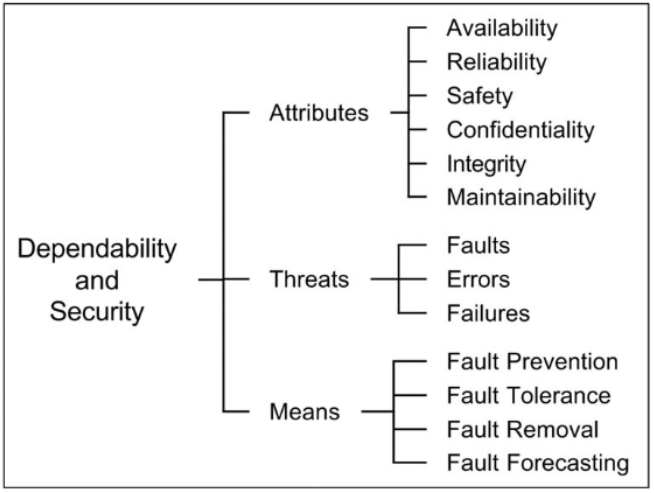
    <div align="center">Fig. 2. The dependability and security tree.</div>
</p>

<br/>

### 3 The Threats To Dependability And Security

#### 3.1 System Life Cycle: Phases and Environments

이 섹션에서는 전체 수명 동안 시스템에 영향을 미칠 수있는 위협의 분류를 제시합니다. 시스템의 수명주기는 개발과 사용의 두 단계로 구성됩니다.

&nbsp;개발 단계에는 사용자의 초기 개념 프레젠테이션부터 시스템이 모든 승인 테스트를 통과했으며 사용자 환경에서 서비스를 제공 할 준비가되었는지 결정하는 모든 활동이 포함됩니다. 개발 단계에서 시스템은 개발 환경과 상호 작용하며 개발 오류는 환경에 의해 시스템에 도입 될 수 있습니다. 시스템의 개발 환경은 다음 요소로 구성됩니다.

1. 자연 현상이있는 물리적 세계,
2. 인간 개발자, 일부는 능력이 부족하거나 악의적 인 목표가있을 수 있습니다.
3. 개발 도구 : 개발자가 개발 프로세스를 지원하기 위해 사용하는 소프트웨어 및 하드웨어
4. 생산 및 테스트 시설

&nbsp;시스템 수명의 사용 단계는 시스템 사용이 승인되고 사용자에게 서비스 제공이 시작될 때 시작됩니다. 사용은 올바른 서비스 제공 (서비스 제공이라고 함), 서비스 중단 및 서비스 종료의 교대로 구성됩니다. 서비스 중단은 서비스 오류로 인해 발생합니다. 서비스 인터페이스에서 잘못된 서비스 (서비스 없음 포함)가 전달되는 기간입니다. 서비스 종료는 권한이 부여 된 주체가 의도적으로 서비스를 중단하는 것입니다. 유지 관리 작업은 사용 단계의 세 기간 모두에서 발생할 수 있습니다.

&nbsp;사용 단계에서 시스템은 사용 환경과 상호 작용하며 그에서 발생하는 오류의 영향을받을 수 있습니다. 사용 환경은 다음 요소로 구성됩니다.

1. 자연 현상이있는 물리적 세계;
2. 관리자 (관리자 포함) : 시스템을 관리, 수정, 수리 및 사용할 권한이있는 개체 (휴먼 또는 기타 시스템) 권한이있는 일부 사람은 능력이 부족하거나 악의적 인 목표를 가질 수 있습니다.
3. 사용자 : 사용 인터페이스에서 시스템으로부터 서비스를받는 엔티티 (인간 또는 기타 시스템)
4. 제공자 : 사용 인터페이스에서 시스템에 서비스를 제공하는 엔티티 (인간 또는 기타 시스템)
5. 인프라 : 정보 소스 (예 : 시간, GPS 등), 통신 링크, 전원, 냉각 기류 등과 같은 시스템에 특수 서비스를 제공하는 엔티티.
6. 침입자 : 자신이 가질 수있는 권한을 초과하여 서비스를 변경하거나 중지하거나 시스템의 기능이나 성능을 변경하거나 기밀 정보에 액세스하려는 악의적 인 개체 (인간 및 기타 시스템). 예를 들면 해커, 파괴자, 부패한 내부자, 적대적인 정부 또는 조직의 요원, 악성 소프트웨어가 있습니다.

&nbsp;여기에서 사용되는 유지 보수라는 용어는 일반적인 사용에 따른 수리뿐만 아니라 시스템 수명의 사용 단계에서 발생하는 시스템의 모든 수정도 포함합니다. 따라서 유지 관리는 개발 프로세스이며 이전의 개발 논의는 유지 관리에도 적용됩니다. 다양한 형태의 유지 보수가 그림 3에 요약되어 있습니다.

<p align="center">
    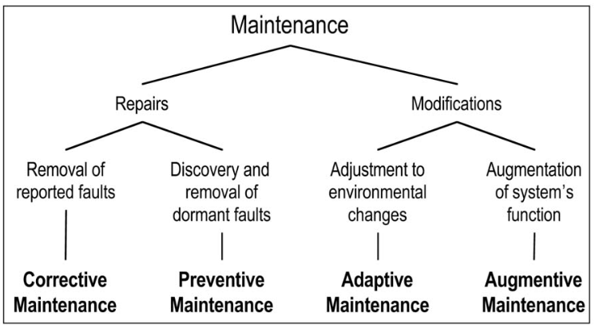
    <div align="center">Fig. 3. The various forms of maintenance.</div>
</p>

&nbsp;수리 및 내결함성이 관련된 개념이라는 것은 주목할 만합니다. 이 백서에서 내결함성과 유지 관리의 차이점은 유지 관리에는 수리공, 테스트 장비, 소프트웨어 원격 재로드와 같은 외부 에이전트의 참여가 포함된다는 것입니다. 또한 수리는 결함 제거 (사용 단계 동안)의 일부이며 결함 예측은 일반적으로 수리 상황을 고려합니다. 실제로 수리는 수리중인 시스템과 그러한 수리를 수행하는 사람 및 기타 시스템을 포함하는 더 큰 시스템 내의 내결함성 활동으로 볼 수 있습니다.

<br/>

#### 3.2 Faults

#### 3.2.1 A Taxonomy of Faults

수명 동안 시스템에 영향을 미칠 수있는 모든 결함은 8 가지 기본 관점에 따라 분류되어 그림 4와 같이 기본 결함 등급으로 이어집니다.

<p align="center">
    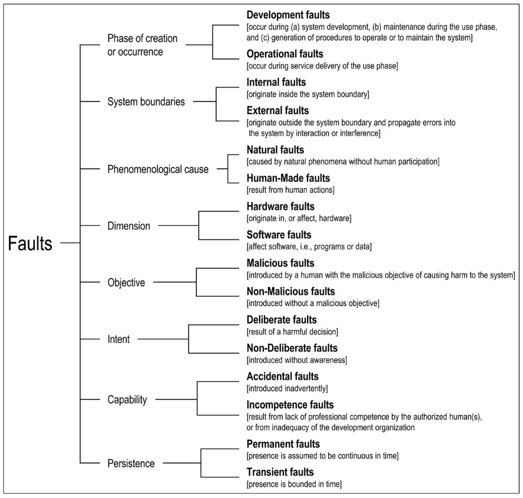
    <div align="center">Fig. 4. The elementary fault classes.</div>
</p>

&nbsp;8 개의 기본 결함 클래스의 모든 조합이 가능하다면 256 개의 서로 다른 결합 된 결함 클래스가 있습니다. 그러나 모든 기준이 모든 오류 등급에 적용되는 것은 아닙니다. 예를 들어 자연 결함은 객관적, 의도 및 능력으로 분류 할 수 없습니다. 31 개의 가능한 조합을 확인했습니다. 그림 5에 나와 있습니다.

<p align="center">
    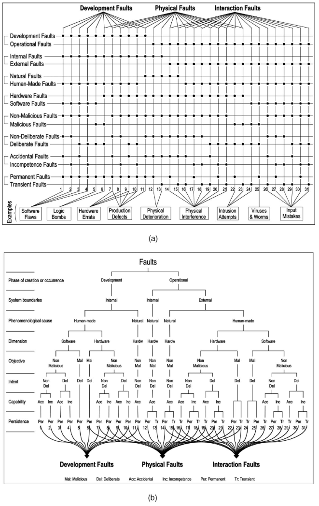
    <div align="center">Fig. 5. The classes of combined faults (a) Matrix representation. (b) Tree representation.</div>
</p>

&nbsp;앞으로 더 많은 조합이 확인 될 수 있습니다. 그림 5의 결합 된 결함 등급은 부분적으로 겹치는 세 가지 주요 그룹에 속하는 것으로 표시됩니다.

- 개발 중에 발생하는 모든 결함 클래스를 포함하는 개발 결함
- 하드웨어에 영향을 미치는 모든 결함 클래스를 포함하는 물리적 결함,
- 모든 외부 결함을 포함하는 상호 작용 결함.

&nbsp;그림 5a의 하단에있는 상자는 몇 가지 예시적인 오류 등급의 이름을 식별합니다.

&nbsp;가능한 모든 오류 클래스에 대한 지식을 통해 사용자는 신뢰성 및 보안 사양에 포함될 클래스를 결정할 수 있습니다. 다음으로 그림 5에 표시된 오류 등급에 대해 설명합니다. 오류 번호 (1 ~ 31)는 토론을 그림 5와 관련시키는 데 사용됩니다.

<br/>

#### 3.2.2 On Natural Faults

자연적 결함 (11-15)은 인간의 참여없이 자연 현상으로 인해 발생하는 물리적 (하드웨어) 결함입니다. 인간은 또한 신체적 결함을 일으킬 수 있습니다 (6-10, 16-23). 이에 대해서는 아래에서 설명합니다. 생산 결함 (11)은 개발 과정에서 발생하는 자연스러운 결함입니다. 작동 중에 자연적 결함은 물리적 열화를 유발하는 자연적 프로세스로 인한 내부 (12-13) 또는 시스템 경계 외부에서 발생하고 시스템을 관통하여 물리적 간섭을 유발하는 자연적 프로세스로 인해 외부 (14-15)입니다. 시스템의 하드웨어 경계 (방사선 등) 또는 사용 인터페이스 (과도 전력, 잡음이있는 입력 라인 등)를 통해 입력합니다.

<br/>

#### 3.2.3 On Human-Made Faults

인간이 만든 결함 (인간의 행동으로 인한)의 정의에는 조치를 수행해야 할 때 조치의 부재, 즉 누락 결함 또는 단순히 누락이 포함됩니다. 잘못된 작업을 수행하면 커미션 오류가 발생합니다.

&nbsp;인간이 만든 결함의 두 가지 기본 클래스는 개발자 또는 사용 중에 시스템과 상호 작용하는 인간의 목표에 따라 구별됩니다.

- 사용 중 (5-6) 또는 사용 중 직접 (22-25) 시스템에 해를 끼칠 목적으로 시스템 개발 중에 도입 된 악의적 인 결함.

- 악의적이지 않은 결함 (1-4, 7-21, 26-31), 악의적 인 목적없이 도입되었습니다.

&nbsp;먼저 비 악의적 인 결함을 고려합니다. 개발자의 의도에 따라 분할 할 수 있습니다.

- 실수로 인한 비 고의적 오류, 즉 개발자, 운영자, 관리자 등이 알지 못하는 의도하지 않은 행동 (1, 2, 7, 8, 16-18, 26-28)

- 잘못된 결정으로 인한 고의적 결함, 즉 잘못되고 결함을 유발하는 의도 된 조치 (3, 4, 9, 10, 19-21, 29-31).

&nbsp;고의적이고 악의적이지 않은 개발 결함 (3, 4, 9, 10)은 일반적으로 1) 허용 가능한 성능 유지, 시스템 활용 촉진 또는 2) 경제적 고려에 의해 유발 된 트레이드 오프로 인해 발생합니다. 고의적이고 악의적이지 않은 상호 작용 오류 (19-21, 29-31)는 예상치 못한 상황을 극복하기위한 운영자의 조치로 인해 발생하거나이 조치의 잠재적 인 손상 결과를 깨닫지 못한 채 의도적으로 운영 절차를 위반 한 결과 일 수 있습니다. 고의적이고 악의적이지 않은 결함은 종종 허용 할 수없는 시스템 동작 후에 만 결함으로 인식됩니다. 따라서 실패가 발생했습니다. 개발자 또는 운영자는 결정의 결과가 잘못이라는 것을 당시에 인식하지 못했습니다.

&nbsp;일반적으로 실수와 잘못된 결정은 모두 악의적 인 목적으로 만들어지지 않는 한 우발적 인 것으로 간주됩니다. 그러나 악의적이지 않은 사람의 모든 실수와 잘못된 결정이 우연 인 것은 아닙니다. 매우 해로운 실수와 매우 나쁜 결정은 자신이 수행 한 작업을 수행 할 전문적인 능력이 부족한 사람들이 내립니다. 완전한 결함 분류가 결함의 원인을 숨기면 안됩니다. 따라서 우리는 인간이 만든 비 악의적 결함을 1) 우치-치과 결함 및 2) 무능 결함으로 더 분할합니다. 인간이 만든 결함의 분류 구조는 그림 6에 나와 있습니다.

<p align="center">
    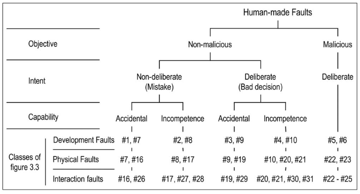
    <div align="center">Fig. 6. Classification of human-made faults.</div>
</p>

&nbsp;무능한 결함을 인식하는 방법에 대한 질문은 실수 나 잘못된 결정이 경제적 손실, 부상 또는 인명 손실을 초래하는 결과를 초래할 때 중요합니다. 이 경우 전문적 과실이 관련되었는지 여부를 결정하기 위해 조사위원회의 독립적 인 전문적 판단 또는 법원의 법적 절차가 필요할 수 있습니다.

&nbsp;지금까지 무능한 결함에 대한 논의는 개인을 다루었습니다. 그러나 팀 또는 전체 조직이 업무를 수행 할 수있는 조직적 역량이 없었기 때문에 인간이 만든 노력은 실패했습니다. 조직적 무능함의 좋은 예는 미국의 노후화 된 항공 교통 관제 시스템을 대체하기위한 AAS 시스템의 개발 실패입니다 [67].

&nbsp;악의적이지 않은 개발 결함은 하드웨어와 소프트웨어에 존재할 수 있습니다. 하드웨어, 특히 마이크로 프로세서에서 일부 개발 결함은 생산이 시작된 후 발견됩니다 [5]. 이러한 결함을 "정오표"라고하며 사양 업데이트에 나열됩니다. 정오표 발견은 일반적으로 프로세서 수명 내내 계속됩니다. 따라서 새로운 사양 업데이트가 주기적으로 발행됩니다. 인간이 만든 도구에 결함이 있기 때문에 일부 개발 결함이 발생합니다.

&nbsp;기성품 (OTS) 구성 요소는 불가피하게 시스템 설계에 사용됩니다. OTS 구성 요소를 사용하면 추가 문제가 발생합니다. 알려진 개발 결함과 함께 올 수 있으며 알려지지 않은 결함 (버그, 취약성, 발견되지 않은 정오표 등)도 포함 할 수 있습니다. 사양이 불완전하거나 부정확 할 수 있습니다. 이 문제는 이전에 설계되고 사용 된 시스템에서 제공되는 기존 OTS 구성 요소를 사용할 때 특히 심각하며 사용자의 요구로 인해 새 시스템에 유지되어야합니다.

&nbsp;소프트웨어에 영향을 미치는 일부 개발 결함은 소프트웨어 노화 [27]를 유발할 수 있습니다. 즉, 점진적으로 발생하는 오류 상태로 인해 성능 저하 또는 완전한 오류가 발생할 수 있습니다. 예를 들면 메모리 팽창 및 누수, 종료되지 않은 스레드, 해제되지 않은 파일 잠금, 데이터 손상, 저장 공간 조각화, 반올림 오류 누적 등이 있습니다 [10].

<br/>

#### 3.2.4 On Malicious Faults

사용하는 동안 시스템의 기능을 변경하려는 악의적 인 목적과 함께 인간이 만든 악의적 인 결함이 도입됩니다. 목적 상 의도와 능력에 따른 분류는 적용 할 수 없습니다. 이러한 결함의 목표는 다음과 같습니다: 1) 서비스를 중단하거나 중단하여 서비스 거부를 유발합니다. 2) 기밀 정보에 액세스하기 위해 또는 3) 시스템을 부적절하게 수정합니다. 두 클래스로 그룹화됩니다.

1. 트로이 목마, 로직 또는 타이밍 폭탄, 트랩 도어와 같은 개발 결함 (5,6)과 바이러스, 웜 또는 좀비와 같은 작동 결함 (25)을 포함하는 악성 로직 결함. 이러한 결함에 대한 정의 [39], [55]는 그림 7에 나와 있습니다.
2. 작동 외부 결함 인 침입 시도 (22-24). 침입 시도의 외부 특성은 자신의 권한을 초과하는 시스템 운영자 또는 관리자가 수행 할 수있는 가능성을 배제하지 않으며 침입 시도는 물리적 수단을 사용하여 전력 변동, 복사, 도청, 가열 등의 오류를 일으킬 수 있습니다. / 냉각 등

<p align="center">
    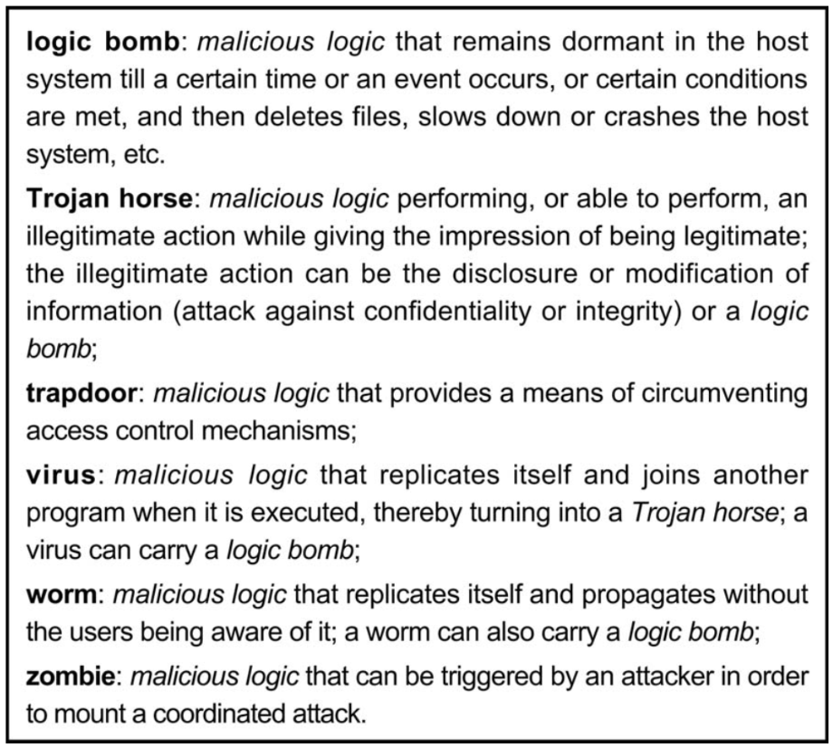
    <div align="center">Fig. 7. Malicious logic faults.</div>
</p>

&nbsp;구어 적으로 "악용"이라고하는 것은 본질적으로 시스템 취약성을 행사하고 침입자가 시스템에 액세스하고 때로는 제어 할 수 있도록하는 소프트웨어 스크립트입니다. 여기에 정의 된 용어에서 익스플로잇을 호출하는 것은 작동, 외부, 인간이 만든 소프트웨어, 악의적 인 상호 작용 오류입니다 (24-25). 소프트웨어 보안 위반을 허용하는 메모리 오류를 발생시키는 헤어 드라이어로 RAM을 가열하는 것은 외부의 사람이 만든 하드웨어, 악의적 인 상호 작용 오류입니다 (22-23). 익스플로잇이 이용하는 취약점은 일반적으로 개발 적, 내부적, 인간이 만든 소프트웨어, 비 악의적, 비 고의적, 영구적 인 결함 (1-2)으로 특성화 될 수있는 소프트웨어 결함 (예 : 검사되지 않은 버퍼)입니다.

<br/>

#### 3.2.5 On Interaction Faults

&nbsp;상호 작용 오류는 사용 단계에서 발생하므로 모두 작동 오류입니다. 이는 시스템과 상호 작용하는 사용 환경 (섹션 3.1 참조)의 요소로 인해 발생합니다. 따라서 그들은 모두 외부입니다. 대부분의 클래스는 사용 환경에서 사람의 행동으로 인해 발생합니다. 따라서 그들은 인간이 만든 것입니다. 그것들은 그림 5의 결함 등급 16-31입니다. 예외는 우주선, 태양 플레어 등으로 인한 외부 자연 결함 (14-15)입니다. 여기서 자연은 인간의 개입없이 시스템과 상호 작용합니다.

&nbsp;인간이 만든 광범위한 작동 오류는 구성 오류, 즉 보안, 네트워킹, 스토리지, 미들웨어 등에 영향을 미칠 수있는 잘못된 매개 변수 설정입니다. [24] 이러한 오류는 시스템 작동과 동시에 수행되는 적응 형 또는 증가 형 유지 관리 중에 수행되는 구성 변경 중에 발생할 수 있습니다 (예 : 네트워크 서버에 새 소프트웨어 버전 도입). 그런 다음 재구성 오류 [70]라고합니다.

&nbsp;2.2 절에서 언급했듯이 상호 작용 오류의 일반적인 특징은 "성공"하기 위해 일반적으로 취약성, 즉 외부 오류가 시스템에 해를 끼칠 수있는 내부 오류의 사전 존재가 필요하다는 것입니다. 취약성은 개발 또는 운영상의 결함 일 수 있습니다. 악의적이거나 악의적이지 않을 수 있으며이를 악용하는 외부 결함이있을 수 있습니다. 침입 시도와 차폐 부족을 "악용"하는 물리적 외부 결함 사이에는 흥미롭고 명백한 유사점이 있습니다. 취약성은 경제적 또는 사용성 이유로 고의적 인 개발 결함으로 인해 발생할 수 있으므로 제한적인 보호 또는 부재시에도 발생할 수 있습니다.

<br/>

#### 3.3	Failures

#### 3.3.1  Service Failures

2.2 절에서 서비스 장애는 전달 된 서비스가 올바른 서비스에서 벗어날 때 발생하는 이벤트로 정의됩니다. 편차가 나타나는 여러 방법은 시스템의 서비스 오류 모드입니다. 각 모드는 둘 이상의 서비스 실패 심각도를 가질 수 있습니다.

&nbsp;장애 발생은 기능 사양에 명시된 기능에 대한 설명이 아니라 시스템의 기능과 관련하여 섹션 2에서 정의되었습니다. 사양을 준수하는 서비스 제공은 시스템 사용자에게 허용되지 않을 수 있습니다. ), 따라서 사양 오류를 발견합니다. 즉, 사양이 시스템 기능을 적절하게 설명하지 않았다는 사실을 드러냅니다. 이러한 사양 오류는 누락 또는 커미션 오류 (오해, 보증되지 않은 가정, 불일치, 오타) 일 수 있습니다. 이러한 상황에서 이벤트가 원치 않는다는 사실 (실제로는 실패)은 예를 들어 그 결과를 통해 발생 후에 만 인식 될 수 있습니다. 따라서 실패는 주관적이고 논쟁의 여지가있을 수 있습니다. 즉, 식별하고 특성화하기 위해 판단이 필요할 수 있습니다.

&nbsp;서비스 장애 모드는 다음 네 가지 관점에 따라 잘못된 서비스를 특징으로합니다.
1. 실패 도메인,
2. 실패의 감지 가능성,
3. 실패의 일관성
4. 환경에 대한 실패의 결과.

실패 영역의 관점:

- 콘텐츠 오류. 서비스 인터페이스에서 전달되는 정보의 내용 (즉, 서비스 내용)이 시스템 기능 구현에서 벗어납니다.
- 타이밍 실패. 서비스 인터페이스에서 전달되는 정보의 도착 시간 또는 기간 (즉, 서비스 전달 시점)이 시스템 기능 구현에서 벗어납니다.

&nbsp;이러한 정의는 전문화 될 수 있습니다. 1) 콘텐츠가 숫자 또는 비 숫자 집합 (예 : 알파벳, 그래픽, 색상, 사운드) 일 수 있으며 2) 서비스가 너무 일찍 제공되는지 여부에 따라 타이밍 실패가 빠르거나 늦을 수 있습니다. 또는 너무 늦었습니다. 정보와 타이밍이 모두 잘못된 경우 실패는 두 가지 클래스로 나뉩니다.

- 서비스가 중단되었을 때 중단 실패 또는 단순히 중단 (외부 상태가 일정 해짐, 즉 시스템 활동이있는 경우 사용자가 더 이상 인식 할 수 없음) 정지의 특별한 경우는 서비스 인터페이스에서 서비스가 전혀 제공되지 않을 때 자동 실패 또는 단순히 침묵입니다 (예 : 분산 시스템에서 메시지가 전송되지 않음).
- 그렇지 않은 경우, 즉 서비스가 제공 (중지되지 않음)되었지만 불규칙한 (예 : 옹알이) 오류.

&nbsp;그림 8은 장애 도메인 관점에서 서비스 장애 모드를 요약 한 것이다.

<p align="center">
    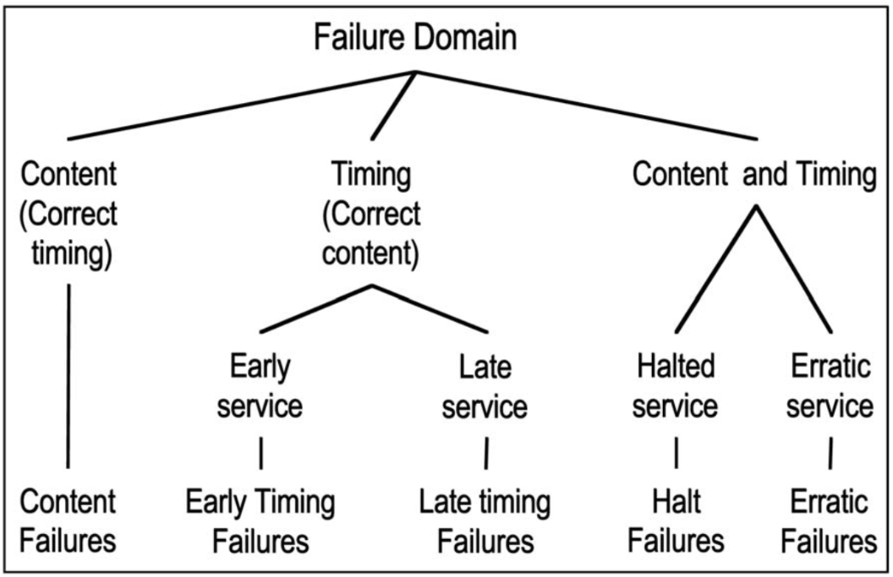
    <div align="center">Fig. 8. ervice failure modes with respect to the failure domainviewpoint.</div>
</p>

&nbsp;탐지 가능성 관점은 사용자 (들)에 대한 서비스 실패 신호를 다룹니다. 서비스 인터페이스에서의 시그널링은 전달 된 서비스의 정확성을 확인하는 시스템의 감지 메커니즘에서 발생합니다. 손실이 감지되고 경고 신호로 신호를 받으면 신호 장애가 발생합니다. 그렇지 않으면 신호가없는 오류입니다. 감지 메커니즘 자체에는 두 가지 오류 모드가 있습니다. 1) 실제로 오류가 발생하지 않았을 때 기능 손실 신호 (잘못된 경보), 2) 기능 손실 신호 없음, 즉 신호없는 오류입니다. 서비스 장애 발생으로 인해 서비스 모드가 감소하면 시스템은 사용자에게 서비스 모드가 저하되었음을 알립니다. 저하 된 모드는 사소한 감소에서 긴급 서비스 및 안전한 종료에 이르기까지 다양합니다.

&nbsp;실패의 일관성으로 인해 시스템에 두 명 이상의 사용자가있을 때 구별 할 수 있습니다:

- 일관된 실패. 잘못된 서비스는 모든 시스템 사용자가 동일하게 인식합니다.
- 일관되지 않은 오류. 일부 또는 모든 시스템 사용자가 다르게 잘못된 서비스를 인식합니다 (일부 사용자는 실제로 올바른 서비스를 인식 할 수 있음). 일관성없는 실패는 일반적으로 [38] 비잔틴 실패 이후에 호출됩니다.

&nbsp;시스템 환경에서 장애의 결과를 등급 화하면 장애 심각도를 정의 할 수 있습니다. 장애 모드는 일반적으로 허용 가능한 최대 발생 확률과 관련된 심각도 수준으로 정렬됩니다. 허용 가능한 발생 확률뿐만 아니라 심각도 수준의 수, 레이블 및 정의는 응용 프로그램과 관련되어 있으며 고려되는 응용 프로그램에 대한 종속성 및 보안 속성을 포함합니다. 고장 심각도 등급을 결정하기위한 기준의 예는 다음과 같습니다.

1. 가용성, 중단 기간;
2. 안전을 위해 인간의 생명이 위험에 처할 가능성;
3. 기밀 유지를 위해 부당하게 공개 될 수있는 정보 유형; 과
4. 무결성, 데이터 손상 정도 및 이러한 손상으로부터 복구 할 수있는 능력.

&nbsp;일반적으로 두 가지 제한 수준은 장애가없는 상태에서 제공되는 서비스가 제공하는 혜택 (경제적 고려 사항에 국한되지 않는 넓은 의미의 용어)과 장애의 결과 간의 관계에 따라 정의 할 수 있습니다.

- 해로운 결과가 올바른 서비스 제공으로 제공되는 혜택과 유사한 비용 인 경미한 오류
- 해로운 결과의 비용이 정확한 서비스 제공으로 제공되는 혜택보다 훨씬 더 높거나 심지어 비교할 수 없을 정도로 높은 치명적인 오류.

&nbsp;그림 9는 서비스 장애 모드를 요약 한 것입니다.

<p align="center">
    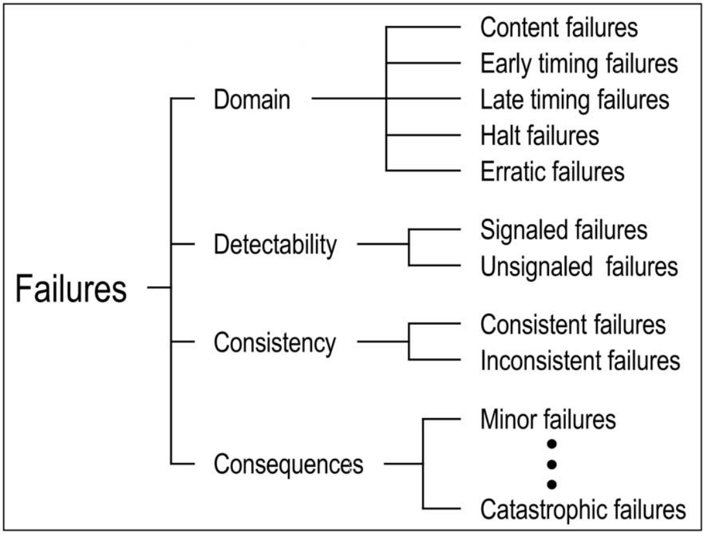
    <div align="center">Fig. 9. Service failure modes.</div>
</p>

&nbsp;신뢰성 및 보안 사양에 설명 된 특정 실패 모드에서만 실패하고 허용 가능한 범위까지만 실패하도록 설계 및 구현 된 시스템은 오류 제어 시스템입니다 (예 : 불규칙한 값을 제공하는 대신 출력이 멈춤, 반대로 침묵). 일관되지 않은 실패와는 대조적으로 일관된 옹알이. 장애가 허용 가능한 범위까지 장애를 중지하는 시스템은 장애 중지 (또는 장애 중지) 시스템입니다. 중단 된 서비스와 침묵의 상황은 각각 페일 패시브 시스템과 페일 사일런트 시스템으로 이어진다 [53]. 허용 가능한 범위 내에서 모든 사소한 오류 인 시스템은 오류 방지 시스템입니다.

&nbsp;섹션 2에 정의 된대로 잘못된 서비스 제공은 서비스가 복원 될 때까지 지속되는 중단입니다. 중단 기간은 장애 발생 후 서비스 복원과 관련된 조치에 따라 크게 달라질 수 있습니다. 1) 자동 또는 운영자 지원 복구, 재시작 또는 재부팅; 2) 수정 유지 보수. 개발 오류 수정 (패치 또는 해결 방법에 의한)은 일반적으로 서비스 복원 후 오프라인으로 수행되며 오류 수정으로 인한 업그레이드 된 구성 요소는 시스템 작동 중단 여부에 관계없이 적절한시기에 도입됩니다. 업그레이드 또는 예방 적 유지 보수를위한 시스템 운영의 선제 적 중단은 계획된 중단이라고도하는 서비스 종료입니다 (실패에 연속적인 중단이 발생하여 계획되지 않은 중단이라고 함).

<br/>

#### 3.3.2 Development Failures

3.1 절에서 언급했듯이 개발 결함은 환경, 특히 인간 개발자, 개발 도구 및 생산 시설에 의해 개발중인 시스템에 도입 될 수 있습니다. 이러한 개발 결함은 부분적 또는 완전한 개발 실패의 원인이 될 수 있으며 사용 단계까지 감지되지 않을 수 있습니다. 완전한 개발 실패로 인해 시스템 사용이 승인되고 서비스가 시작되기 전에 개발 프로세스가 종료됩니다. 개발 실패에는 두 가지 측면이 있습니다.

1. 예산 실패. 할당 된 자금은 시스템이 수락 테스트를 통과하기 전에 소진됩니다.
2. 일정 실패. 예정된 배송 일정은 미래의 시스템이 기술적으로 쓸모 없거나 사용자의 요구에 기능적으로 부적절 할 시점으로 미끄러집니다.

&nbsp;개발 실패의 주요 원인은 다음과 같습니다. 불완전하거나 잘못된 사양, 사용자가 시작한 과도한 수의 사양 변경 기능 및 / 또는 성능 목표와 관련하여 부적절한 디자인; 너무 많은 개발 결함; 부적절한 결함 제거 기능; 불충분 한 신뢰성 또는 보안에 대한 예측; 개발 비용의 잘못된 추정. 모두 일반적으로 개발할 시스템의 복잡성을 과소 평가하기 때문입니다.

&nbsp;부분 개발 실패에는 두 가지 종류가 있습니다. 즉, 프로젝트 종료보다 심각도가 낮은 실패입니다. 예산 또는 일정 초과는 개발이 완료되었지만 노력을 완료하는 데 필요한 자금 또는 시간이 원래 예상치를 초과 할 때 발생합니다. 부분적인 개발 실패의 또 다른 형태는 다운 그레이드입니다. 개발 된 시스템은 기능이 적거나 성능이 저하되거나 원래 시스템 사양에서 요구했던 것보다 낮은 신뢰성 또는 보안을 가질 것으로 예상됩니다.

&nbsp;개발 실패, 오버런 및 다운 그레이드는 사용자 커뮤니티에 매우 부정적인 영향을 미칩니다. 예를 들어 대규모 소프트웨어 프로젝트에 대한 통계 [34] 또는 AAS 시스템의 전체 개발 실패 분석에서 $ 1.5를 낭비했습니다. 10 억 [67].

<br/>

#### 3.3.3 Dependability and Security Failures

다양한 종류의 결함이 사용 단계에서 시스템에 영향을 미칠 것으로 예상됩니다. 결함으로 인해 허용 할 수 없을 정도로 성능이 저하되거나 지정된 서비스를 제공하지 못할 수 있습니다. 이러한 이유로 가용성, 신뢰성, 안전성, 신뢰성, 무결성 및 유지 보수 가능성과 같은 각 속성에 대한 목표를 설명하는 신뢰성 및 보안 사양에 동의합니다.

&nbsp;사양은 예상되는 오류 클래스와 시스템이 작동 할 사용 환경을 명시 적으로 식별합니다. 또한 사양에는 바람직하지 않거나 위험한 특정 조건에 대한 보호 장치가 필요할 수 있습니다. 또한 사용자는 특정 결함 방지 또는 결함 허용 기술을 포함해야 할 수 있습니다.

&nbsp;의존성 또는 보안 실패는 주어진 시스템이 수용 가능한 것보다 더 자주 또는 더 심각하게 서비스 실패를 겪을 때 발생합니다.

&nbsp;신뢰성 및 보안 사양에는 오류도 포함될 수 있습니다. 누락 오류는 사용 환경에 대한 설명이나 방지 또는 허용 할 오류 등급을 선택할 때 발생할 수 있습니다. 또 다른 종류의 결함은 개발 비용을 높이고 비용 초과 또는 개발 실패로 이어질 수있는 하나 이상의 속성에 대해 매우 높은 요구 사항을 부당하게 선택하는 것입니다. 예를 들어, 1994 년의 새로운 계약에 대해 초기 AAS 완전 중단 제한 인 연간 3 초가 연간 5 분으로 변경되었습니다 [67].

<br/>

#### 3.4 Errors

2.2 절에서 오류는 오류로 이어질 수있는 시스템의 전체 상태의 일부로 정의되었습니다. 오류로 인해 전달 된 서비스가 올바른 서비스에서 벗어날 때 오류가 발생합니다. 오류의 원인을 오류라고합니다.

&nbsp;오류 메시지 또는 오류 신호로 표시되면 오류가 감지됩니다. 존재하지만 감지되지 않은 오류는 잠재적 오류입니다.

&nbsp;시스템은 상호 작용하는 구성 요소 집합으로 구성되므로 전체 상태는 구성 요소 상태 집합입니다. 정의는 오류가 원래 하나 이상의 구성 요소 상태 내에서 오류를 유발하지만 해당 구성 요소의 외부 상태가 시스템의 외부 상태에 속하지 않는 한 서비스 오류가 발생하지 않음을 의미합니다. 오류가 구성 요소의 외부 상태의 일부가 될 때마다 해당 구성 요소의 서비스 오류가 발생하지만 오류는 전체 시스템 내부에 남아 있습니다.

&nbsp;오류가 실제로 서비스 실패로 이어질지 여부는 다음 두 가지 요인에 따라 다릅니다:

1. 시스템의 구조, 특히 시스템에 존재하는 중복의 특성 :
   - 내결함성을 제공하기 위해 도입 된 보호 중복성, 이는 오류가 서비스 실패로 이어지는 것을 방지하기위한 것입니다.
   - 의도하지 않은 중복성 (실제로는 어떤 형태의 중복성없이 시스템을 구축하는 것이 불가능하지는 않더라도 어렵습니다)은 의도적 인 중복성과 동일한 결과를 가져올 수 있습니다.
2. 시스템의 동작: 오류가 포함 된 상태 부분은 서비스에 절대 필요하지 않거나 오류로 이어지기 전에 오류가 제거 될 수 있습니다 (예 : 덮어 쓰기).

&nbsp;오류의 편리한 분류는 섹션 3.3.1 : 콘텐츠 대 타이밍 오류, 감지 된 오류 대 잠재 오류, 서비스가 2 개 또는 2 개로 이동할 때 일관된 오류와 일관되지 않은 오류의 용어를 사용하여 발생하는 기본 서비스 실패 측면에서 오류를 설명하는 것입니다. 더 많은 사용자, 사소한 오류 대 치명적인 오류. 오류 제어 코드 분야에서 콘텐츠 오류는 손상 패턴 (단일, 이중, 삼중, 바이트, 버스트, 삭제, 산술, 트랙 등)에 따라 더 세분화됩니다.

&nbsp;일부 결함 (예 : 전자파 폭발)은 둘 이상의 구성 요소에서 동시에 오류를 일으킬 수 있습니다. 이러한 오류를 여러 관련 오류라고합니다. 단일 오류는 하나의 구성 요소에만 영향을 미치는 오류입니다.

<br/>

#### 3.5 The Pathology of Failure: Relationship between Faults, Errors, and Failures

오류, 오류 및 실패의 생성 및 표시 메커니즘은 그림 10에 설명되어 있으며 다음과 같이 요약됩니다:

<p align="center">
    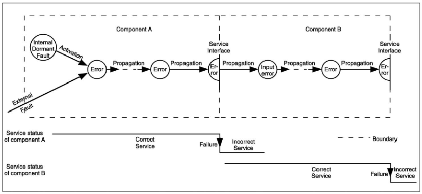
    <div align="center">Fig. 10. Error propagation.</div>
</p>

1. 오류가 발생하면 오류가 활성화됩니다. 그렇지 않으면 휴면 상태입니다. 활성 오류는 1) 이전에 휴면 상태 였고 계산 프로세스 또는 환경 조건에 의해 활성화 된 내부 오류 또는 2) 외부 오류입니다. 오류 활성화는 휴면 오류를 활성화시키는 구성 요소에 입력 (활성화 패턴)을 적용하는 것입니다. 대부분의 내부 결함은 휴면 상태와 활성 상태 사이를 순환합니다.
2. 주어진 구성 요소 내에서 오류 전파 (즉, 내부 전파)는 계산 프로세스에 의해 발생합니다. 오류는 연속적으로 다른 오류로 변환됩니다. A 컴포넌트에서 A에서 서비스를받는 컴포넌트 B 로의 오류 전파 (즉, 외부 전파)는 내부 전파를 통해 컴포넌트 A의 서비스 인터페이스에 오류가 도달했을 때 발생한다. 이때 A가 B에게 전달한 서비스가 부정확하게되고, A의 후속 서비스 실패는 B에 외부 결함으로 나타나고 사용 인터페이스를 통해 B로 오류를 전파합니다.
3. 서비스 실패는 오류가 서비스 인터페이스에 전파되어 시스템에서 제공하는 서비스가 올바른 서비스에서 벗어나게하는 경우 발생합니다. 구성 요소의 오류로 인해 구성 요소가 포함 된 시스템에 영구적 또는 일시적인 오류가 발생합니다. 시스템의 서비스 실패는 주어진 시스템에서 서비스를받는 다른 시스템에 영구적이거나 일시적인 외부 오류를 유발합니다.

&nbsp;이러한 메커니즘을 통해 그림 11에 표시된 것처럼 "위협 체인"이 완료 될 수 있습니다.이 체인의 화살표는 결함, 오류 및 실패 간의 인과 관계를 나타냅니다. 일반적으로 해석되어야합니다. 전파에 의해 실패가 발생하기 전에 여러 오류가 생성 될 수 있습니다. 위에 나열된 메커니즘에서 전파, 따라서이 체인의 인스턴스화가 구성 요소 또는 시스템 간의 상호 작용, 구성 요소를 시스템으로 구성, 시스템 생성 또는 수정을 통해 발생할 수 있음을 강조할 가치가 있습니다.

<p align="center">
    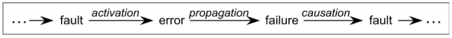
    <div align="center">Fig. 11. The fundamental chain of dependability and security threats.</div>
</p>

&nbsp;결함 병리의 몇 가지 예시적인 예가 그림 12에 나와 있습니다. 이러한 예에서 결함 휴면 상태는 결함, 주어진 시스템의 활용도 등에 따라 상당히 달라질 수 있음을 쉽게 이해할 수 있습니다.

<p align="center">
    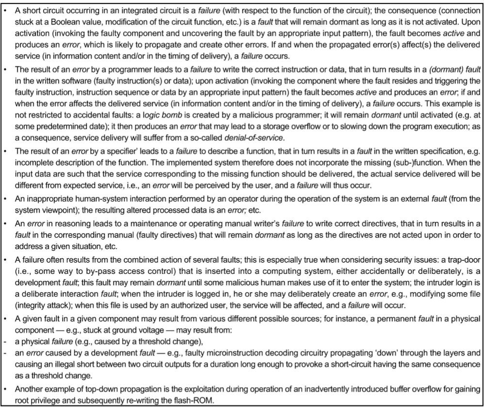
    <div align="center">Fig. 12. Examples illustrating fault pathology.</div>
</p>

&nbsp;하나 이상의 오류를 일으킨 오류의 활성화 패턴을 식별하는 능력은 오류 활성화 재현성입니다. 결함은 활성화 재현성에 따라 분류 할 수 있습니다. 활성화가 재현 가능한 결함을 솔리드 또는 하드 결함이라고하는 반면, 활성화가 체계적으로 재현 할 수없는 결함은 파악하기 어렵거나 부드러운 결함입니다. 크고 복잡한 소프트웨어에 남아있는 대부분의 개발 결함은 파악하기 어려운 결함입니다. 활성화 조건이 내부 상태와 외부 요청의 복잡한 조합에 의존 할 정도로 충분히 복잡합니다. 드물게 발생하고 재현하기 매우 어려울 수 있습니다 [23]. 파악하기 어려운 결함의 다른 예는 다음과 같습니다:

- 반도체 메모리의 "패턴에 민감한"결함, 하드웨어 구성 요소의 매개 변수 변경 (온도 변화의 영향, 기생 정전 용량으로 인한 타이밍 지연 등).
- 시스템 부하가 특정 수준을 초과 할 때 발생하는 하드웨어 또는 소프트웨어에 영향을 미치는 조건 (예 : 한계 타이밍 및 동기화).

&nbsp;파악하기 어려운 개발 결함과 일시적인 물리적 결함의 표현의 유사성은 두 클래스가 간헐적 결함으로 함께 그룹화되도록합니다. 간헐적 인 오류로 인해 발생하는 오류를 일반적으로 소프트 오류라고합니다. 그림 13은 이 논의를 요약합니다.

<p align="center">
    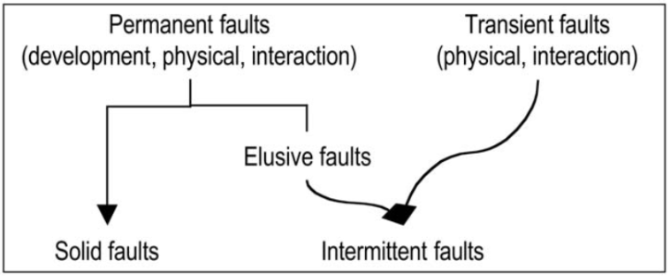
    <div align="center">Fig. 13. Solid versus intermittent faults.</div>
</p>

&nbsp;여러 오류 및 / 또는 오류와 관련된 상황이 자주 발생합니다. 시스템 오류는 나중에 여러 가지 공존 오류로 인한 오류로 인해 발생하는 것으로 나중에 확인되는 경우가 많습니다. 경계가 정의 된 시스템에서 단일 결함은 하나의 불리한 물리적 이벤트 또는 하나의 유해한 인간 행동으로 인해 발생하는 결함입니다. 다중 오류는 두 개 이상의 동시, 중복 또는 순차적 단일 오류로 그 결과, 즉 오류, 시간 중첩, 즉 이러한 오류로 인한 오류가 시스템에 동시에 존재합니다. 다중 결함을 고려하면 1) 다른 원인에 기인하는 독립적 인 결함과 2) 공통 원인에 기인하는 관련 결함을 구별하게됩니다. 관련 오류는 일반적으로 유사한 오류, 즉 어떤 감지 메커니즘을 사용하든 구별 할 수없는 오류를 유발하는 반면 독립적 오류는 일반적으로 별개의 오류를 유발합니다. 그러나 독립적 인 오류 (특히 누락)가 유사한 오류로 이어 지거나 [6] 관련 오류가 뚜렷한 오류로 이어질 수 있습니다. 유사한 오류로 인한 오류는 공통 모드 오류입니다.

&nbsp;"위협", "오류", "오류"및 "실패"라는 단어 또는 레이블에 대한 세 가지 추가 설명:

1. 일반적으로 결함, 오류 및 실패를 지칭하는 위협의 사용은 일반적으로 잠재적 인 개념을 유지하는 보안에서 일반적인 사용보다 더 넓은 의미를 갖습니다. 우리의 용어로는 이러한 잠재적 측면 (예 : 아직 활성화되지 않은 오류, 서비스 장애에 대한 의존성 손상 없음) 및 실현 측면 (예 : 활성 오류, 존재하는 오류, 발생하는 서비스 오류)이 모두 있습니다. 보안 측면에서 악의적 인 외부 결함은 공격입니다.
2. 이 문서에서 오류, 오류 및 실패를 독점적으로 사용한다고해서 특정 위협 등급을 간략하고 분명하게 지정하는 특수한 상황에서의 사용이 배제되지는 않습니다. 이는 특히 오류 (예 : 버그, 결함, 결함, 결함, 정오표) 및 오류 (예 : 고장, 오작동, 서비스 거부)에 적용됩니다.
3. 특정 용어의 오류, 오류 및 실패로 이루어진 할당은 1) 오류 방지, 허용 오차 및 진단, 2) 오류 감지 및 수정, 3) 오류율과 같은 일반적인 사용을 단순히 고려합니다.

<br/>

### 4 Dependability, Security, And Their Attributes

#### 4.1  The Definitions of Dependability and Security

2.3 절에서 우리는 의존성의 두 가지 대체 정의를 제시했습니다:

- 원래 정의 : 정당하게 신뢰할 수있는 서비스를 제공하는 능력.

- 대체 정의 : 허용 가능한 것보다 더 자주 또는 더 심각한 서비스 장애를 피하는 시스템의 능력.

&nbsp;원래의 정의는 가용성, 신뢰성, 안전성, 무결성, 유지 보수성 등의보다 고전적인 개념을 일반화 한 다음 신뢰성의 속성이되는 것을 목표로하는 일반적인 정의입니다. 의존성의 대체 정의는 다음과 같은 주장에서 비롯됩니다. 시스템은 실패 할 수 있으며 일반적으로 실패합니다. 그러나 여전히 신뢰할 수 있습니까? 언제 뗄 수없는 일이됩니까? 따라서 대체 정의는 서비스 장애에도 불구하고 시스템이 여전히 신뢰할 수있는 것으로 간주되는지 여부를 결정하는 기준을 제공합니다. 또한, 그 정의에서 직접 추론 한 의존성 실패 개념은 개발 실패와의 연결을 설정할 수 있게 합니다.

&nbsp;현재 표준에 존재하는 신뢰성의 정의는 우리의 정의와 다릅니다. 두 가지 다른 정의는 다음과 같습니다:

- "가용성 성능과 그 영향 요인을 설명하는 데 사용되는 총칭 : 신뢰성 성능, 유지 보수 성능 및 유지 보수 지원 성능"[31].
- "정의 된 기간 동안 또는 주어진 시간에 정의 된 운영 및 환경 조건 하에서 시스템 작업을 배타적이고 정확하게 수행하기 위해 시스템이 신뢰할 수있는 정도"[29].

&nbsp;ISO 정의는 명확하게 가용성에 중점을 둡니다. 이 정의는 전화 운영 회사의 주요 관심사가 가용성이었던 당시 전화 통신에 대한 국제기구 인 CCITT [11]가 제공 한 정의로 거슬러 올라갈 수 있기 때문에 놀라운 일이 아닙니다. 그러나 일반적인 특성에 대한 신뢰성을 부여하려는 의지는 주목할 만합니다. 일반적으로 정의 된 가용성을 넘어서 신뢰성 및 유지 보수 가능성과 관련되기 때문입니다. 이 점에서 ISO / CCITT 정의는 "필요할 때 시스템이 작동 할 확률"이라는 신뢰성에 대해 [26]에 제공된 정의와 일치합니다. [29]의 두 번째 정의는 신뢰의 개념을 도입하고 있으므로 우리의 정의에 훨씬 더 가깝습니다.

&nbsp;보안 세계의 용어는 그 자체로 풍부한 역사를 가지고 있습니다. 컴퓨터 보안, 통신 보안, 정보 보안 및 정보 보증은 보안 연구자 및 실무자 커뮤니티에서 오랫동안 개발 및 사용되어 왔으며 대부분의 경우 신뢰성에 대한 직접적인 언급이 없습니다. 그럼에도 불구하고 이러한 모든 용어는 기밀성, 무결성 및 가용성이라는 세 가지 주요 보안 속성의 관점에서 이해할 수 있습니다.

&nbsp;보안은 신뢰성의 단일 속성으로 특성화되지 않았습니다. 이것은“기밀성의 조합, 정보의 무단 공개 방지, 무결성, 정보의 무단 수정 또는 삭제 방지, 그리고 가용성, 정보의 무단 보류 방지”[12], [52]. 보안에 대한 통합 정의는 시스템 상태에 대한 무단 액세스 또는 처리가 없다는 것입니다. 신뢰성과 보안 사이의 관계는 그림 14, 즉 그림 1을 개선 한 그림에 나와 있습니다.

<p align="center">
    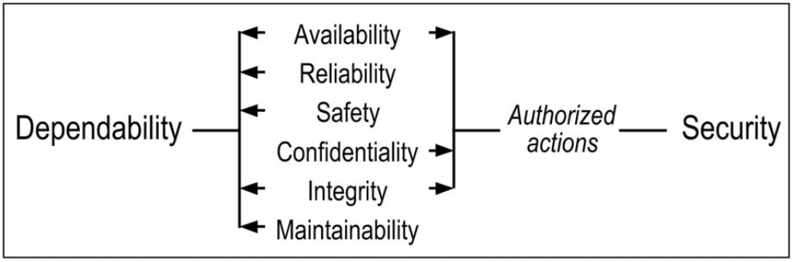
    <div align="center">Fig. 14. Relationship between dependability and security.</div>
</p>

<br/>

#### 4.2  Dependence and Trust

2.3 절에서 의존과 신뢰의 개념을 소개했습니다:

- 시스템 B에 대한 시스템 A의 의존성은 시스템 A의 의존성이 시스템 B의 의존성에 영향을받는 (또는 영향을받을) 정도를 나타냅니다.

- 신뢰는 받아 들여지는 의존입니다.

&nbsp;다른 시스템에 대한 시스템의 종속성은 완전한 독립성 (B가 A를 실패하게 할 수 없음)까지 전체 종속성 (B가 실패하면 A가 실패 함)과 다를 수 있습니다. B의 신뢰성이 A의 필수 신뢰성에 충분하지 않다고 믿을만한 이유가있는 경우 전자를 강화하거나 A의 의존성을 줄이거 나 추가 내결함성 수단을 제공해야합니다. 의존성에 대한 우리의 정의는 [50], [14]에 따라 달라지며, 그 정의는 a의 정의가 a의 서비스 제공의 정확성을 위해 b의 서비스 제공의 정확성이 필요한 경우 구성 요소 b에 의존합니다. 그러나이 관계는 신뢰성이 아니라 정확성이라는 더 좁은 개념으로 표현되므로 이진법 일 뿐인 반면, 의존성 개념은 측정 가능한 공간에서 값을 취할 수 있습니다.

&nbsp;수용된 의존성이란이 의존성 수준이 수용 가능하다는 판단과 관련이있는 의존성 (예 : A on B)을 의미합니다. B에 대한 그러한 판단 (A에 의해 또는 A를 대신하여 내림)은 아마도 명시적일 수 있으며 A와 B 사이의 계약에 명시되어있을 수도 있지만 암묵적 일 수도 있고 생각하지 않을 수도 있습니다. 실제로 A는 B를 신뢰하는 것 외에 다른 대안이 없다는 점에서 기피 할 수도 있습니다. 따라서 A가 B를 신뢰하는 한, B의 실패에 대한 책임을지는 것, 즉 허용 수단을 제공 할 필요가 없습니다 ( 이것이 가능한지에 대한 질문은 또 다른 문제입니다). 사실 A가 B의 실패를 견딜 수있는 수단을 제공하지 못하는 정도는 B에 대한 A (아마도 생각하지 않거나 원하지 않는) 신뢰의 척도입니다.

<br/>

#### 4.3  The Attributes of Dependability and Security

2.3 절에 정의 된 신뢰성과 보안의 속성은 주어진 컴퓨팅 시스템을 위해 의도 된 애플리케이션에 따라 다양하게 중요 할 수 있습니다. 애플리케이션에 따라 다양하지만 일반적으로 가용성, 무결성 및 유지 보수 가능성이 필요합니다. , 신뢰성, 안전 및 기밀성은 애플리케이션에 따라 요구 될 수도 있고 필요하지 않을 수도 있습니다. 시스템이 신뢰성과 보안의 속성을 보유하는 정도는 절대적이고 결정적인 의미가 아닌 상대적이고 확률 적이며 의미에서 고려되어야합니다. 피할 수없는 오류의 존재 또는 발생으로 인해 시스템은 절대적으로 사용 가능하고 신뢰할 수 없습니다. , safe 또는 secure.

&nbsp;무결성에 대해 제공된 정의 (부적절한 시스템 상태 변경 없음)는 1) 승인 된 작업의 개념에만 관련되고 2) 정보에 초점을 맞춘 일반적인 정의 (예 : 승인되지 않은 수정 또는 삭제 방지)를 뛰어 넘습니다. 정보 [12], 승인 된 데이터 변경에 대한 보증 [33]) : 1) 시스템이 인증 정책을 구현할 때 당연히 "부적절"은 "승인되지 않음"을 포함하고, 2) "부적절한 변경"은 업그레이드를 방지하는 조치를 포함합니다. 3) "시스템 상태"에는 시스템 수정 또는 손상이 포함됩니다.

&nbsp;유지 보수 가능성에 대해 제공된 정의는 의도적으로 시정 및 예방 유지 보수를 넘어서며 섹션 3에 정의 된 다른 형태의 유지 보수, 즉 적응 및 증강 유지 보수를 포함합니다. 자율 컴퓨팅의 개념 [22]은 관리 자동화를 통해 대규모 네트워크 컴퓨터 시스템에 높은 유지 보수성을 제공하는 것을 주요 목표로합니다.

&nbsp;섹션 2에서 정의하고 위에서 논의한 속성 외에도 다른 보조 속성을 정의 할 수 있습니다. 이는 섹션 2에 정의 된대로 기본 속성을 구체화하거나 전문화합니다. 특수 보조 속성의 예는 견고성입니다. 즉, 외부에 대한 신뢰성입니다. 특정 등급의 결함에 대한 시스템 반응을 특징으로하는 결함.

&nbsp;2 차 속성의 개념은 특히 보안과 관련이 있으며 다양한 유형의 정보를 구별하는 데 기반을두고 있습니다 [9]. 이러한 보조 속성의 예는 다음과 같습니다:

- 책임 : 작업을 수행 한 사람의 신원에 대한 가용성 및 무결성;
- 진위성 : 메시지 내용 및 출처의 무결성, 그리고 가능한 경우 방출 시간과 같은 다른 정보의 무결성;
- nonrepudiability : 메시지 발신자 (발신자 부인 방지) 또는 수신자 (수신 부인 방지)의 신원 가용성 및 무결성.

&nbsp;보안 정책의 개념은 예를 들어 조직이나 컴퓨터 시스템이 준수해야하는 보안 동기 제약 집합의 개념입니다 [47]. 이러한 제약의 시행은 기술, 관리 및 / 또는 운영 통제를 통해 이루어질 수 있으며 정책은 이러한 통제가 시행되는 방법을 규정 할 수 있습니다. 따라서 실제로 보안 정책은 (부분) 시스템 사양이며 준수하지 않으면 보안 실패로 간주됩니다. 실제로 시스템 계층과 관련된 보안 정책의 계층이있을 수 있습니다 (예 : 전체 회사, 정보 시스템 부서,이 부서의 개인 및 컴퓨터 시스템). 관련 정책이나 전체 정책 문서의 별도 부분이 다른 보안 문제 (예 : 회사 컴퓨터에 대한 물리적 및 네트워크 액세스에 대한 회사 정보의 통제 된 공개 공개에 관한 정책)와 관련하여 별도로 생성 될 수 있습니다. 일부 컴퓨터 보안 정책에는 시스템 내에서 정보가 어떻게 흐르는 지에 대한 제약과 시스템 상태에 대한 제약이 포함됩니다.

&nbsp;모든 신뢰성 및 보안 사양과 마찬가지로 완전성, 일관성 및 정확성 문제가 매우 중요합니다. 따라서 보안 정책을 공식적으로 표현하고 분석하는 방법에 대한 광범위한 연구가 진행되었습니다. 그러나 일부 시스템 활동이 관련 보안 정책을 위반하는 것으로 확인되면 시스템 사양과 마찬가지로 보안 실패는 시스템의 실패이거나 정책이 의도 된 보안 요구 사항을 적절하게 설명하지 않기 때문일 수 있습니다. 일부 특정 동작을 안전하지 않은 것으로 지정하지 않아 결함이있는 것으로 입증 된 만족스러운 보안 정책의 잘 알려진 예가 [44]에서 논의됩니다.

&nbsp;신뢰성 및 보안 등급은 일반적으로 특정 애플리케이션에 대해 우려되는 속성에 대한 장애 빈도 및 심각도, 중단 기간 분석을 통해 정의됩니다. 이 분석은 위험 평가를 통해 직접 또는 간접적으로 수행 될 수 있습니다 (예 : 가용성은 [25], 안전은 [58], 보안은 [32] 참조).

&nbsp;다양한 속성에 대한 강조점의 차이는 결과 시스템을 신뢰할 수 있고 안전하게 만들기 위해 사용할 기술 (결함 방지, 허용, 제거 및 예측)의 균형에 직접적인 영향을줍니다. 이 문제는 일부 속성 (예 : 가용성 및 안전성, 가용성 및 기밀성)이 상충되어 트레이드 오프가 필요하기 때문에 더욱 어렵습니다.

<br/>

#### 4.4  Dependability, High Confidence, Survivability, and Trustworthiness

높은 신뢰도, 생존 가능성 및 신뢰성과 같은 신뢰성과 유사한 다른 개념이 있습니다. 그것들은 그림 15에 제시되고 신뢰성과 비교됩니다. 나란히 비교하면 네 가지 개념 모두 본질적으로 목표가 동일하고 유사한 위협을 처리한다는 결론을 내릴 수 있습니다.

<p align="center">
    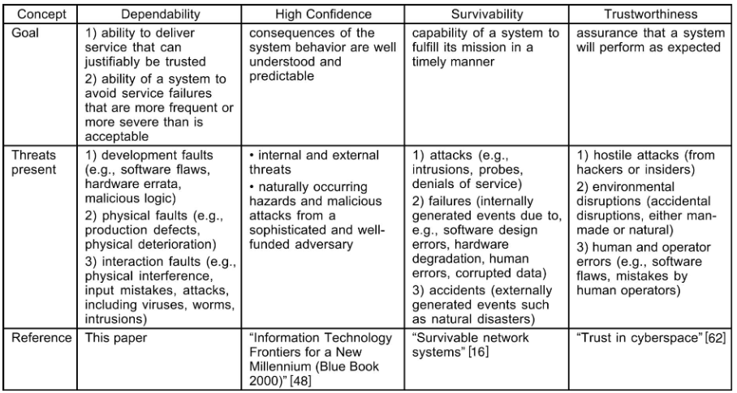
    <div align="center">Fig. 15. Dependability, high confidence, survivability, and trustworthiness.</div>
</p>

<br/>

### 5 The Means To Attain Depenability And Security

이 섹션에서는 장애 예방, 내결함성, 장애 제거 및 장애 예측을 차례로 살펴 봅니다. 이 섹션은 이러한 다양한 수단 간의 관계에 대한 논의로 끝납니다.

<br/>

#### 5.1  Fault Prevention

오류 방지는 일반 엔지니어링의 일부이므로 여기서는 그다지 강조하지 않습니다. 그러나 신뢰성 및 보안과 관련하여 직접적인 관심이 있고 섹션 3.2에 정의 된 오류 등급에 따라 논의 할 수있는 오류 방지 측면이 있습니다.

&nbsp;개발 오류 방지는 소프트웨어 (예 : 정보 숨김, 모듈화, 강력한 형식의 프로그래밍 언어 사용) 및 하드웨어 (예 : 설계 규칙) 모두에 대한 개발 방법론의 명백한 목표입니다. 생산 된 시스템에 도입 된 결함의 수를 줄이기위한 개발 프로세스의 개선은 제품의 결함 기록과 프로세스 수정을 통한 결함의 원인 제거에 기반한다는 점에서 한 단계 더 나아갑니다. [13], [51].

<br/>

#### 5.2  Fault Tolerance

#### 5.2.1 Fault Tolerance Techniques

장애 방지를 목표로하는 내결함성 [3]은 오류 감지 및 시스템 복구를 통해 수행됩니다. 그림 16은 내결함성과 관련된 기술을 보여줍니다.

<p align="center">
    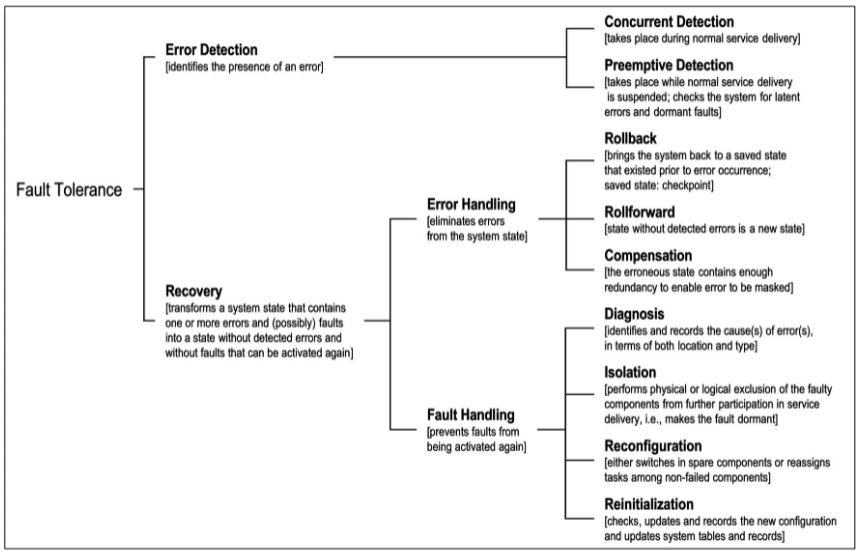
    <div align="center">Fig. 16. Fault tolerance techniques.</div>
</p>

&nbsp;일반적으로 오류 처리 다음에는 오류 처리로 격리 된 오류를 제거하기위한 수정 유지 관리가 뒤 따릅니다. 즉, 내결함성을 유지 관리와 구별하는 요소는 유지 관리에 외부 에이전트의 참여가 필요하다는 것입니다. 폐쇄 형 시스템은 오류 제거를 실제로 구현할 수없는 시스템입니다 (예 : 딥 스페이스 프로브의 하드웨어).

&nbsp;롤백 및 롤 포워드는 오류 감지가 발생한 후 요청시 호출되는 반면, 보상은 (감지 된) 오류의 유무에 관계없이 미리 결정된 시간 또는 이벤트에 요청시 또는 체계적으로 적용될 수 있습니다. 요청시 오류 처리 후 함께 오류 처리가 시스템 복구를 구성합니다. 따라서 내결함성을위한 해당 전략의 이름 : 오류 감지 및 시스템 복구 또는 단순히 감지 및 복구.

&nbsp;결함 마스킹 또는 단순히 마스킹은 보상의 체계적인 사용으로 인해 발생합니다. 이러한 마스킹은 보호 중복성의 점진적이며 결국 치명적인 손실을 감추게됩니다. 따라서 마스킹의 실제 구현에는 일반적으로 오류 감지 (및 가능한 오류 처리)가 포함되어 마스킹 및 복구로 이어집니다.

&nbsp;주목할 점 :

1. 롤백과 롤 포워드는 상호 배타적이지 않습니다. 롤백이 먼저 시도 될 수 있습니다. 오류가 지속되면 롤 포워드를 시도 할 수 있습니다.
2. 간헐적 인 오류로 인해 격리 또는 재구성이 필요하지 않습니다. 오류 처리 (오류 재발은 오류가 간헐적이지 않음을 나타냄) 또는 롤 포워드가 사용되는 경우 오류 진단을 통해 오류가 간헐적인지 여부를 식별 할 수 있습니다.
3. 오류 처리를 시도하지 않고도 오류 처리가 오류 감지에 바로 이어질 수 있습니다.

&nbsp;선제적 오류 감지 및 처리 후 오류 처리가 일반적으로 시스템 전원을 켤 때 수행됩니다. 또한 작동 중에 예비 검사, 메모리 스크러빙, 감사 프로그램 또는 소위 소프트웨어 재생 [27]과 같은 다양한 형태로 작동하면서 소프트웨어 노화의 영향이 실패로 이어지기 전에 제거하는 것을 목표로합니다.

&nbsp;그림 17은 내결함성을 구현하기 위해 확인 된 다양한 전략에 대한 네 가지 일반적인 및 개략적 인 예를 제공합니다.

<p align="center">
    
    <div align="center">Fig. 17. Examples for the basic strategies for implementing fault tolerance.</div>
</p>

<br/>

#### 5.2.2 Implementation of Fault Tolerance

오류 감지, 오류 처리 및 오류 처리 기술의 선택과 그 구현은 기본 오류 가정과 직접 관련이 있으며 그에 크게 의존합니다. 실제로 허용 할 수있는 오류 클래스는 오류 가정에 따라 다릅니다. 이는 개발 프로세스에서 고려되고 있으므로 오류 생성 및 활성화 프로세스와 관련하여 중복성의 독립성에 의존합니다. 내결함성을 달성하는 (일반적으로 사용되는) 방법은 여러 채널을 통해 순차적으로 또는 동시에 여러 계산을 수행하는 것입니다. 물리적 결함에 대한 허용 오차가 예상되면 하드웨어 구성 요소가 독립적으로 실패한다는 가정에 따라 채널이 동일한 디자인 일 수 있습니다. 이러한 접근 방식은 롤백을 통해 파악하기 어려운 개발 오류에 적합한 것으로 입증되었습니다 [23], [28]; 그러나 견고한 개발 결함의 허용 범위에는 적합하지 않습니다. 채널이 별도의 설계 및 구현을 통해 동일한 기능을 구현해야합니다 [57], [4], 즉 설계 다양성 [6].

&nbsp;동시 오류 감지 메커니즘과 함께 필요한 기능 처리 기능의 구성 요소 내에서 제공하면 하드웨어 또는 소프트웨어에서 자체 검사 구성 요소라는 개념이 생깁니다. 자가 점검 구성 요소 접근 방식의 중요한 이점 중 하나는 오류 제한 영역을 명확하게 정의 할 수 있다는 것입니다 [63].

&nbsp;모든 내결함성 기술이 똑같이 효과적인 것은 아님이 분명합니다. 주어진 내결함성 기술의 효과 측정을 적용 범위라고합니다. 내결함성의 불완전 성, 즉 내결함성 범위의 부족은 얻을 수있는 신뢰성의 증가에 심각한 제한을 구성합니다. 내결함성의 이러한 불완전 성 (그림 18)은

<p align="center">
    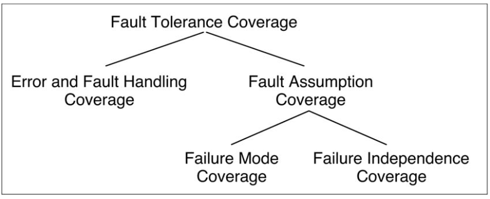
    <div align="center">Fig. 18. Fault tolerance coverage.</div>
</p>

1. 개발 중에 명시된 결함 가정과 관련하여 결함 허용 메커니즘에 영향을 미치는 개발 결함, 그 결과 오류 및 결함 처리 범위 (예 : 단일 오류의 클래스와 관련하여 정의 됨)가 부족합니다. , 오류 또는 결함이 발생한 경우 기술이 효과적 일 수있는 조건부 확률로 고정 된 결함 등) 또는
2. 작동 중에 실제로 발생하는 오류와 다른 오류 가정으로 인해 오류 가정 범위의 부족이 발생하며 이는 1) 가정 한대로 작동하지 않는 고장난 구성 요소, 즉 오류의 부족으로 인해 발생할 수 있습니다. 모드 적용 범위 또는 2) 독립된 오류를 가정 할 때 공통 모드 오류의 발생, 즉 오류 독립 범위의 부족입니다.

&nbsp;오류 및 오류 처리 범위의 부족은 신뢰성 향상에 큰 한계가되는 것으로 나타났습니다 [8], [1]. 유사한 효과는 장애 모드 적용 범위의 부족으로 인해 발생할 수 있습니다. 보수적 인 장애 가정 (예 : 비잔틴 장애)은 중복성 및 더 복잡한 내결함성 메커니즘의 증가를 필요로하는 대신 더 높은 장애 모드 적용 범위를 초래할 수 있습니다. 시스템 의존성 및 보안의 전반적인 감소 [54].

&nbsp;여러 구성 요소의 활동 조정에서 중요한 문제는 오류 전파가 실패하지 않은 구성 요소의 작동에 영향을 미치는 것을 방지하는 것입니다. 이 문제는 특정 구성 요소가 일부 정보를 다른 구성 요소와 통신해야 할 때 특히 중요합니다. 이러한 단일 소스 정보의 일반적인 예는 로컬 센서 데이터, 로컬 시계의 값, 다른 구성 요소의 상태에 대한 로컬보기 등입니다. 이로 인해 한 구성 요소에서 다른 구성 요소로 단일 소스 정보를 전달해야합니다. 구성 요소는 실패하지 않은 구성 요소가 획득 한 정보를 상호 일관된 방식으로 사용하는 방법에 대한 합의에 도달해야한다는 것입니다. 이것은 합의 문제로 알려져 있습니다 [43].

&nbsp;내결함성은 (또한) 재귀 적 개념입니다. 내결함성을 구현하는 메커니즘은 영향을 미칠 수있는 결함으로부터 보호되어야합니다. 이러한 보호의 예로는 유권자 복제, 자체 검사 검사기, 복구 프로그램 및 데이터를위한 "안정적인"메모리가 있습니다.

&nbsp;내결함성의 체계적인 도입은 종종 내결함성에 특화된 지원 시스템 (예 : 소프트웨어 모니터, 서비스 프로세서, 전용 통신 링크)을 추가하여 용이하게합니다.

&nbsp;반사, 객체 또는 소프트웨어 구성 요소의 모든 관련 작업을 투명하고 적절하게 보강하는 기술, 예를 들어 필요한 경우 이러한 작업을 취소 할 수 있도록하기 위해 객체 지향 소프트웨어 및 미들웨어 제공을 통해 사용할 수 있습니다 [17].

&nbsp;내결함성은 모든 종류의 결함에 적용됩니다. 침입에 대한 보호는 전통적으로 암호화와 방화벽을 포함합니다. 일부 오류 감지 메커니즘은 악의적이지 않은 오류와 악의적 인 오류 (예 : 메모리 액세스 보호 기술) 모두를 대상으로합니다. 침입 탐지는 일반적으로 가능성 검사를 통해 수행됩니다 [18], [15]. 다음을 허용하기위한 접근법과 계획이 제안되었습니다:

- 정보 단편화 및 분산을 통한 침입 및 물리적 결함 [20], [56],
- 악성 로직,보다 구체적으로는 제어 흐름 검사 [35] 또는 설계 다양성 [36]을 통해 바이러스에
- 서버 다양성을 통한 침입, 악의적 인 논리, 물리적 또는 개발 결함으로 인한 취약성 [68].

&nbsp;마지막으로, 1) 내결함성에 대해 몇 가지 동의어가 존재한다는 점을 언급 할 가치가 있습니다.자가 수리,자가 치유, 복원력, 2) 근본적으로 내결함성에 대해 복구 지향 컴퓨팅 [19]이라는 용어가 최근 도입되었습니다. 전체 시스템 의존성을 달성하기위한 접근 방식, 즉 개별 컴퓨터 시스템보다 높은 수준에서 이러한 개별 시스템의 장애가 허용 할 결함을 구성합니다.

<br/>

#### 5.3  Fault Removal

이 섹션에서는 시스템 개발 중 및 시스템 사용 중 오류 제거를 고려합니다.

<br>

#### 5.3.1 Fault Removal During Development

시스템 수명주기의 개발 단계에서 오류 제거는 확인, 진단 및 수정의 세 단계로 구성됩니다. 우리는 검증에 중점을 둡니다. 즉, 검증 조건이라고하는 시스템이 주어진 속성을 준수하는지 확인하는 프로세스입니다. 그렇지 않은 경우 다른 두 단계를 수행해야합니다. 검증 조건이 충족되지 못하도록 방해 한 결함을 진단 한 다음 필요한 수정을 수행하는 것입니다. 수정 후, 결함 제거로 인해 원치 않는 결과가 발생하지 않았는지 확인하기 위해 확인 프로세스를 반복해야합니다. 이 단계에서 수행되는 검증을 일반적으로 비 회귀 검증이라고합니다.

&nbsp;사양 확인은 일반적으로 유효성 검사라고합니다 [7]. 사양 결함을 발견하는 것은 사양 단계 자체 또는 시스템이 기능을 구현하지 않거나 구현이 비용 효율적인 방식으로 달성 될 수 없다는 증거가 발견되는 후속 단계에서 개발의 모든 단계에서 발생할 수 있습니다.

&nbsp;검증 기법은 시스템 실행 여부에 따라 분류 될 수 있습니다. 실제 실행없이 시스템을 확인하는 것은 정적 확인입니다. 이러한 확인을 수행 할 수 있습니다:

- 1) 정적 분석 (예 : 검사 또는 워크 스루, 데이터 흐름 분석, 복잡성 분석, 추상 해석, 컴파일러 검사, 취약성 검색 등) 또는 2) the-orem 증명의 형태로 시스템 자체에서 ;

- 모델이 일반적으로 상태 전환 모델 (Petri nets, 유한 또는 무한 상태 자동) 인 시스템 동작의 모델에서 모델 검사로 이어집니다.

&nbsp;실행을 통한 시스템 검증은 동적 검증을 구성합니다. 시스템에 제공되는 입력은 상징적 실행의 경우 상징적이거나 검증 테스트의 경우 실제적 일 수 있으며 일반적으로 간단히 테스트라고합니다.

&nbsp;그림 19는 검증 접근법을 요약합니다.

<p align="center">
    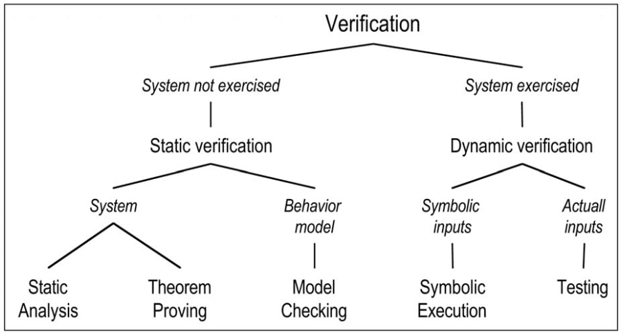
    <div align="center">Fig. 19. Verification approaches.</div>
</p>

&nbsp;가능한 모든 입력과 관련하여 시스템을 철저히 테스트하는 것은 일반적으로 비현실적입니다. 테스트 패턴을 결정하는 방법은 테스트 입력 선택 기준과 테스트 입력 생성의 두 가지 관점에 따라 분류 할 수 있습니다.

&nbsp;그림 20은 테스트 선택에 따른 다양한 테스트 방법을 요약 한 것입니다. 그림의 위쪽 부분은 기본 테스트 접근 방식을 식별합니다. 그림의 아래 부분은 하드웨어 테스트가 주로 생산 결함을 제거하는 데 목적이 있기 때문에 하드웨어 테스트와 소프트웨어 테스트를 구분하는 기본적인 접근 방식의 조합을 보여줍니다. 소프트웨어 테스트는 개발 결함에만 관련됩니다. 하드웨어 테스트는 일반적으로 결함 기반 인 반면 소프트웨어 테스트는 기준 기반이지만 결함 기반인 돌연변이 테스트는 예외입니다.

<p align="center">
    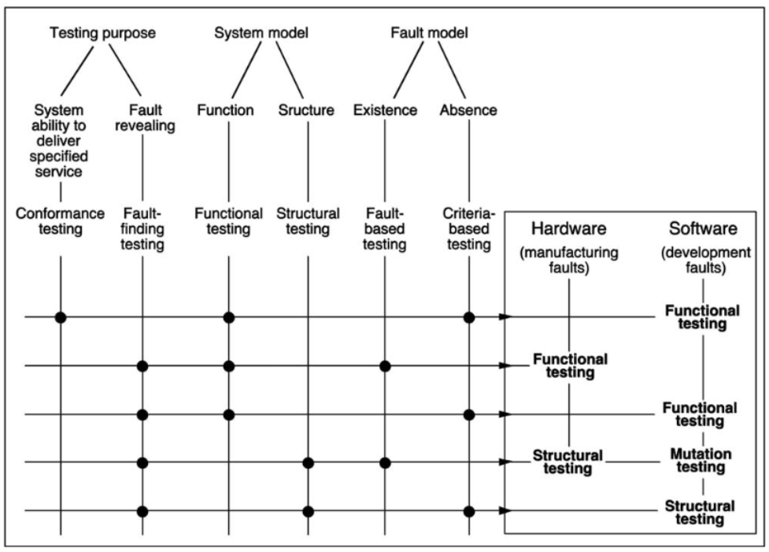
    <div align="center">Fig. 20. Testing approaches according to test pattern selection.</div>
</p>

&nbsp;테스트 입력의 생성은 결정적이거나 확률적일 수 있습니다:

- 결정 론적 테스트에서 테스트 패턴은 선택적 선택에 의해 미리 결정됩니다.
- 무작위 또는 통계적 테스트에서 테스트 패턴은 입력 도메인에 정의 된 확률 분포에 따라 선택됩니다. 입력 데이터의 분포와 개수는 주어진 결함 모델 또는 기준에 따라 결정됩니다.

&nbsp;테스트 출력을 관찰하고 검증 조건을 충족하는지 여부를 결정하는 것을 오라클 문제라고합니다. 검증 조건은 전체 출력 세트 또는 후자의 콤팩트 기능에 적용될 수 있습니다 (예 : 하드웨어의 물리적 결함 테스트시 시스템 서명, 소프트웨어 개발 결함 테스트시 "부분 오라클"[69]). ). 물리적 결함을 테스트 할 때 주어진 입력 시퀀스에 대해 테스트중인 시스템에서 예상되는 결과 (압축 여부에 관계없이)는 시뮬레이션 또는 참조 시스템 (골든 유닛)에서 결정됩니다. 개발 결함의 경우 참조는 일반적으로 사양입니다. 또한 프로토 타입이거나 디자인 다양성의 경우 동일한 사양의 또 다른 구현 일 수 있습니다 (백투백 테스트).

&nbsp;검증 방법을 조합하여 사용할 수 있습니다. 예를 들어, 기호 실행은 테스트 패턴의 결정을 용이하게하기 위해 사용될 수 있고, 정리 증명은 무한 상태 모델의 속성을 확인하는 데 사용될 수 있으며 [60], 돌연변이 테스트는 다양한 테스트 전략을 비교하기 위해 사용될 수 있습니다 [66].

&nbsp;시스템 개발 전반에 걸쳐 검증을 수행해야하므로 개발 과정에서 시스템이 취하는 다양한 형태 (프로토 타입, 구성 요소 등)에 위의 기술을 적용 할 수 있습니다.

&nbsp;위의 기술은 결함 허용 메커니즘의 검증, 특히 1) 공식적인 정적 검증 [59], 2) 결함이나 오류가 테스트 패턴의 일부가되어야하는 테스트 (일반적으로 결함 주입이라고 함)에도 적용됩니다 [2].

&nbsp;시스템이 지정된 것 이상을 수행 할 수 없음을 확인하는 것은 시스템이 수행하지 않아야하는 작업과 관련하여 특히 중요합니다 (예 : 침투 테스트).

&nbsp;검증을 용이하게하기 위해 시스템을 설계하는 것을 검증 가능성을위한 설계라고합니다. 이 접근 방식은 물리적 결함과 관련하여 하드웨어용으로 잘 개발되었으며, 해당 기술을 테스트 가능성을 위한 설계라고합니다.

<br/>

#### 5.3.2 Fault Removal During Use

시스템 사용 중 결함 제거는 수정 또는 예방 유지 보수입니다. 교정 유지 보수는 하나 이상의 오류를 생성하고보고 된 결함을 제거하는 것을 목표로하며, 예방 유지 보수는 정상 작동 중에 오류가 발생하기 전에 결함을 발견하고 제거하는 것을 목표로합니다. 후자의 결함에는 1) 마지막 예방 유지 보수 조치 이후 발생한 물리적 결함 및 2) 다른 유사한 시스템에서 오류를 유발 한 개발 결함이 포함됩니다. 개발 결함에 대한 수정 유지 보수는 일반적으로 단계적으로 수행됩니다. 실제 제거가 완료되기 전에 결함이 먼저 분리 될 수 있습니다 (예 : 해결 방법 또는 패치에 의해). 이러한 형태의 유지 관리는 내결함성이없는 시스템과 내결함성 시스템에 적용되며, 온라인 (서비스 제공 중단없이) 또는 오프라인 (서비스 중단시)으로 유지 관리 할 수 있습니다.

<br/>

#### 5.4  Fault Forecasting

오류 예측은 오류 발생 또는 활성화와 관련하여 시스템 동작을 평가하여 수행됩니다. 평가에는 두 가지 측면이 있습니다:

- 고장 모드 또는 시스템 고장으로 이어질 이벤트 조합 (구성 요소 고장 또는 환경 조건)을 식별, 분류 및 순위 지정하는 것을 목표로하는 정 성적 또는 순 서적 평가
- 일부 속성이 충족되는 정도를 확률 측면에서 평가하는 것을 목표로하는 정량적 또는 확률 적 평가; 그런 다음 해당 속성은 측정 값으로 표시됩니다.

&nbsp;정성적 및 정량적 평가 방법은 구체적이거나 (예 : 정 성적 평가를위한 고장 모드 및 효과 분석 또는 정량적 평가를위한 Markov 체인 및 확률 적 페트리 넷) 두 가지 형태의 평가를 수행하는 데 사용할 수 있습니다 (예 : 신뢰도 블록). 다이어그램, 결함 트리).

&nbsp;확률적 추정을 도출하기위한 확률 적 오류 예측에 대한 두 가지 주요 접근 방식은 모델링 및 (평가) 테스트입니다. 모델링에는 테스트 또는 실패 데이터 처리를 통해 얻을 수있는 모델링 된 기본 프로세스 (고장 프로세스, 유지 관리 프로세스, 시스템 활성화 프로세스 등)에 대한 데이터가 필요하기 때문에 이러한 접근 방식은 완전합니다.

&nbsp;모델링은 1) 물리적 결함, 2) 개발 결함 또는 3) 둘 모두의 조합에 대해 수행 할 수 있습니다. 모델링은 일반적으로 악의적이지 않은 결함에 대해 수행되지만 악성 결함에 대한 모델링을 수행하려는 시도는 언급 할 가치가 있습니다 [49], [61]. 모델링은 두 단계로 구성됩니다:

- 시스템 구성 요소의 동작과 상호 작용을 모델링하는 기본 확률 적 프로세스에서 시스템 모델을 구성합니다. 이러한 기본 확률 적 프로세스는 고장, 수리를 포함한 서비스 복원 및 가능하면 시스템 듀티 사이클 또는 활동 단계와 관련됩니다.
- 모델을 처리하여 시스템의 신뢰성 측정 값과 표현식을 얻습니다.

&nbsp;일반적으로 여러 서비스를 구분할 수있을뿐만 아니라 두 개 이상의 서비스 모드 (예 : 전체 용량에서 응급 서비스까지)를 구분할 수 있습니다. 이러한 모드는 덜 완전한 서비스 제공을 구별합니다. 성능 관련 신뢰성 측정은 일반적으로 성능 개념에 포함됩니다 [45], [64].

&nbsp;하드웨어, 소프트웨어 또는 둘 다에 대한 안정성 증가 모델은 과거 시스템 오류에 대한 데이터에서 안정성 예측을 수행하는 데 사용됩니다.

&nbsp;평가 테스트는 섹션 5.3.1에 정의 된 관점, 즉 적합성, 기능, 비결 함 기반, 통계, 테스트를 사용하여 특성화 할 수 있지만, 주로 시스템 검증을 목표로하는 것은 아닙니다. 주요 관심사는 입력 프로파일이 운영 프로파일을 대표해야한다는 것입니다 [46]; 따라서 평가 테스트의 일반적인 이름은 운영 테스트입니다.

&nbsp;내결함성 시스템을 평가할 때 오류 및 결함 처리 메커니즘이 제공하는 범위는 신뢰성 측정에 큰 영향을 미칩니다 [8], [1]. 커버리지 평가는 모델링 또는 테스트 (예 : 결함 주입)를 통해 수행 할 수 있습니다.

&nbsp;오류가있는 경우 컴퓨터 시스템의 동작 측정을 평가하는 절차 인 신뢰성 및 보안 벤치 마크의 개념은 통합 프레임 워크에서 다양한 오류 예측 기술을 통합 할 수 있도록합니다. 이러한 벤치 마크는 1) 시스템의 신뢰성과 보안의 특성화, 2) 하나 또는 여러 속성에 따른 대안 또는 경쟁 솔루션의 비교를 가능하게합니다 [37].

<br/>

#### 5.5 Relationships between the Means for Dependability and Security

섹션 2에 제공된 결함 방지, 결함 허용, 결함 제거, 결함 예측의 정의에 나타나는 모든 "방법"은 사실상 모든 설계 및 분석 활동이 사람의 활동이기 때문에 거의 도달 할 수없는 목표입니다. 따라서 불완전합니다. 이러한 불완전 함은 설계 및 구현 프로세스의 각 단계에서 위의 활동을 결합하여 활용하는 이유를 설명하는 관계를 가져와 신뢰할 수 있고 안전한 컴퓨팅 시스템으로 가장 잘 이어질 수 있습니다. 이러한 관계 관계는 다음과 같이 스케치 할 수 있습니다. 개발 방법론 및 구성 규칙을 통한 오류 방지에도 불구하고 (실행 가능하기 위해 자체적으로 불완전 함) 오류가 발생할 수 있습니다. 따라서 결함 제거가 필요합니다. 결함 제거는 그 자체로 불완전하며 (즉, 모든 결함을 찾을 수없고 결함을 제거 할 때 다른 결함이 발생할 수 있음) 시스템의 기성 구성 요소 (하드웨어 또는 소프트웨어)는 일반적으로 다음과 같이 할 수 있습니다. 결함을 포함합니다. 따라서 오류 예측의 중요성 (작동 오류의 가능한 결과 분석 외에). 컴퓨팅 시스템에 대한 우리의 의존도가 증가함에 따라 내결함성에 대한 요구 사항이 발생하며 이는 차례로 구성 규칙을 기반으로합니다. 따라서 내결함성 메커니즘 자체에 오류 제거 및 오류 예측을 다시 적용해야합니다. 프로세스는 위에 표시된 것보다 훨씬 더 재귀 적이라는 점에 유의해야합니다. 현재 컴퓨팅 시스템은 너무 복잡해서 설계 및 구현에 비용 효율적 (성공 능력을 포함하여 넓은 의미에서 소프트웨어 및 하드웨어 도구)이 필요합니다. 허용되는 시간 범위 내). 이러한 도구 자체는 신뢰할 수 있고 안전해야합니다.

&nbsp;앞의 추론은 오류 제거와 오류 예측 사이의 밀접한 상호 작용을 설명하고, 신뢰할 수있는 서비스를 제공 할 수있는 능력에 대한 확신에 도달하는 것을 목표로하는 반면, 오류 방지 및 오류 그룹화를 목표로 수집을 신뢰성 및 보안 분석으로 유도합니다. 관용은 신뢰할 수있는 서비스를 제공 할 수있는 능력을 제공하기위한 신뢰성과 보안 제공을 구성합니다. 수단의 또 다른 그룹은 1) 결함 방지 및 결함 제거를 결함 방지 (예 : 결함없는 시스템을 목표로하는 방법)로 연결하고, 2) 결함 허용 및 결함 예측을 결함 수용으로 연결하는 것입니다. 결함이있는 시스템. 그림 21은 신뢰성을위한 수단의 그룹화를 예시한다. 보안에 초점을 맞출 때 이러한 분석을 보안 평가[32]라고 한다.

<p align="center">
    
    <div align="center">Fig. 21.  Groupings of the means for dependability and security.</div>
</p>

&nbsp;내결함성의 절차 및 메커니즘을 평가할 필요성을 강조하는 것 외에도, 동일한 활동의 두 가지 구성 요소 (의존성 분석)로 결함 제거 및 결함 예측을 고려하면 커버리지 개념을 더 잘 이해할 수 있으므로 위의 재귀에 의해 도입 된 문제 : 평가 평가 또는 시스템에 대한 신뢰 구축에 사용 된 방법 및 도구에 대한 신뢰에 도달하는 방법. 커버리지는 여기에서 시스템이 작동하는 동안 직면하게 될 실제 상황과 비교하여 분석 중에 시스템이 적용되는 상황의 대표성을 측정하는 것을 의미합니다. 여기에 정의 된 적용 범위 개념은 매우 일반적입니다. 응용 범위, 예를 들어 소프트웨어 텍스트에 대한 소프트웨어 테스트 범위, 제어 그래프 등에 대한 범위, 결함 모델에 대한 집적 회로 테스트 범위, 결함 허용 범위를 표시하여 더 정확하게 만들 수 있습니다. 결함의 종류와 관련하여 현실과 관련된 개발 가정의 범위.

&nbsp;시스템이 진정으로 신뢰할 수 있고 적절한 경우 안전한지 (즉, 제공된 서비스를 정당하게 신뢰할 수 있는지 여부)에 대한 평가는 최소한 다음 세 가지 이유 때문에 이전 섹션에서 다루었던 분석 기술을 뛰어 넘습니다. 제한 사항:

- 현실과 관련하여 설계 또는 검증 가정의 범위에 대한 정확한 검사 (예 : 테스트 입력을 결정하는 데 사용되는 기준의 실제 결함과의 관련성, 결함 허용 메커니즘 설계의 결함 가설)은 지식과 마스터 링을 의미합니다. 사용 된 기술, 시스템의 의도 된 활용 등 일반적으로 달성 할 수있는 것을 훨씬 초과합니다.
- 신뢰성의 일부 속성, 특히 특정 등급의 결함과 관련된 보안에 대한 시스템의 평가는 확률 이론적 기반이 존재하지 않거나 아직 널리 수용되지 않았기 때문에 현재 실현 불가능하거나 중요하지 않은 결과를 산출하는 것으로 간주됩니다. 예를 들어 우발적 인 개발 오류에 대한 안전, 의도적 오류에 대한 보안이 있습니다.
- 분석이 수행되는 사양에는 다른 시스템과 마찬가지로 결함이 포함될 가능성이 있습니다.

&nbsp;이 상태의 수많은 결과 중에서 다음을 언급하겠습니다.

- 시스템을 평가할 때 개발 프로세스에 중점을 둡니다. 즉, 개발에 사용되는 방법과 기술 및 사용 방법에 대해 강조합니다. 어떤 경우에는 1) 개발에 사용 된 방법 및 기술의 특성과 2) 활용도 평가 [51], [58], [32]에 따라 등급이 지정되어 시스템에 전달됩니다. [65].
- 일부 내결함성 시스템의 사양 (신뢰성 측정 측면에서 확률 적 요구 사항에 추가)에 허용 할 결함 유형 및 개수 목록의 존재 위에서 언급 한 한계를 극복 할 수 있다면 그러한 사양은 필요하지 않을 것입니다 (이러한 사양은 "Fail-operational"(FO) 또는 "fail-safe"의 연결 형태로 항공 우주 응용 분야에서 고전적입니다). ”(FS) 요구 사항 (예 : FO / FS 또는 FO / FO / FS 등).

<br/>

### 6 Conclusion

점점 더 많은 개인과 조직이 현금 자동 지급기 서비스, 위성 별자리 제어, 비행기, 원자력 발전소 또는 방사선 치료 장치 등의 서비스를 신뢰해야하는 정교한 컴퓨팅 시스템을 개발하거나 조달하고 있습니다. 민감한 데이터베이스의 기밀성을 유지합니다. 서로 다른 상황에서 이러한 서비스의 서로 다른 속성에 초점을 맞출 것입니다. 예를 들어 달성 된 평균 실시간 응답, 필요한 결과를 생성 할 가능성, 시스템 환경에 치명적인 장애를 피할 수있는 능력, 또는 고의적 인 침입을 방지 할 수있는 정도. 신뢰성과 보안을 동시에 고려하면 이러한 다양한 문제를 단일 개념적 프레임 워크에 포함시킬 수있는 매우 편리한 수단을 제공합니다. 여기에는 가용성, 신뢰성, 안전성, 기밀성, 무결성, 유지 보수 가능성과 같은 특성이 포함됩니다. 또한 사용자가 일반적으로 시스템에서 필요로하는 것이 이러한 속성의 적절한 균형이라는 문제를 해결하는 수단을 제공합니다.

&nbsp;이 문서에서 공식화 한 개념의 주요 강점은 통합적 특성입니다. 이를 통해 신뢰성, 가용성, 안전, 기밀성, 무결성 및 유지 보수 가능성에 대한보다 고전적인 개념을 관점에 적용 할 수 있습니다. 오류 오류 실패 모델은 시스템에 영향을 미칠 수있는 다양한 위협을 이해하고 마스터하는 데 핵심이되며이를 가능하게합니다. 정의 할 수있는 다양한 장애 등급을 통해 특이성을 보존하면서 이러한 위협에 대한 통합 프레젠테이션. 신뢰성과 보안을 달성하기위한 수단을 위해 제공된 모델은 매우 유용하며, 천식 수단은 이러한 속성이 경향이 있기 때문에 임의의 시스템의 개발이 트레이드 오프를 수행해야하는 의존성 속성에 따라 더 고전적인 분류보다 서로 훨씬 더 직교합니다. 서로 충돌합니다. 섹션 2에 제공된 기본 정의를 개선하면 그림 22에서와 같이 개선 된 신뢰성과 보안 트리가 생성됩니다.

<p align="center">
    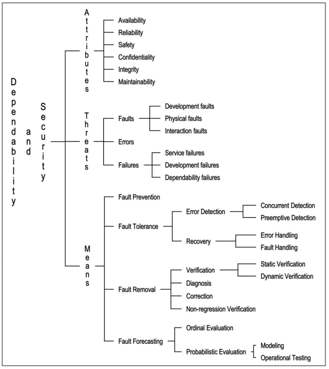
    <div align="center">Fig. 22. A refined dependability and security tree.</div>
</p>
<br/>

### Index of Definitions

```
Accidental fault 3.2.1
Accountability 4.3
Active fault 2.2
Adaptive maintenance 3.1
Atomic 2.1
Augmentive maintenance 3.1
Authenticity 4.3
Autonomic computing 4.3
Availability 2.3
Back-to-back testing 5.3.1
Backward recovery 5.2.1
Behavior 2.1
Byzantine failure 3.3.1
Catastrophic failure 3.3.1
Commission fault 3.2.3
Common-mode failure 3.5
Compensation 5.2.1
Component 2.1
Computer-based systems 2
Concurrent detection 5.2.1
Confidentiality 2.3
Configuration fault 3.2.3
Consistency 3.3.1
Consistent failure 3.3.1
Content failure 3.3.1
Correct service 2.2
Corrective maintenance 3.1
Coverage 5.5
Degraded mode 2.2
Deliberate fault 3.2.1
Denial of service 3.2.4
Dependability & security analysis 5.5
Dependability & security benchmark 5.4
Dependability & security failure 3.3.3
Dependability & security provision 5.5
Dependability & security specification 2.3
Dependability 2.3
Dependence 2.3
Design diversity 5.2.2
Design for testability 5.3.1
Design for verifiability 5.3.1 
Detectability 3.3.1
Detected error 3.4
Detection and recovery 5.2.1
Deterministic testing 5.3.1
Development environment 3.1
Development failure 3.3.2
Development fault 3.2.1
Development phase 3.1
Diagnosis 5.2.1	
Dormant fault 2.2	
Downgrading 3.3.2	
Dynamic verification 5.3.1
Early timing failure 3.3.1
Elusive fault 3.5
Environment 2.1
Erratic failure 3.3.1
Error 2.2 
Error detection and system recovery 5.2.1
Error handling 5.2.1
External fault 3.2.1
External state 2.1
Fail-controlled system 3.3.1
Fail-halt system 3.3.1
Fail-passive system 3.3.1
Fail-safe system 3.3.1
Fail-silent system 3.3.1
Fail-stop system 3.3.1
Failure 2.2 
Failure domain 3.3.1
Failure severity 2.2
False alarm 3.3.1
Fault 2.2	Fault acceptance 5.5
Fault activation 3.5
Fault activation reproducibility 3.5
Fault avoidance 5.5
Fault forecasting 2.4	
Fault handling 5.2.1
Fault injection 5.3.1
Fault masking 5.2.1	
Fault prevention 2.4
Fault removal 2.4	
Fault tolerance 2.4	
Forward recovery 5.2.1
Function 2.1	
Functional specification 2.1
Functional testing 5.3.1
Golden unit 5.3.1	
Halt 3.3.1		
Halt failure 3.3.1
Hard fault 3.5
Hardware fault 3.2.1
High Confidence 4.4 
Human-made fault 3.2.1
Incompetence fault 3.2.1
Inconsistent failure 3.3.1
Independent faults 3.5
Integrity 2.3	
Interaction fault 3.2.1
Intermittent fault 3.5
Internal fault 3.2.1	
Internal state 2.1	
Intrusion attempt 3.2.4
Isolation 5.2.1	
Late timing failure 3.3.1
Latent error 3.4
Logic bomb 3.2.4
Maintainability 2.3
Maintenance 3.1	
Malicious fault 3.2.1 
Malicious logic fault 3.2.4
Masking 5.2.1 
Masking and recovery 5.2.1
Minor failure 3.3.1
Multiple faults 3.5	
Multiple related errors 3.4
Mutation testing 5.3.1
Natural fault 3.2.1	
Nondeliberate fault 3.2.1
Nonmalicious fault 3.2.1
Nonregression verification 5.3.1
Nonrepudiability 4.3 
Omission 3.2.3
Omission fault 3.2.3
Operational fault 3.2.1 
Operational testing 5.4
Oracle problem 5.3.1
Ordinal evaluation 5.4
Overrun 3.3.2
Partial development failure 3.3.2
Partial failure 2.2
Penetration testing 5.3.1
Performability 5.4
Permanent fault 3.2.1
Physical fault 3.2.1
Preemptive detection 5.2.1
Preventive maintenance 3.1
Probabilistic evaluation 5.4
Provider 2.1 
Qualitative evaluation 5.4
Quantitative evaluation 5.4
Random testing 5.3.1
Reconfiguration 5.2.1
Reconfiguration fault 3.2.3
Recovery-oriented computing 5.2.2
Reinitialization 5.2.1
Related faults 3.5 
Reliability 2.3  Resilience 5.2.2
Robustness 4.3
Rollback 5.2.1
Rollforward 5.2.1
Safety 2.3 
Security 2.3, 4.3
Security policy 4.3
Self-checking component 5.2.2
Self-healing 5.2.2
Self-repair 5.2.2
Service 2.1
Service delivery 3.1
Service failure 2.2 
Service failure mode 2.2
Service interface 2.1
Service outage 2.2
Service restoration 2.2
Service shutdown 3.1
Signaled failure 3.3.1
Silence 3.3.1 
Silent failure 3.3.1
Single error 3.4
Single fault 3.5
Soft error 3.5
Soft fault 3.5  
Software ageing 3.2.3
Software fault 3.2.1
Software rejuvenation 5.2.1
Solid fault 3.5
Static verification 5.3.1
Statistical testing 5.3.1
Structural testing 5.3.1
Structure 2.1
Survivability 4.4
Symbolic execution 5.3.1
System 2.1
System boundary 2.1 
System life cycle 3.1
System recovery 5.2.1
Testing 5.3.1 
Timing failure 3.3.1
Total state 2.1 
Transient fault 3.2.1
Transition 2.2
Trapdoor 3.2.4
Trojan horse 3.2.4
Trust 2.3
Trustworthiness 4.4
Unsignaled failure 3.3.1
Use environment 3.1
Use interface 2.1
Use phase 3.1
User 2.1
Validation 5.3.1
Verification 5.3.1
Virus 3.2.4
Vulnerability 2.2
Worm 3.2.4
Zombie 3.2.4
```

